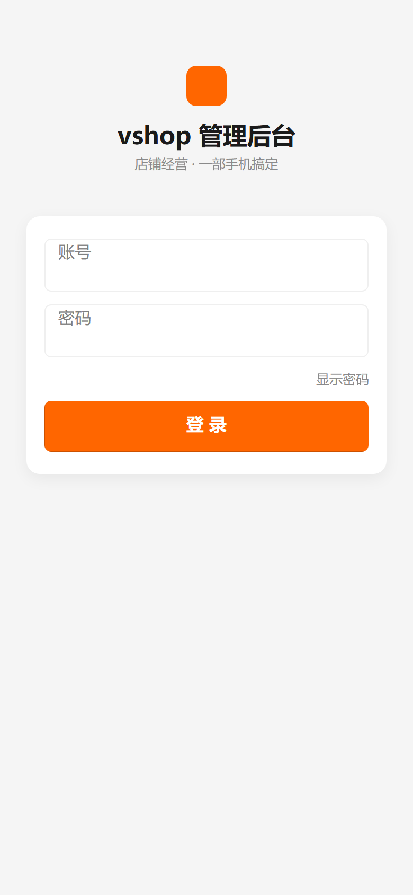
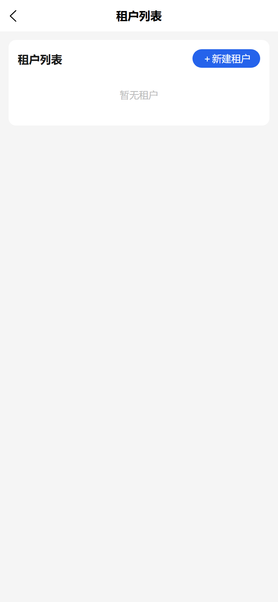

# 示例：后台登录 + 仪表盘手机截图

> 用例ID：`example-demo` ｜ 视口：390×844 @2x（手机视图） ｜ 站点：`https://e.joho.cn/guanli/`

- **① 回归断言**：`tenants.totalItems` 查询成功（当前官方视角租户数 `5`）。

### 1. 登录后仪表盘
用 superadmin 注入登录态，直开后台首屏。

### 2. 平台租户列表
手机视口 390×844 @2x。

### 3. 租户列表（同屏复核）
演示连续截图登记。

