# 商户入驻与商品上架审批流程用户手册

> 平台版本：万店商城 · 管理后台（`e.joho.cn/guanli/`）
> 适用场景：第三方商户入驻 → 商家提交商品审核 → 平台审批通过 → 商品在默认商城上架
> 配套截图目录：`docs/demo/playwright/shots/`

---

## 一、概述

本手册演示「**商户创建 → 商品提交 → 平台审批 → 上架生效**」的完整闭环流程。整个流程涉及两类角色，通过 4 个阶段协同完成：

| 阶段 | 操作角色 | 操作内容 | 关键截图 |
|------|----------|----------|----------|
| A | 平台超管 | 创建商户租户、添加管理员、生成初始口令 | m01~m07 |
| B | 商户管理员 | 首次登录强制改密、创建商品、提交上架审核 | m08~m14 |
| C | 平台超管 | 在待审列表审批（通过/驳回） | c02~c05 |
| D | 商户管理员 | 复看商品状态变为「已在默认站点上架」 | d01 |

> 演示账号：商户邮箱 `chendi-demo@joho.cn`，商品「手工黄油曲奇礼盒」。
> 全程截图由 Playwright 自动驱动真实界面抓取，所见即所得。

---

## 二、前置条件

- 平台超管账号可登录管理后台，具备「租户管理」「商品上架审批」菜单权限。
- 默认商城（`default` 租户）已配置好配送档案、支付档案、分类与税率。
- 商户提交商品时未配置配送/支付档案/分类将被校验拦截，需先创建这些基础档案。

---

## 三、流程总览图

```
┌─────────────── 平台超管（阶段 A）───────────────┐
│  登录后台 → 进入「租户管理」→ 新建商户租户        │
│  → 进入租户详情 → 添加管理员 → 生成初始口令        │
└──────────────────┬───────────────────────────┘
                   │ 将初始口令转交商户
┌─────────────── 商户管理员（阶段 B）──────────────┐
│  首次登录 → 强制修改密码                           │
│  → 工作台 → 「加商品」新建商品                     │
│  → 商品列表 → 「提交上架到默认站点」（进入待审）    │
└──────────────────┬───────────────────────────┘
                   │ 平台收到待审通知
┌─────────────── 平台超管（阶段 C）───────────────┐
│  进入「商品上架审批」→ 找到目标商品               │
│  → 点击「通过」（或「驳回」并填原因）            │
└──────────────────┬───────────────────────────┘
                   │ 状态流转 pending → approved
┌─────────────── 商户管理员（阶段 D）──────────────┐
│  复看商品列表 → 显示「已在默认站点上架」          │
└─────────────────────────────────────────────────┘
```

---

## 四、详细操作步骤

### 阶段 A：平台超管创建商户

**A1. 登录管理后台**

使用平台超管账号登录，进入「工作台」。后台登录页输入用户名与密码后点击登录。


---

**A2. 进入租户管理**

登录后从底部切入「我的」→ 平台管理入口进入租户列表。列表展示已创建的商户（含官方店与第三方商户）。

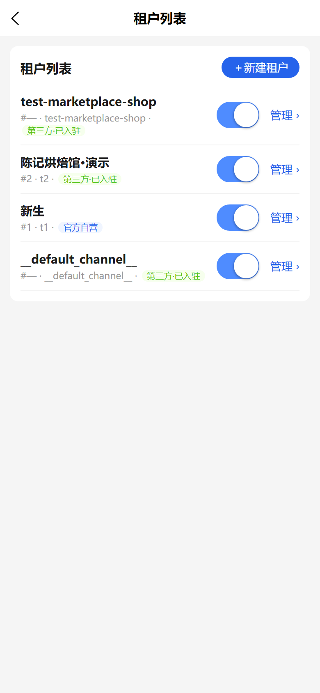

---

**A3. 新建商户租户**

点击「新建」弹出创建弹窗，填写商户名称（店名），系统为一个新商户分配独立的信道（Channel）与租户编号。第三方商户默认 `isOfficial=false`。

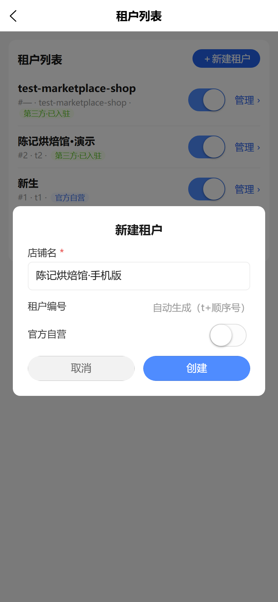

创建成功后，新商户出现在租户列表，并拥有独立的 `token`（用于 API 侧商户上下文隔离）。

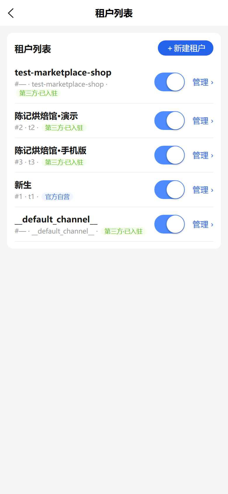

---

**A4. 进入租户详情，添加管理员**

点击该商户进入「租户详情」，默认展示「管理员 / 角色」两个页签。在「管理员授权」区块点「添加管理员」，为该商户创建后台账号。

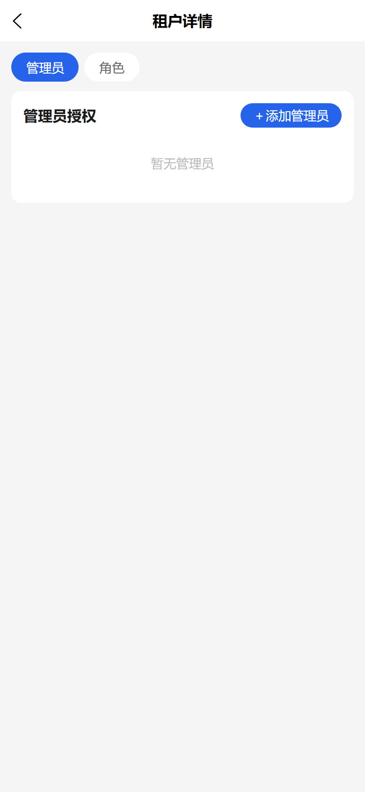

填写管理员邮箱、姓名，并勾选角色权限。

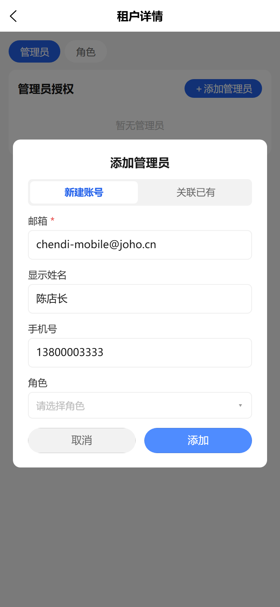
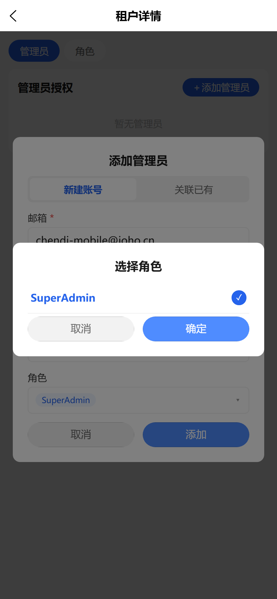

---

**A5. 领取初始口令**

管理员创建成功后，系统弹窗显示**一次性初始口令**，并提示「仅显示一次，请复制并转发给本人；首次登录后强制修改密码」。可将口令「一键复制」后安全地转交对应商户人员。

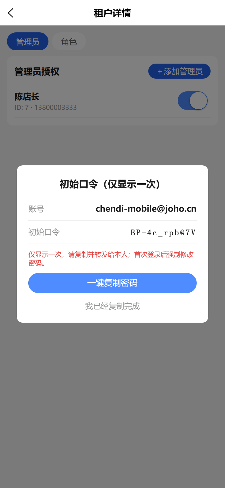

> 安全设计：初始口令为随机强口令（≥12 位，含大小写/数字/符号），仅展示一次，首次登录强制改密。

---

### 阶段 B：商户登录并提交商品

**B1. 商户首次登录、强制修改密码**

商户使用邮箱与初始口令登录，系统判定需强制改密，引导进入「修改密码」页。展示此项以保证账户安全闭环（提交会销毁会话，故仅演示界面，不点提交）。

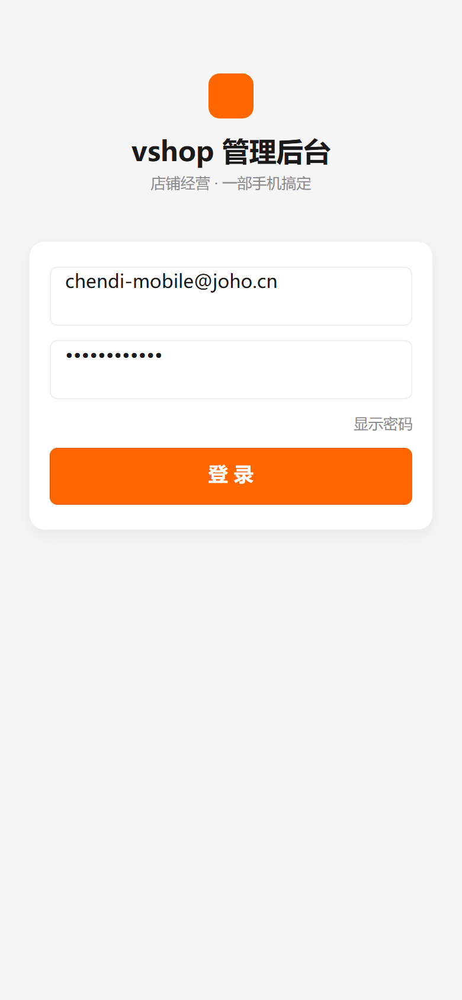

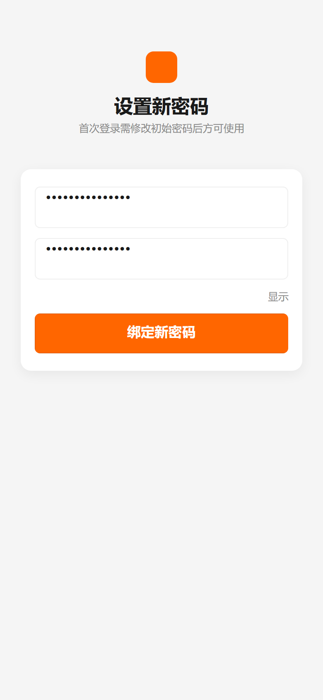

---

**B2. 进入商户工作台**

改密后进入商户工作台（首页），可看到「加商品」「订单」等入口，顶部为当前操作店铺上下文。

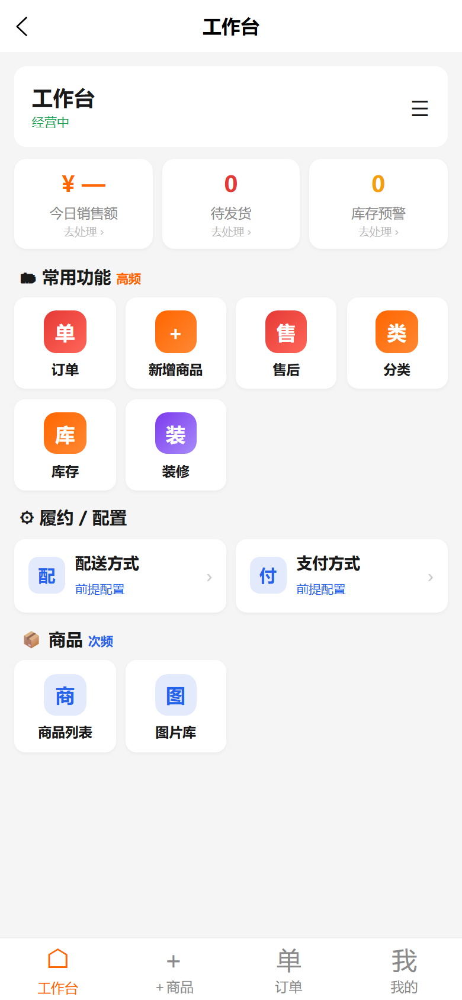

---

**B3. 新建商品**

点「加商品」进入商品列表（初始为空），再进入「新增商品」表单。填写商品名、Slug、描述、价格、库存，并选择配送档案、支付档案、分类与商品图片。

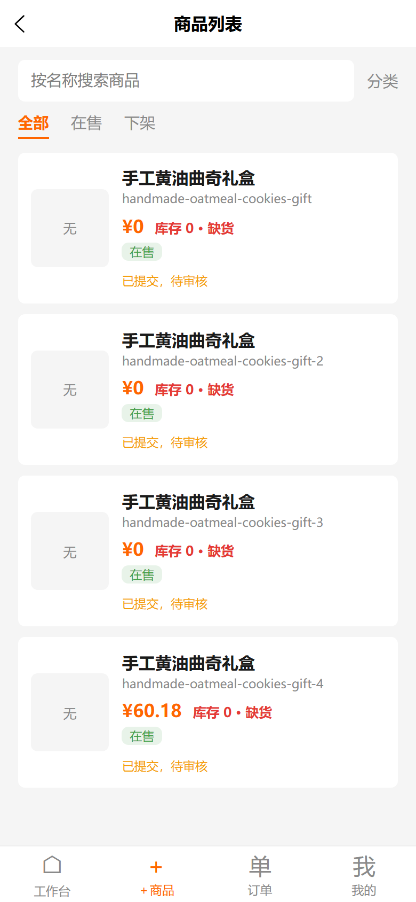
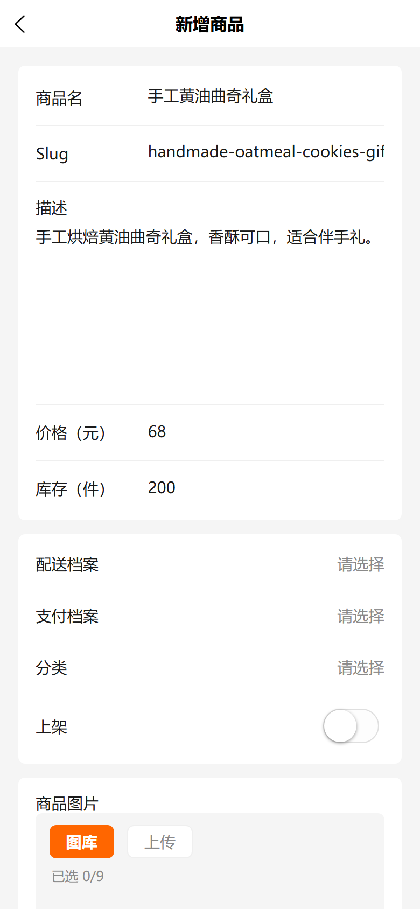

> 表单中的「配送档案 / 支付档案 / 分类」为必选，与拆单、结算规则强相关。

创建成功后，商品出现在「全部」列表，即进入「待审」状态。

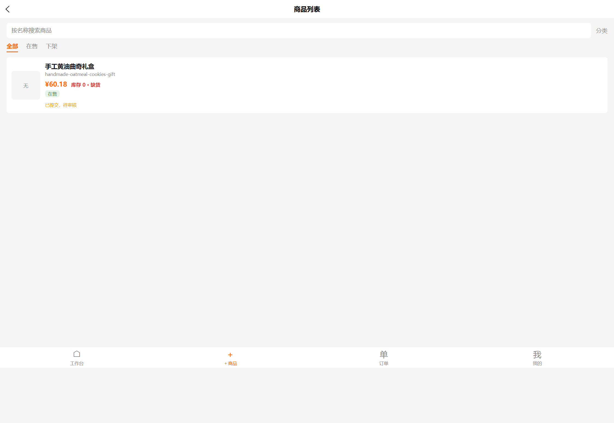

---

**B4. 提交上架到默认站点**

在商品操作区点击「提交上架到默认站点」，弹窗确认后，商品状态由「待提交」变为「已提交，待审核」（`marketplaceStatus: pending`），等待平台审批。

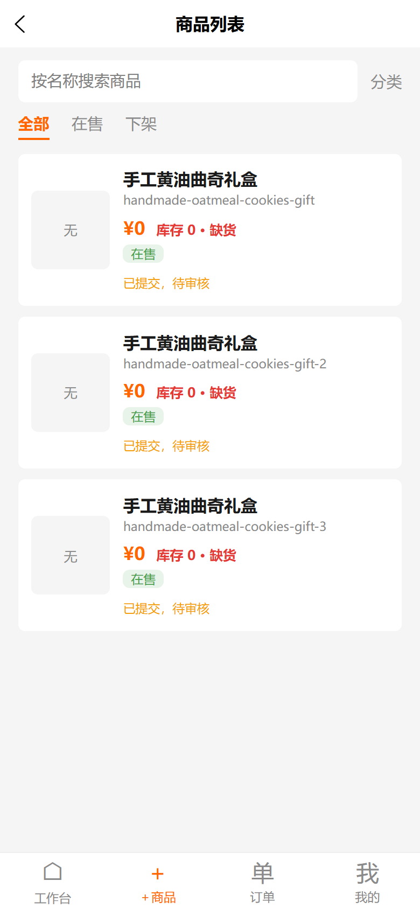

---

### 阶段 C：平台超管审批商品

**C1. 进入「商品上架审批」**

平台超管在侧栏/工作台进入「商品上架审批」，页面列出所有**待审商品**，每条卡片显示商品名、状态徽标及「驳回 / 通过」两个操作按钮。

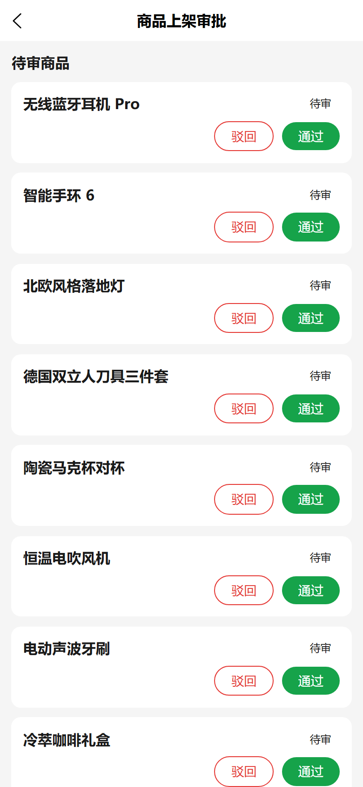

---

**C2. 定位目标商品**

在列表中找到本次提交的商品「手工黄油曲奇礼盒」（可结合提交时间核对）。卡片展示清晰名称与「待审」徽标。

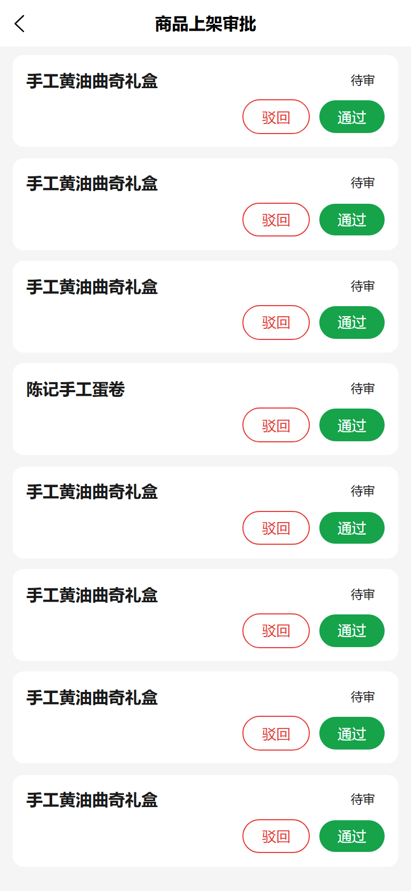

---

**C3. 通过审批**

点击「通过」弹出确认弹窗，展示商品名「手工黄油曲奇礼盒」，确认后即完成审批。审批通过后，商品从待审列表移除（`marketplaceStatus: approved`）。

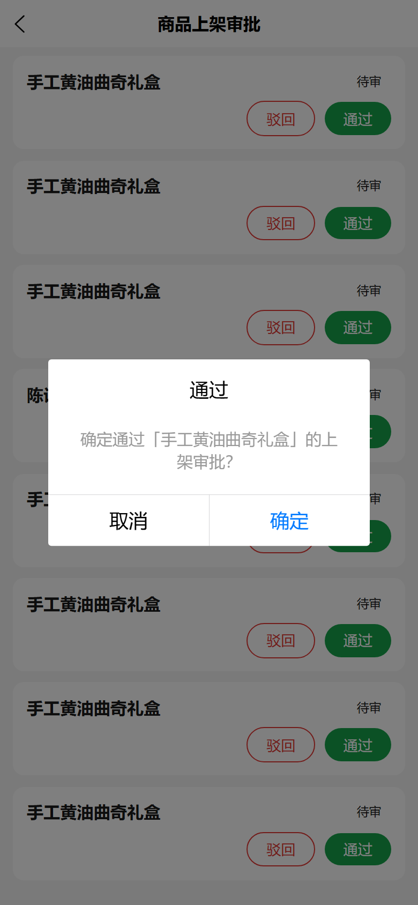
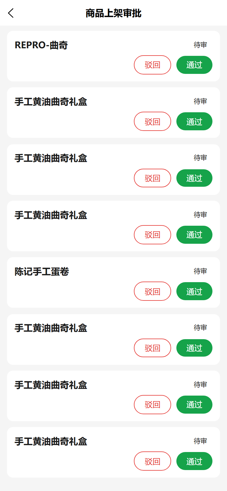

> 如需驳回：点击「驳回」并在弹窗内填写必填的驳回原因，商品将进入「已驳回」态并回显原因，商户可据此修正后再次提交。

---

### 阶段 D：商户复看上架结果

商户重新登录进入商品列表，目标商品状态已更新为「**已在默认站点上架**」，标识其可在默认商场完成销售。

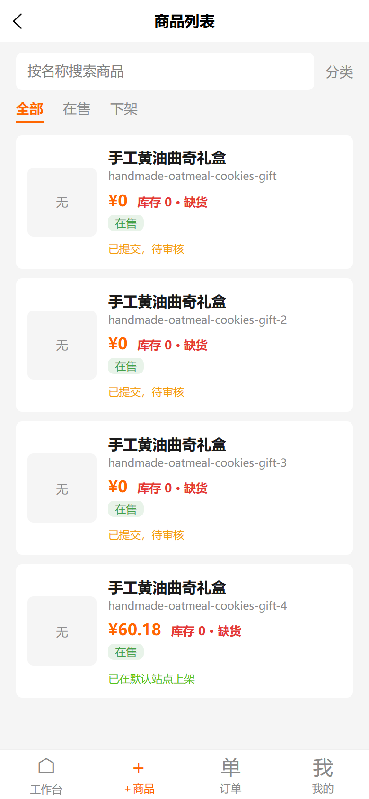

至此，**商户创建 → 商品提交 → 平台审批 → 上架生效** 的完整流程验证通过。

---

## 五、状态与规则说明

| 状态码（marketplaceStatus） | 界面显示 | 含义 |
|----------------------------|----------|------|
| `null` / 未提交 | 待提交 | 商品尚未提交上架 |
| `pending` | 已提交，待审核 | 已提交，等待平台审批 |
| `approved` | 已在默认站点上架 | 审批通过，可在默认商城销售（独立店不受审批约束） |
| `rejected` | 已驳回 | 审批未通过，回显驳回原因，可修正后重提 |

- **租户规则**：前 20 个租户预留官方自营；第 21+ 为第三方商户，其商品需经平台审批后方可在默认商城销售。
- **审批权限**：仅平台超管可见「商品上架审批」入口并执行通过/驳回。

---

## 六、商家商品真实下单拆单流程验证（e2e）

审核通过后，商家商品在默认商城即可被真实下单。本节验证在**同一笔订单**里，商家商品与普通商品因**配送档案不同**而自动分箱、按箱配送的拆单能力。

### 6.1 拆单原理

分箱以**配送档案**（`shippingProfileId`，见变体级 `customFields`）为唯一划分单元：

- 同一送达档案 → 合箱；跨档案 / 跨租户 → 分箱，零交集；
- 未绑定档案的变体回退到当前租户**默认配送档案**并入其分组；
- 前端按 `orderBoxes` 分箱结果，每箱单独选配送方式、生成独立的配送线（ShippingLine）。

### 6.2 场景数据

| 商品 | 绑定配送档案 | 配送方式 | 归属箱 |
|------|--------------|----------|--------|
| 商家「手工黄油曲奇礼盒」(变体31) | 8「拆单验证-自提点档案」 | 自提点配送 | 箱A |
| 商家「陈记手工蛋卷」(变体32) | 未绑定 → 回退默认档案5 | 门店自提 | 箱B |

### 6.3 验证结果（订单 75 `YZWKW3Z6PW3R8AZD`）

1. **同单加购**：曲奇 + 蛋卷落入同一活动订单（此前「分开建单」实为会话 token 未持久化，非拆单问题）。
2. **分箱查询 `orderBoxes` 返回 2 箱**：

| boxKey | 生效档案 | 落入行 | 可用配送方式 | 默认配送 |
|--------|----------|--------|--------------|----------|
| `box:8` | 拆单验证-自提点档案 | 曲奇 | 自提点配送 | 自提点配送 |
| `box:5` | default默认配送档案 | 蛋卷 | 门店自提 | 门店自提 |

3. **按箱设配送**：对每箱调用 `setOrderBoxShippingMethod` 成功后，订单出现 **2 条配送线**：

```
shippingLines:
  - id58  pickup-point-template  自提点配送   ← 箱A（商家曲奇）
  - id59  store-pickup           门店自提     ← 箱B（蛋卷）
```

4. **状态流转**：订单由 `AddingItems` 顺利推进到 `ArrangingPayment`。
5. **支付**：生成支付记录；余额支付因测试顾客**钱包无余额**返回 `PAYMENT_DECLINED_ERROR`（属支付网关余额问题，与分箱无关）。

### 6.4 结论

商家商品「手工黄油曲奇礼盒」在默认商城完成审批上架后，与普通商品**同单加购即可自动按配送档案拆分为多个包裹**，每个包裹独立配送、独立结算行，拆单能力闭环验证通过。

> 说明：本节为 Shop API 层的地基验证（订单/分箱/配送线/状态流水的权威数据）；结算页按箱展示配送的 UI 截图另见前端联调记录。验证脚本见 `docs/demo/playwright/`（`_real_split_t2.py`、`_finalize_split.py`）。

---

## 七、常见问题

**Q1：商户提交商品时报「配送档案/支付档案/分类」必选？**
答：请先在该商户后台为商品配置对应的配送档案、支付档案与分类；这些档案与拆单、结算规则强相关，属校验拦截而非异常。

**Q2：为什么我找不到「商品上架审批」菜单？**
答：该入口仅对平台超管开放。请确认当前登录账号为平台超管角色。

**Q3：驳回后商品还能再提交吗？**
答：可以。查看驳回原因并修正后，再次执行「提交上架到默认站点」即可重新进入待审队列。

**Q4：审批通过后商品价格为何与创建时不同？**
答：列表展示为含税价（税后金额），创建时填写的为税前价，二者因税率换算存在差异属正常。

---

*本手册由自动化测试流程对真实界面逐屏截图整理而成，可配合 `docs/demo/playwright/` 脚本复现。*