# 中医馆医生工作台 操作手册

uni-app H5（Vue 3）医生端工作台：接诊录入 → 病志版本化管理 → 康养规划 → 随访任务。后端为 Vendure + `@vendure/tcm-clinic-plugin`（Admin API 经 zhao-sso 桥接认证）。

---

## 1. 访问方式与部署路径

- 构建：`pnpm build:h5`，产物在 `dist/build/h5/`。
- 部署子路径：**`/workbench/`**（`vite.config.ts` 中 `base: '/workbench/'`，产物资源引用 `/workbench/assets/*`）。
- 路由形态：**hash 路由**，页面地址形如 `https://<域名>/workbench/#/pages/home/index`，服务器无需为子路径做 history 回退配置，nginx 只需把 `/workbench/` 静态目录指向构建产物，并把 `/admin-api` 反代到 Vendure 服务。
- 本地开发：`pnpm dev:h5` → `http://localhost:5177/workbench/`（vite proxy 已把 `/admin-api` 指向本地 fixture `http://localhost:3930`，可用 `VITE_API_TARGET` 覆盖）。

## 2. 登录

### 2.1 线上 SSO 流程（`VITE_AUTH_MODE=sso`）

1. 访问任意页面时 `App.vue` 全局守卫检查登录态；未登录且当前非登录页 → 重定向到 zhao-sso 统一登录页（`VITE_SSO_LOGIN_URL`），携带约定参数：
   - `app_code`：应用标识，固定 `tcm-workbench`（`VITE_SSO_APP_CODE`）；
   - `return_url` / `c_end_url`：登录成功后的回跳地址，即 `<站点>/workbench/#/pages/auth-callback/auth-callback`。
2. zhao-sso 认证成功后回跳并携带 `token`（或 `error`）；回跳页用该 access_token 调 Admin API `authenticate(input: { tcmSso: { accessToken } })` 换取 Vendure 管理会话（`vendure-auth-token`，前端存本地并自动附带）。
3. 30 秒窗口内最多跳转 3 次防 SSO 循环重定向；登录态失效（401）自动清会话重新走 SSO。

### 2.2 医生账号绑定约定（服务端身份映射，命中顺序）

1. 已绑定：`ExternalAuthenticationMethod(strategy='tcmSso', externalIdentifier='sso:tcm:<uuid>')` 直接登录；
2. 首登自动绑定：SSO 账号的**手机号**或**邮箱**与 Vendure `User.identifier` 一致，且该账号具有非顾客角色（即 Administrator）→ 自动建立映射并登录；
   - 约定：医生 `Administrator` 的 identifier 用**手机号**，或其**邮箱与 zhao-sso 账号邮箱一致**；
   - 顾客（患者）角色账号命中 → 拒绝（`SSO_ACCOUNT_NOT_STAFF`）；无匹配 → `SSO_ACCOUNT_NOT_LINKED`。

### 2.3 本地 mock 模式（`VITE_AUTH_MODE=mock`）

- 登录页直接输入已绑定的医生手机号，前端用 `mock-<手机号>` 作为 access_token 走同一 `authenticate` 流程；
- 服务端需开启 mock：`TcmClinicPlugin.init({ sso: { mock: true } })` 或环境变量 `SSO_MOCK=true`（accessToken 以 `mock-` 前缀时直接构造身份，不访问真实 SSO）。


## 3. 功能说明（逐页）

### 3.1 工作台首页

今日接诊统计（待接诊/进行中/已完成，统计自当天 0 点起的接诊单）、快捷入口（新建接诊/康养规划/随访任务/病志档案）、患者列表（按姓名/手机号搜索，点「接诊」直接对该患者发起接诊）。多馆医生顶部显示馆切换条。

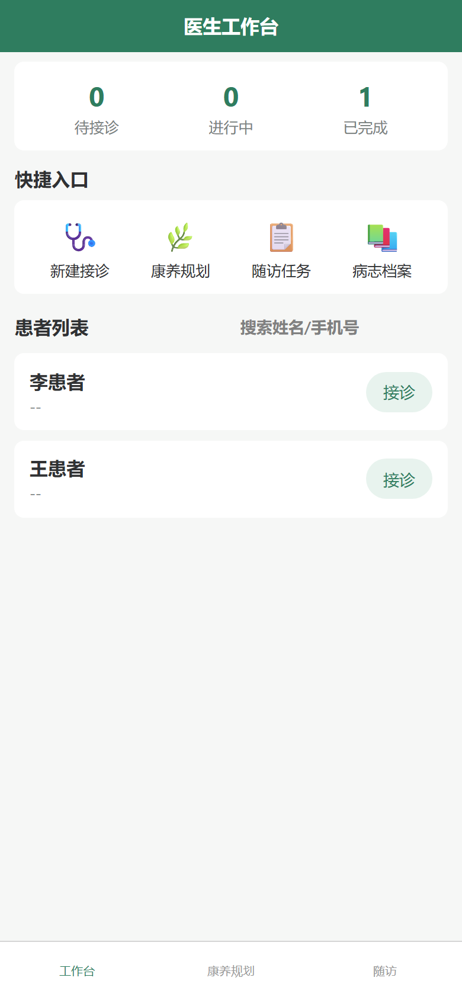

### 3.2 新建接诊

选择患者 → 选择接诊类型（初诊/复诊/上门）→「建档接诊」创建接诊单（PENDING）并进入录入流程。同一患者存在未完成接诊时会被拒绝。

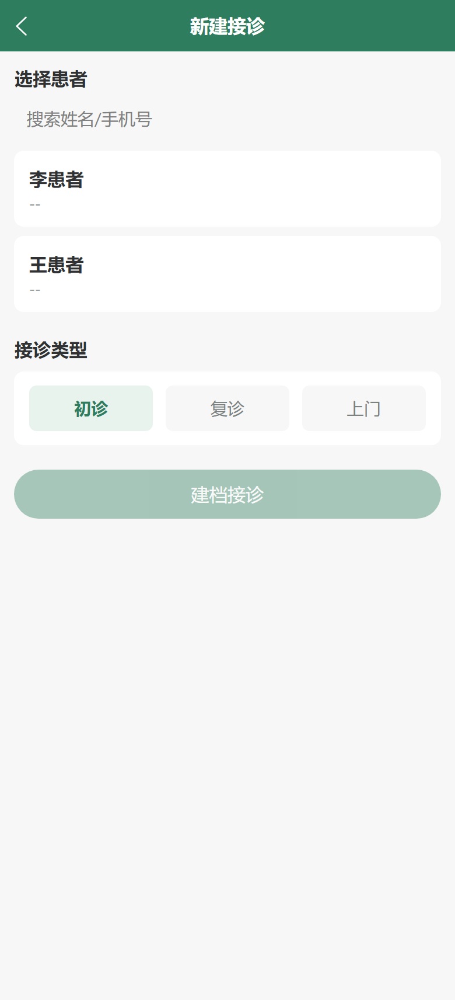

### 3.3 接诊录入（四步流程）

1. **问诊**：录入主诉；
2. **辨证**：录入辨证诊断；
3. **医嘱**：录入处方项（药名/剂量/频次/备注，可多项），「提交病志」生成病志 v1（进入版本化管理，AES-256 加密落库、全程审计留痕）；
4. **完成**：「完成接诊」将接诊单置为 COMPLETED。

步骤条支持回退已完成的步骤修改后重新提交（生成新版本）。

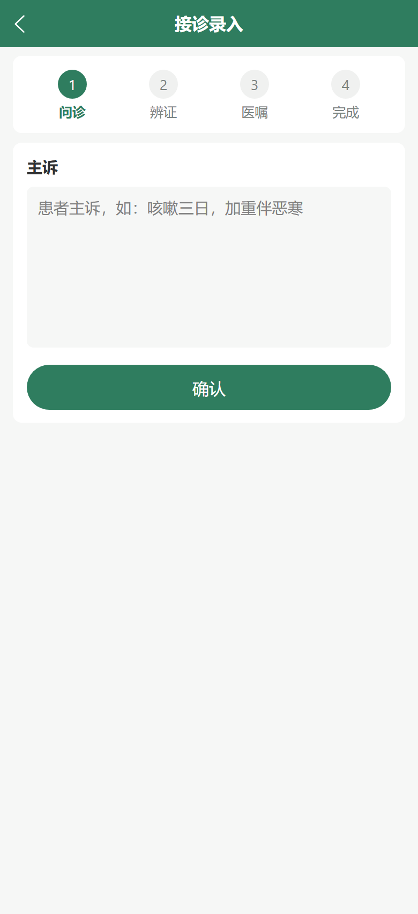
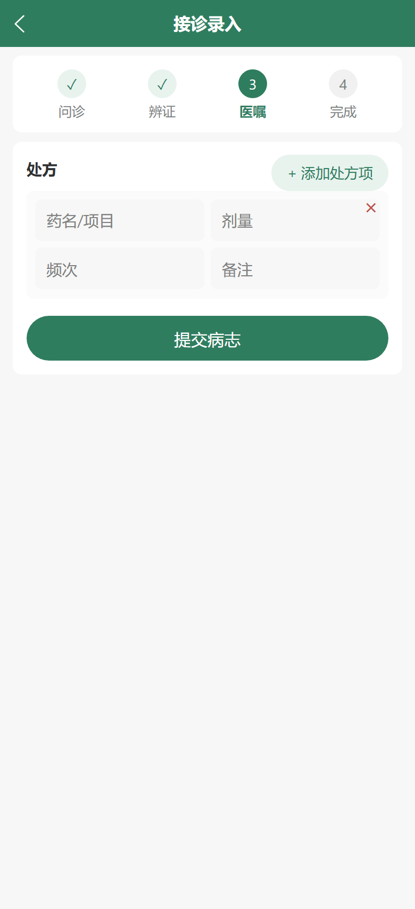
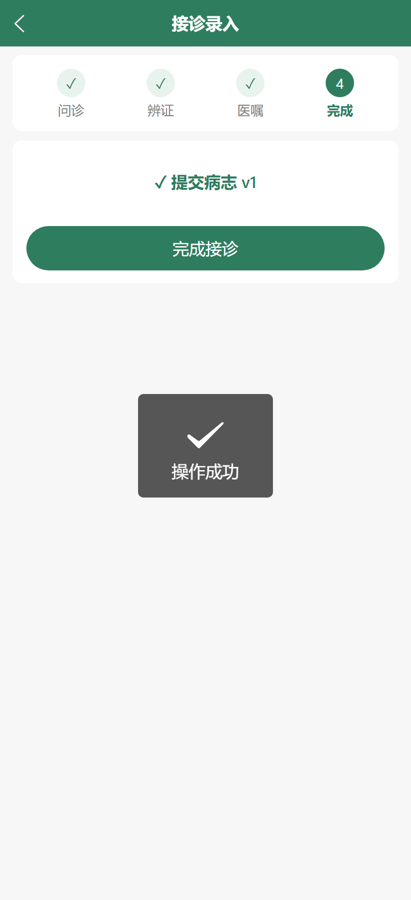

### 3.4 康养规划

规划列表：新建规划（选患者、规划名称、周期起止）、状态流转（草稿 → 开始执行/执行中 → 暂停/结案）。

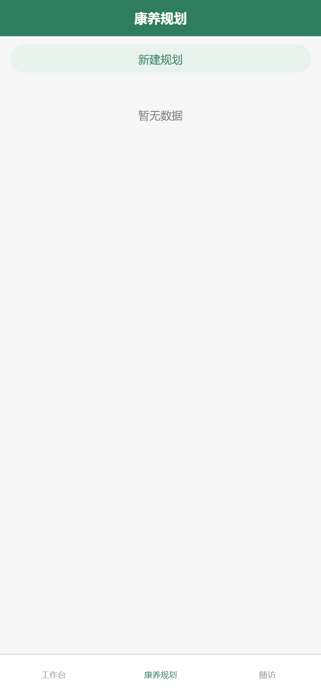

规划详情：管理计划项（项目名称、频次，可关联商品 variant）与随访任务（任务名称、截止日期、渠道：微信/短信/电话；支持完成/取消）。

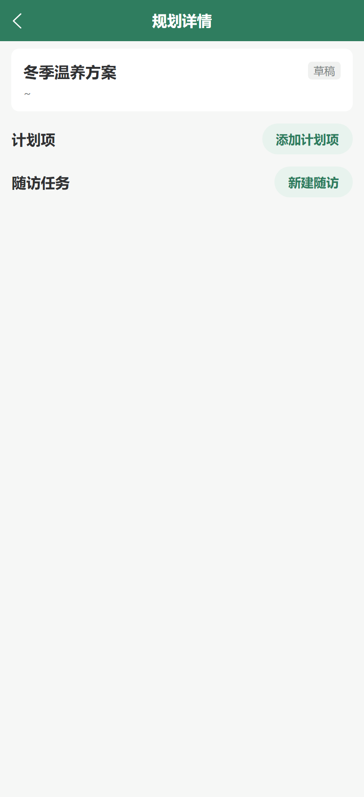
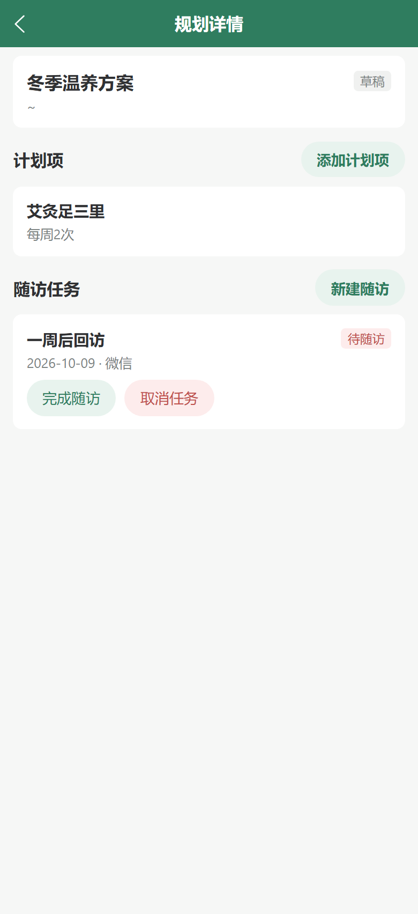

### 3.5 随访任务

全馆随访任务按状态分组（待随访/已完成/已取消），可完成或取消任务。

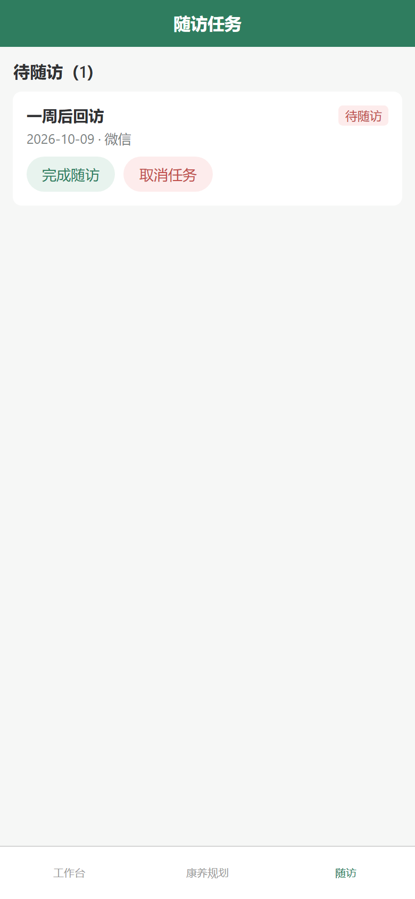

### 3.6 病志档案

病志列表（诊断 + 主诉 + 版本号）；详情页展示主诉/诊断/处方及**修改留痕**（版本时间线，记录每次编辑人与时间），支持「修改病志」（保存期内），超过保存年限（默认 15 年）自动归档只读。

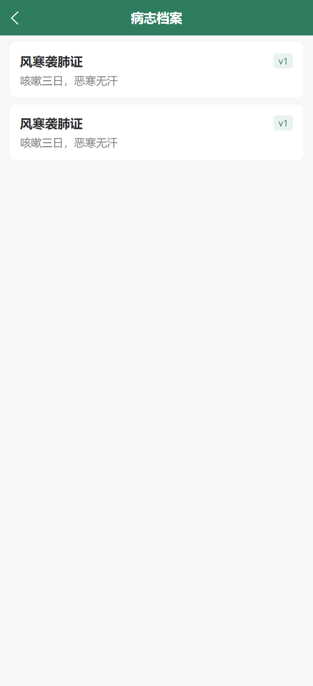
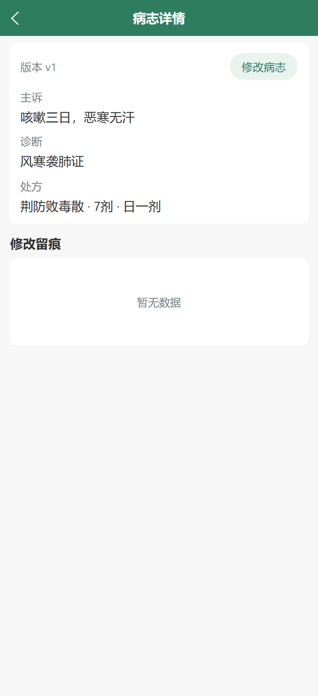

## 4. 环境变量清单

### 4.1 前端（`tcm-workbench`）

| 变量 | 说明 | 默认/示例 |
|---|---|---|
| `VITE_AUTH_MODE` | `sso` = 线上 SSO；`mock` = 本地手机号登录 | `.env.development`: `mock`；`.env.production`: `sso` |
| `VITE_SSO_LOGIN_URL` | zhao-sso 统一登录页地址（sso 模式必填） | `https://sso.example.com/login` |
| `VITE_SSO_APP_CODE` | SSO 应用标识 | `tcm-workbench` |
| `VITE_ADMIN_API_BASE` | Admin API 路径（走同域反代） | `/admin-api` |
| `VITE_API_TARGET` | 仅 dev：vite proxy `/admin-api` 的目标 | `http://localhost:3930`（联调 fixture）或 dev-server `http://localhost:3050` |

### 4.2 服务端（Vendure）

插件注册（`packages/dev-server/dev-config.ts`，即生产入口）：

```ts
TcmClinicPlugin.init({
    sso: {
        baseUrl: process.env.ZHAO_SSO_BASE_URL || '', // zhao-sso 中心地址，策略将 GET {baseUrl}/v1/user/me 校验 accessToken
        mock: process.env.SSO_MOCK === 'true',        // 或在 init 时直接写 mock: true（本地/测试）
    },
})
```

| 变量 | 说明 |
|---|---|
| `ZHAO_SSO_BASE_URL` | zhao-sso 服务基地址（生产必配，否则 tcmSso 登录返回 SSO_NOT_CONFIGURED） |
| `SSO_MOCK` | `true` 时接受 `mock-<手机号>` 形式 accessToken（仅测试/联调，生产必须关闭） |
| `TCM_RECORD_KEY` | 病志 AES-256 密钥（64 位 hex，生产必须提供） |

## 5. 测试账号与联调 fixture

联调 fixture：`packages/tcm-clinic-plugin/scripts/dev-fixture.mts`（standalone Vendure + tcm-clinic-plugin，sqljs 内存库 + mock SSO，无需真实 DB）。

```powershell
cd d:\zhao\vendure\packages\tcm-clinic-plugin
npx tsx scripts/dev-fixture.mts     # admin-api: http://localhost:3930/admin-api
cd d:\zhao\tcm-workbench
pnpm dev:h5                          # http://localhost:5177/workbench/
```

| 角色 | 账号 | 说明 |
|---|---|---|
| 医生 | 手机号 `13800000001` | 登录页输入即可（mock 登录）；Administrator identifier=`13800000001@tcm.test`，张医生，绑定同德堂中医馆 |
| 患者 | 李患者 `13900000002` / 王患者 `13900000003` | 已建档（体质：平和质）， fixture 自动种子 |

- 手机视口截图回归：`python scripts/shoot.py`（需 fixture 与 dev:h5 已启动，产物输出 `docs/shots/`）。
- 后端 e2e 回归：`cd packages/tcm-clinic-plugin && npx vitest --config vitest.config.mts --run`。

## 6. 部署说明

- **服务端入口核查结论**：vendure 仓库内 `TcmClinicPlugin` 仅在 `packages/dev-server/dev-config.ts` 注册（无独立生产 config）；pm2 生产启动脚本 `packages/dev-server/prod-start.js` → `dist/index` → `devConfig`，即 **dev-config 就是生产入口**。本次已把 SSO 接线补进该入口（`ZHAO_SSO_BASE_URL` / `SSO_MOCK` 环境变量读取），生产部署时在服务器 `.env` 配好即可，无需改其他注册点。
- **前端**：`pnpm build:h5` → 将 `dist/build/h5/` 发布到 nginx 站点 `/workbench/` 目录；`/admin-api` 反代到 Vendure。
- **待补充**：workbench 首次部署需服务器 nginx 站点目录与域名信息（可参照 nshop/web-admin 的 `scripts/deploy.mjs` 机制），服务器路径信息不在本仓库内，需运维补充后才能自动化部署。
