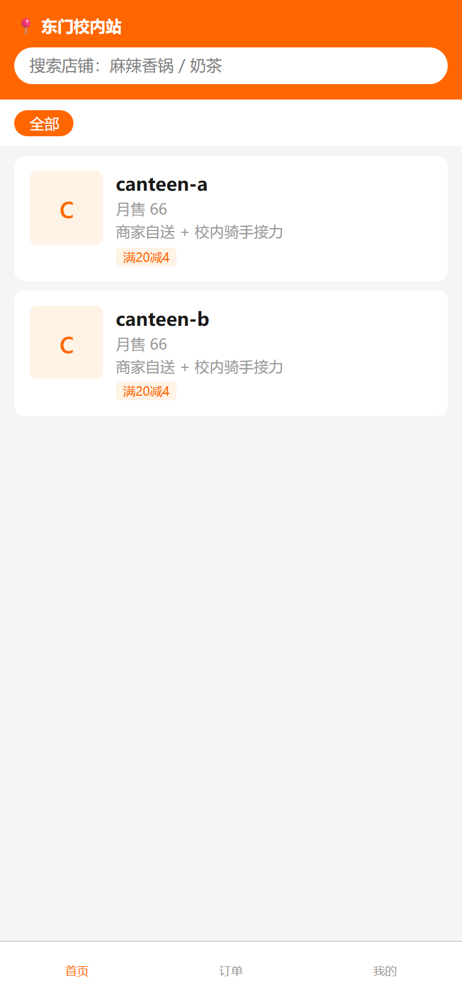
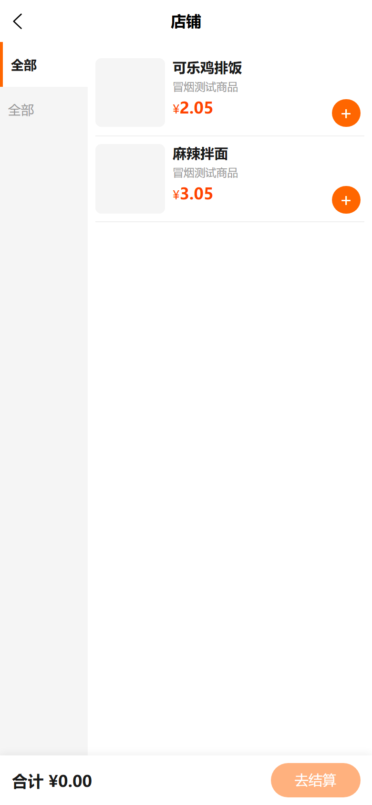
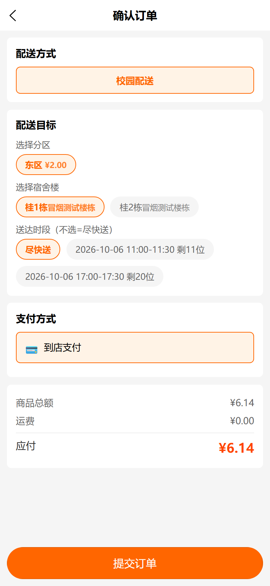
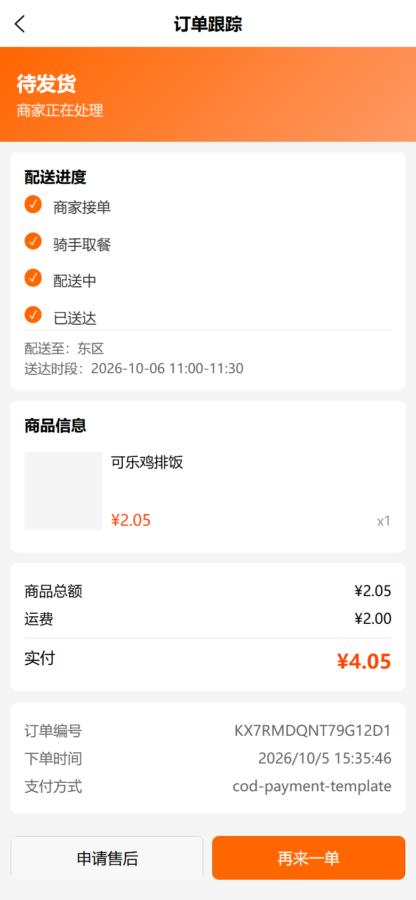
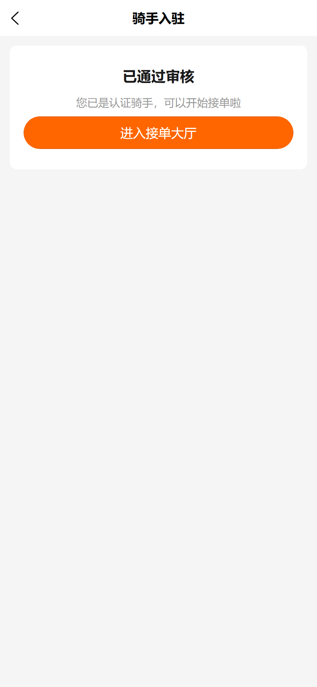
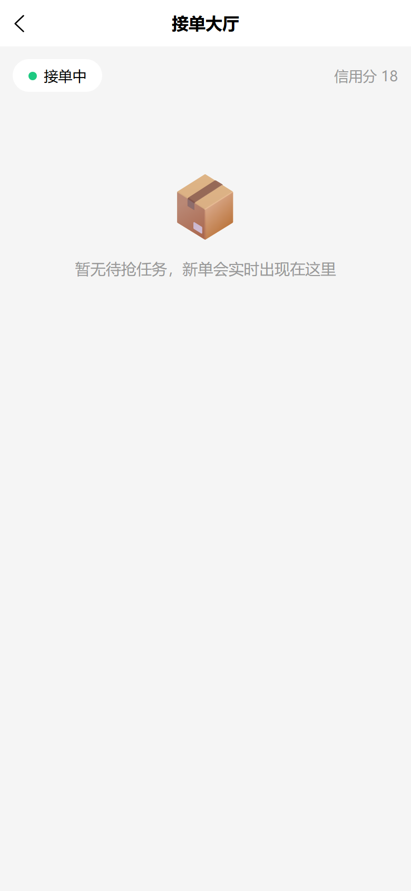
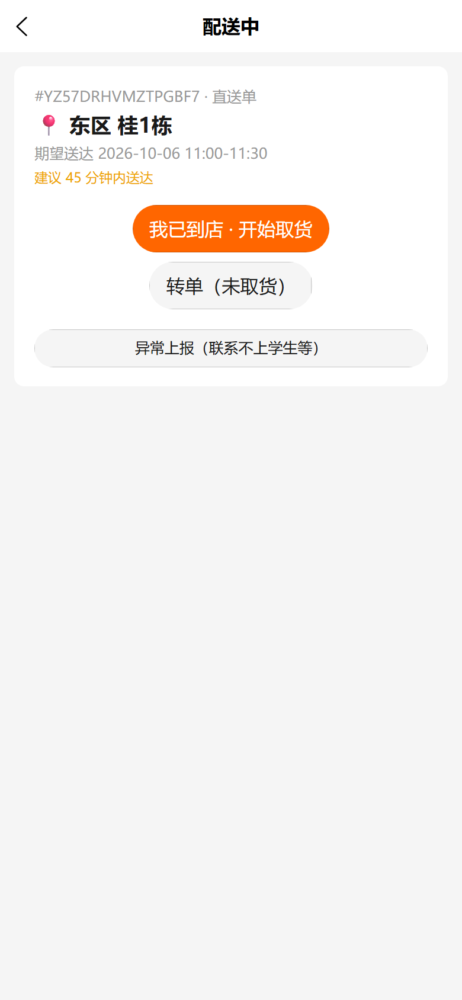
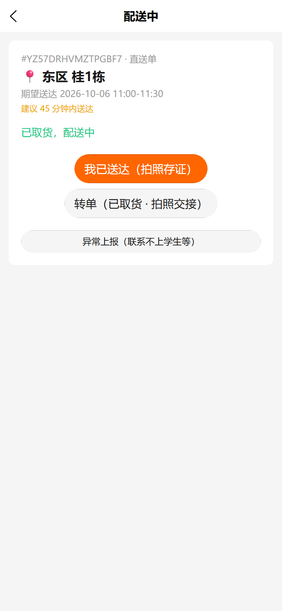
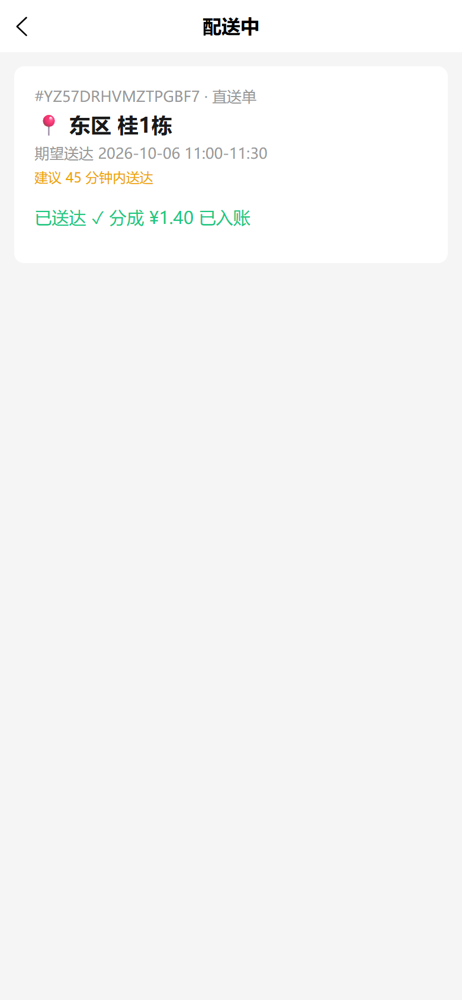
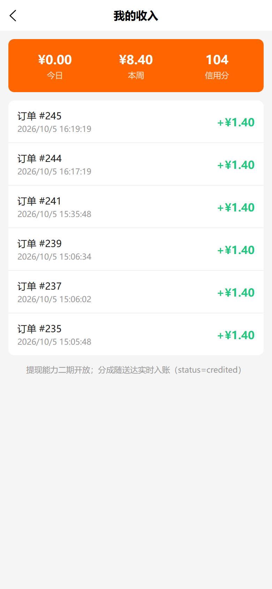

# waimai 外卖（校园配送 + 骑手端）操作手册

上线日期：2026-10-06 ｜ H5 站点：**https://www.yourbao.cn/waimai/**
后端：Vendure（campus-delivery-plugin）｜ 验证：e2e 冒烟 S1-S8 全 PASS（见 `docs/verify/2026-10-waimai-e2e.md`）

## 1. 学生点单流程（五步）

| 步骤 | 页面 | 操作 |
| --- | --- | --- |
| ① 选店铺 | 首页 | 搜索或点店铺卡（商家自送 + 校内骑手接力，满20减4） |
| ② 点餐 | 店铺菜单 | 左侧分类选菜，右侧「+」加购 |
| ③ 结算 | 确认订单 | 选配送方式（校园配送）→ 分区（东区 ¥2.00）→ 宿舍楼 → 送达时段 → 支付方式 → 提交订单 |
| ④ 支付 | — | 到店支付（COD）/ 微信 JSAPI（生产配置后生效） |
| ⑤ 跟踪 | 订单跟踪 | 配送进度四步：商家接单 → 骑手取餐 → 配送中 → 已送达；可申请售后 / 再来一单 |

### 学生端截图






## 2. 骑手流程（入驻 → 接单 → 配送 → 送达）

| 步骤 | 页面 | 操作 |
| --- | --- | --- |
| ① 入驻 | 我的 → 骑手入驻 | 填真实姓名/学号/校区（+学生证照片选填）提交，管理员审核（一般 1 个工作日）。已通过则直接进大厅 |
| ② 接单大厅 | 骑手首页 | 打开「接单中」开关上线；大厅实时出单（跨店铺聚合，加急置顶、小费降序），点击抢单 |
| ③ 到店取货 | 配送中 | 到店后点「我已到店 · 开始取货」；未取货可转单 |
| ④ 送达 | 配送中 | 点「我已送达（拍照存证）」拍照提交 → 已送达 ✓ 分成实时入账 |
| ⑤ 异常/转单 | 配送中 | 已取货转单需拍照交接；联系不上学生走「异常上报」平台介入 |

骑手信用分规则：初始 100，送达 +2；拒单/超时未抢扣分；**低于 60 禁止抢单**（大厅可见但 grab 报 FORBIDDEN）。

### 骑手端截图








## 3. 管理员操作入口

| 事项 | 入口 |
| --- | --- |
| 骑手审核 | Vendure 管理台 → 客户 → 找到申请人 → customFields `riderStatus` 置 `approved`（或 GraphQL `campusSetRiderStatus(customerId, status)`，需 CampusAuditRider 权限） |
| 信用分调整 | admin-api `updateCustomer(input: { id, customFields: { riderCredit } })`（无专用界面） |
| 订单干预 | 管理台订单：cancelOrder / transitionOrderToState / settlePayment |
| 店铺上下架/暂停 | 渠道 customFields（waimaiStoreList 读 paused/promoText） |
| 造数（测试环境） | `node docs/verify/waimai-e2e-prepare.cjs`（幂等：店铺渠道/校区/时段/冒烟商品/账号） |

## 4. 部署与冒烟复跑

```bash
# H5 部署（本地构建 → scp → 服务器解压，绝不在服务器构建）
node d:\zhao\waimai\.secrets\deploy-waimai.mjs

# 生产冒烟（期望 E2E SMOKE PASS，幂等可重复跑）
node d:\zhao\vshop\docs\verify\waimai-e2e-smoke.cjs
```

- 部署产物落点：服务器 `/opt/1panel/apps/openresty/openresty/www/sites/e.joho.cn/yourbao/waimai/`（容器内路径 `/www/sites/...`），静态替换即时生效无需 reload。
- nginx conf：`conf.d/www.yourbao.cn.conf`（改前备份 `.bak_waimai_20261006`）。
- 冒烟账号：`smoke-order@yourbao.cn` / `smoke-rider@yourbao.cn`（Wm@Smoke123）。

## 5. 已知限制 / 待办

- 骑手收入页提现功能二期开放（分成随送达实时入账 `status=credited`）。
- 微信 JSAPI 支付需在生产配置商户参数后生效；当前冒烟走 COD 授权链路。
- 大厅单滞留 >5 分钟自动加急置顶；强派（T2/T3）调度已具备（DispatchJobService），默认关闭。
- 0 分成单（shipping=0 且 tip=0）送达会写库成功但 addBalance 抛错（不影响状态流转，真实跑腿单不触发）。
