# waimai 外卖（校园配送 + 骑手端）操作手册

上线日期：2026-10-06 ｜ H5 站点：**https://www.yourbao.cn/waimai/**
后端：Vendure（campus-delivery-plugin）｜ 验证：e2e 冒烟 S1-S8 全 PASS（见 `docs/verify/2026-10-waimai-e2e.md`）

## 1. 学生点单流程（五步）

| 步骤 | 页面 | 操作 |
| --- | --- | --- |
| ① 选店铺 | 首页 | 搜索或点店铺卡（商家自送 + 校内骑手接力，满20减4） |
| ② 点餐 | 店铺菜单 | 左侧分类选菜，右侧「+」加购 |
| ③ 结算 | 确认订单 | 选配送方式（校园配送）→ 分区（东区 ¥2.00）→ 宿舍楼 → 送达时段 → 支付方式 → 提交订单 |
| ④ 支付 | — | 到店支付（COD）/ 微信 JSAPI（生产配置后生效） |
| ⑤ 跟踪 | 订单跟踪 | 配送进度四步：商家接单 → 骑手取餐 → 配送中 → 已送达；可申请售后 / 再来一单 |

### 学生端截图


## 2. 骑手流程（入驻 → 接单 → 配送 → 送达）

| 步骤 | 页面 | 操作 |
| --- | --- | --- |
| ① 入驻 | 我的 → 骑手入驻 | 填真实姓名/学号/校区（+学生证照片选填）提交，管理员审核（一般 1 个工作日）。已通过则直接进大厅 |
| ② 接单大厅 | 骑手首页 | 打开「接单中」开关上线；大厅实时出单（跨店铺聚合，加急置顶、小费降序），点击抢单 |
| ③ 到店取货 | 配送中 | 到店后点「我已到店 · 开始取货」；未取货可转单 |
| ④ 送达 | 配送中 | 点「我已送达（拍照存证）」拍照提交 → 已送达 ✓ 分成实时入账 |
| ⑤ 异常/转单 | 配送中 | 已取货转单需拍照交接；联系不上学生走「异常上报」平台介入 |

骑手信用分规则：初始 100，送达 +2；拒单/超时未抢扣分；**低于 60 禁止抢单**（大厅可见但 grab 报 FORBIDDEN）。

### 骑手端截图


## 3. 管理员操作入口

| 事项 | 入口 |
| --- | --- |
| 骑手审核 | Vendure 管理台 → 客户 → 找到申请人 → customFields `riderStatus` 置 `approved`（或 GraphQL `campusSetRiderStatus(customerId, status)`，需 CampusAuditRider 权限） |
| 信用分调整 | admin-api `updateCustomer(input: { id, customFields: { riderCredit } })`（无专用界面） |
| 订单干预 | 管理台订单：cancelOrder / transitionOrderToState / settlePayment |
| 店铺上下架/暂停 | 渠道 customFields（waimaiStoreList 读 paused/promoText） |
| 骑手提现审核 | web-admin → 单 → 提现审核（四期，见 §8.1） |
| 造数（测试环境） | `node docs/verify/waimai-e2e-prepare.cjs`（幂等：店铺渠道/校区/时段/冒烟商品/账号） |

## 4. 部署与冒烟复跑

```bash
# H5 部署（本地构建 → scp → 服务器解压，绝不在服务器构建）
node d:\zhao\waimai\.secrets\deploy-waimai.mjs

# 生产冒烟（期望 E2E SMOKE PASS，幂等可重复跑；脚本会临时调低起送价并在结束时自动还原）
node d:\zhao\vshop\docs\verify\waimai-e2e-smoke.cjs
```

- 部署产物落点：服务器 `/opt/1panel/apps/openresty/openresty/www/sites/e.joho.cn/yourbao/waimai/`（容器内路径 `/www/sites/...`），静态替换即时生效无需 reload。
- nginx conf：`conf.d/www.yourbao.cn.conf`（改前备份 `.bak_waimai_20261006`）。
- 冒烟账号：`smoke-order@yourbao.cn` / `smoke-rider@yourbao.cn`（Wm@Smoke123）。

## 5. 校园配送二期（R2/R4/R5 + 起送价硬校验）

上线日期：2026-10-06。设计文档：`docs/superpowers/specs/2026-10-06-campus-delivery-phase2-design.md`。

### 5.1 路线速查（全端统一标准语句）

| 码 | 名称 | 说明 |
| --- | --- | --- |
| R1 | 商家自送+拾光达接力 | 商家送至校门口，拾光传信者接力送到手 |
| R2 | 快递到校+拾光达接力 | 快递到校后，拾光传信者代取并送达 |
| R3 | 档口+拾光达接力 | 档口现做，拾光传信者送至楼层 |
| R4 | 到店自取 | 凭取件码到店自取 |
| R5 | 校内拾光达 | 拾光传信者按下单需求跑腿代办 |

### 5.2 新增功能一览

| 功能 | 入口 | 说明 |
| --- | --- | --- |
| R5 校内拾光达（跑腿单） | 首页「校内拾光达」入口卡 → 发单页 | 服务类型（代取快递/带饭/帮买/其他）+ 起止点 + 物品描述 + 跑腿费（起步价可配）+ 小费滑杆；支付后自动进接单大厅 |
| 我的跑腿单 | 发单页右上「我的跑腿单」 | 跑腿单列表与状态跟踪 |
| R2 快递到校 | checkout 校园配送 tab 选 R2 | 快递段运费按商家标准；校内接力段 ¥0（接力费在发接力单时单独付） |
| R2 已到校确认 | R2 订单详情 | 快递到校后点「快递已到校」（二次确认，不可撤销）→ 自取或发接力 |
| R2 接力子卡 | R2 原单详情 | 实时反查关联 R5 接力单状态（接力中/已接单/已退款），退款后可重发 |
| R4 到店自取 | checkout「到店自取」 | 自提点=店铺地址；订单详情显示核销码，到店出示核销或自助核销 |
| 起送价硬校验 | 下单时（后端拦截） | 商品金额（含税）未达店铺起送价时拦截，提示「未满起送价 ¥X」；R5 跑腿单豁免 |

### 5.3 R2 学生操作流（快递到校）

```
checkout 选 R2 下单支付 → 等快递到校（订单卡显示「快递配送中」）
  → 点「快递已到校」→ 二次确认（确认后不可撤销）
  → 选择取件方式：
     ① 我去自取：凭取件通知到校内代收点自取，取到后「确认收货」完成订单
     ② 发 R5 接力：跳转发单页（自动预填 A 点=校内代收点、B 点=默认宿舍楼），
        支付接力费后进大厅等传信者代取送达
```

- 接力单退款语义：**只退接力单的跑腿费+小费，R2 原单不退**（快递已到校）；接力失败自动降级为自取，原单回到「请选择取件方式」可再次发接力。
- 确认到校为不可撤销操作，误触请走客服人工。

### 5.4 R5 发单流（校内拾光达）

首页点「校内拾光达」→ 发单页：选服务类型 → 填 A 点（取）/ B 点（送）→ 物品描述 → 跑腿费（不低于起步价）+ 小费（可选）→ 提交支付。运力紧张时提示「当前运力紧张，接单可能延迟」但不阻断发单；入厅后订单卡显示「平台调度中」，滞留超时自动加急置顶 → 强派 → 调度看板人工介入 → 自动退款（T0-T4 降级链路）。

### 5.5 后台配置项（web-admin 拾光达配置页）

| 配置 | 字段 | 说明 |
| --- | --- | --- |
| 跑腿起步价 | `errandBaseFee`（元输入，分存储） | R5 发单页跑腿费下限；未配置默认 ¥2 |
| 起送价 | `minOrderAmount`（分） | 商品单下单硬校验（含税口径）；留空=不校验；R5 跑腿单不受限 |
| 店铺地址 | `storeAddress` | 保存时自动绑定该店为 R4 自提点（名称=店铺名）；清空不影响已有自提点 |
| 启用路线 | `routesEnabled` | 勾选后 checkout 才显示对应路线选项 |
| R4 前置（Vendure 管理台） | — | 渠道需绑定 `store-pickup` 运费方式；商品变体配送档案需含 store-pickup。**推荐直接点配置页「初始化配送档案」按钮**（见 5.8） |

### 5.6 二期截图


### 5.7 常见问题

- **接力单退款了，我的快递单钱退吗？** 不退。退款只退接力单的跑腿费+小费，快递原单照常（快递已到校），可在原单重新发接力或自取。
- **起送价按什么算？** 按商品含税金额（页面所见金额）；不含配送费。跑腿单（R5）不校验起送价。
- **「快递已到校」点错了怎么办？** 确认后不可撤销，联系客服人工处理。
- **R5 发单后没人接？** 走平台降级保护：5 分钟加急置顶 → 超时强派 → 调度人工介入 → 最终自动退款，无需手动催单。
- **R4 核销码找不到了？** 订单详情页随时可查，码一生对一单、已核销会显示「已核销」。

### 5.8 配送档案初始化（R2/R4 共用档案，三期）

R2（快递到校）与 R4（到店自取）依赖同一变体档案出配送方式（cjk 分箱按变体 `shippingProfileId` 单值分箱）。拾光达配置页每张店铺卡底部提供**「初始化配送档案」**按钮：

- 点击后自动 **get-or-create** 该渠道租户默认档案「拾光达默认配送档案」，合并 `store-pickup` + `courier-delivery` 两种方式（union 补齐，不删已有绑定），并把两种方式幂等绑定到渠道；
- 渠道内**未绑定档案的商品变体**自动补绑到该默认档案（已显式绑定的变体不触碰）；
- **幂等**，可重复点击；结果弹窗展示已绑定方式与补绑商品数；缺少方式时提示对应路线暂不可用。


## 6. 评价系统（三期：先审后显）

订单完成（Delivered）后，学生可对商品发布图文评价；评价**先审后显**——`pending` 状态对 C 端不可见，管理员「通过」后才进入店铺评论流，并写回商品评分聚合（`reviewRating` / `reviewCount`，商品卡角标直接读）。

### 6.1 学生端（waimai H5）

**写评价**：订单详情页在订单完成后出现「写评价」入口 → 进入评价页（A 经典分节版式）：商品信息卡 + 5 星选择（触点折算档位，1-5 星文案联动）+ 标签快选（口味赞/分量足/配送快/包装好/性价比高）+ 文字评价 + 图片上传（最多 3 张）+ 匿名开关。发布后进入「审核中」。

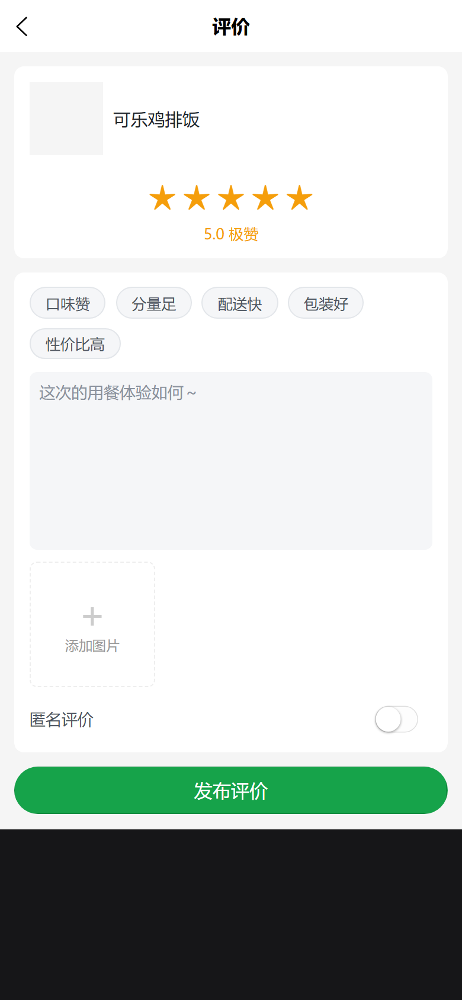

**我的评价**：「我的-我的评价」查看本人全部评价（状态徽标：审核中/已通过/未通过；展示商家回复；支持删除 = 软删，删除后评论流不可见、商品评分回落）。每笔订单每条明细仅可评价一次。

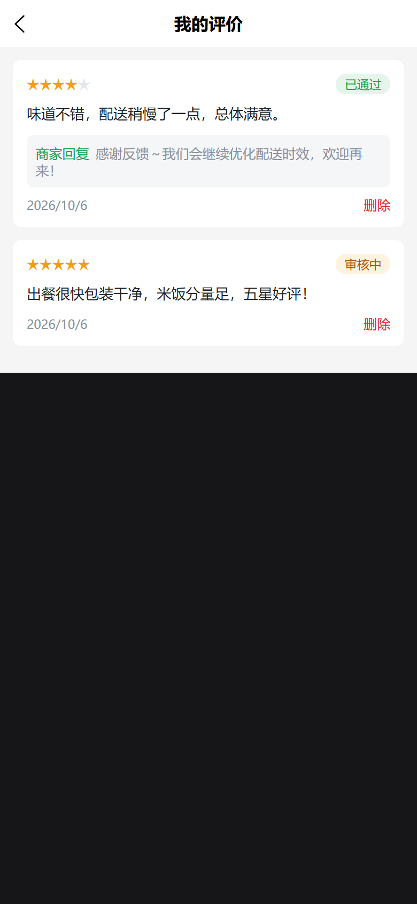

### 6.2 店铺评论 tab（menu）

店铺页「评论」tab（A 摘要卡版式）：综合评分摘要卡（大均分 + 1-5 星分布条 + 总条数 + 好评率）→ 筛选 chips（全部/有图/好评/差评）→ 评论列表（头像/昵称（匿名脱敏）、星级、内容、图片缩略（点击预览）、标签、商家回复气泡），触底自动加载更多。首次切到评论 tab 才拉取数据（首屏不浪费请求）。

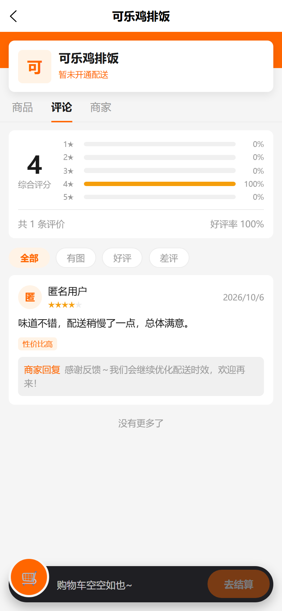

商品卡评分角标：商品有已审核评价后，商品卡显示「★ 4.8 N条评价」。

### 6.3 管理端审核（web-admin）

「单 - 评价管理」四 tab：**待审核**（默认）/ 已通过 / 已驳回 / 全部：

- **通过 / 驳回**：pending 评价可双向操作；驳回后可再改判「通过」（先审后显的唯一放行入口）；
- **回复**：已通过的主评可回复（弹窗输入），回复内容展示在 C 端评论流气泡与「我的评价」；
- 图片点击放大预览；软删评价不在列表出现。

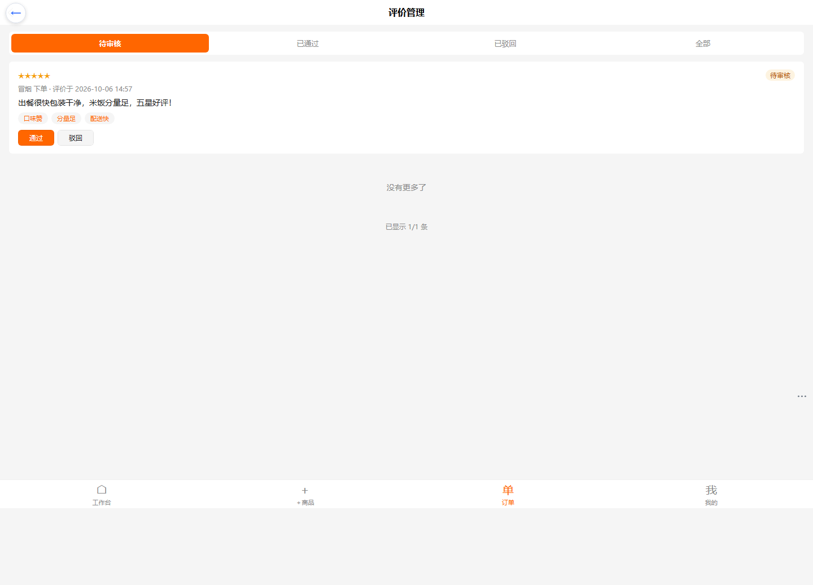
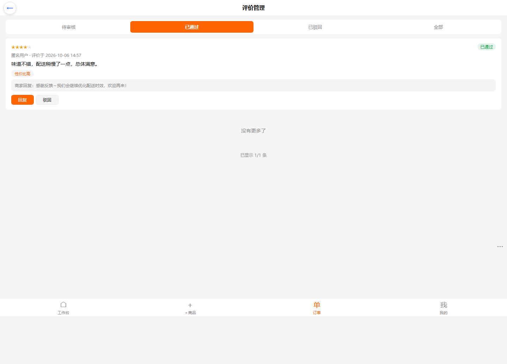

### 6.4 部署与冒烟复跑

```bash
# H5 部署（同外卖主链路，本地构建 → scp → 解压，即时生效）
node .secrets/deploy-waimai.mjs

# 生产 E2E 冒烟（24 断言：订单 Delivered → createReview pending → 双流不可见 →
# approve 可见+发奖（积分/定向券，幂等双闸）→ stats/hasImages/评分聚合 → 回复 →
# 追评（创建 pending → approve → 评论流气泡）→ myReviews → 软删回落 → 起送价还原）
node .secrets/review-e2e-verify.cjs   # 期望 REVIEW-E2E PASS，幂等可重复跑
```

冒烟走渠道 A（canteen-a-token）真实下单链路（临时调低起送价，结束自动还原 1500）；评价数据用软删收尾不留痕。


## 7. 已知限制 / 待办

- R5 载体变体（id=86）`trackInventory=false` 且已分配到店铺渠道——R5 发单购物车载体行依赖，勿回收/重开库存。
- 微信 JSAPI 支付需在生产配置商户参数后生效；当前冒烟走 COD 授权链路。
- 大厅单滞留 >5 分钟自动加急置顶；强派（T2/T3）调度已具备（DispatchJobService），默认关闭。
- 提现打款为线下转账（管理员审核通过后自行转账并标记「已打款」），无线上支付通道对接。
- 评价奖励的定向券依赖券模板 `distributionChannels` 含 `GRANT` 渠道；未配置的渠道 approve 只发积分（或均不发）。

## 8. 四期：增长闭环

上线日期：2026-10-06。设计文档：`docs/superpowers/specs/2026-10-06-phase4-growth-loop-design.md`。三个方向：骑手钱包与提现闭环、评价有礼 + 追评、经营看板增强。

### 8.1 骑手钱包与提现

**钱包（骑手端）**：「我的 → 骑手首页 → 收入卡 → 去提现」进入钱包页——余额卡（可提现大数字 + 冻结/累计收入副行）+「收入明细 / 提现记录」两个 tab（触底加载）。分成随送达实时入账（`status=credited`）。

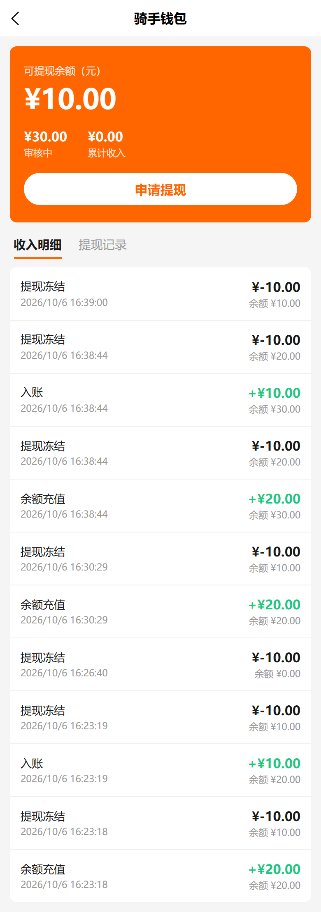

**申请提现**：金额输入（最低 ¥10，不可超可提现余额）+ 收款渠道 + 账号 → 提交后金额立即**冻结**（可提现减少、冻结增加），toast「申请已提交，等待审核」。

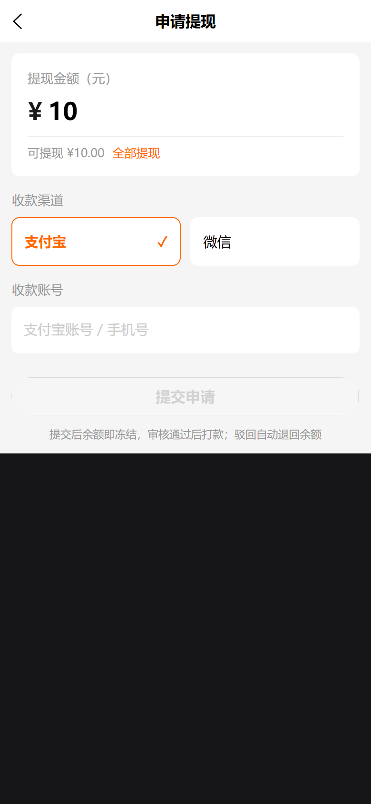
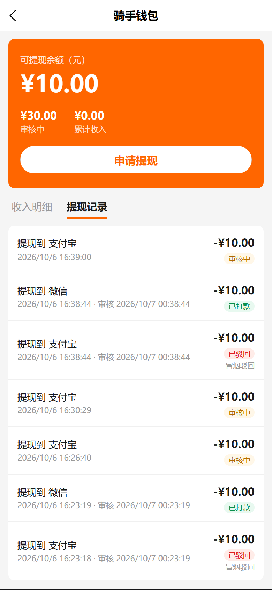

**管理员审核（web-admin）**：「单 → 提现审核」四 tab：**审核中**（默认）/ 已打款 / 已驳回 / 全部。

- **通过**：确认弹窗 → 状态置 PAID（线下已转账后操作）；
- **驳回**：填驳回原因 → 冻结金额全额退回可提现余额。

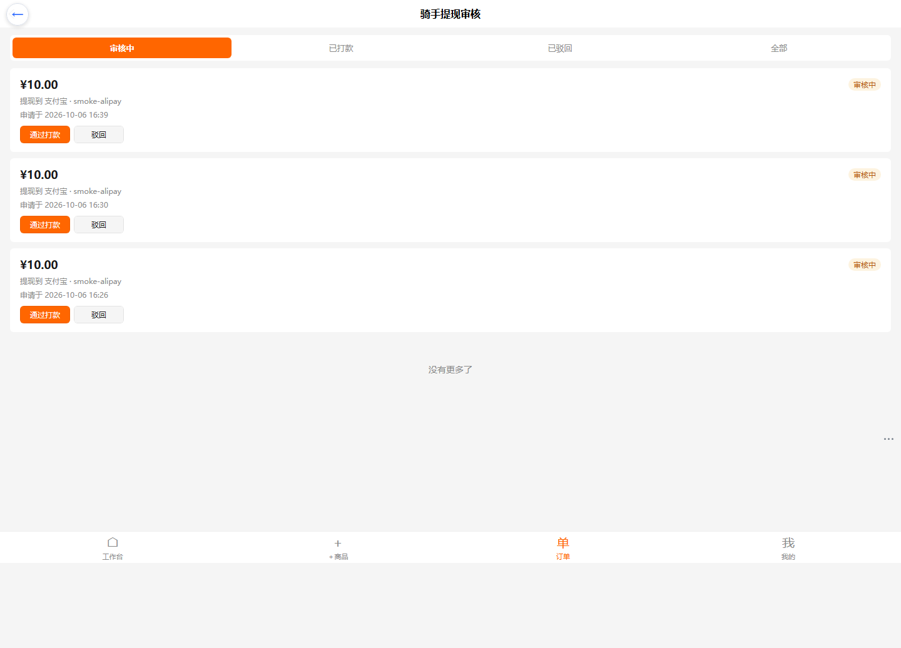

流程：`送达 → 分成入账 → 申请提现（冻结）→ 管理员通过（PAID）/ 驳回（退回）`。

E2E 冒烟（认证 → 入账 → 冻结 → 驳回退回 → 再申请 → 通过 PAID）：

```bash
node .secrets/rider-withdraw-e2e.cjs   # 期望 WITHDRAW-E2E PASS，幂等可重复跑
```

### 8.2 评价有礼 + 追评

**奖励规则**：主评**审核通过**时自动发奖（先审后显，发奖发生在放行时刻，防刷屏）：

- **积分**：渠道配置的评价奖励积分（当前 50 分），写入会员积分流水（remark 含「评价」）；
- **定向券**：渠道配置的券模板定向发放一张（模板须含 `GRANT` 发放渠道）；
- **幂等双闸**：`giftGranted` 标记 + `reviewedAt` 审核时间，重复 approve 不重复发奖；追评 approve 不发奖；未配置奖励的渠道只流转状态。

**追评**：主评通过后 **7 日内**可在「我的评价」对该订单主评**追评一次**（「追评」按钮），追评同样先审后显；通过后以气泡形式嵌在店铺评论 tab 的主评下方。已删主评不可追评，追评不允许再追评。

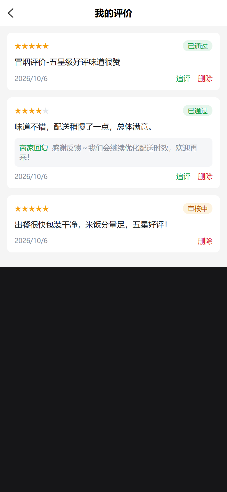
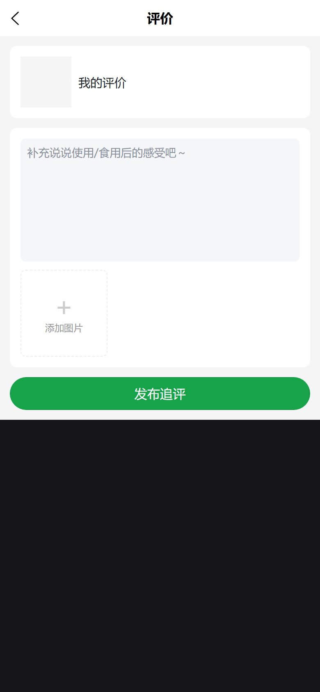
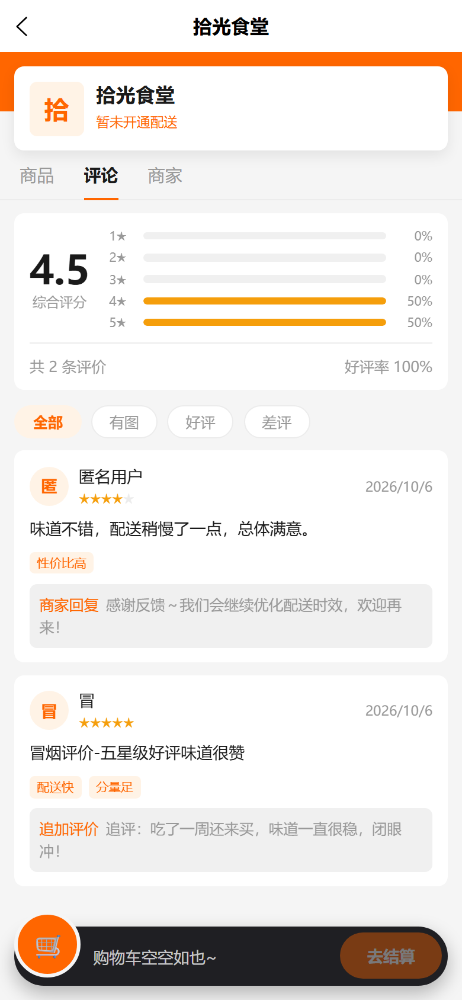

E2E 冒烟：`node .secrets/review-e2e-verify.cjs`（24/24 PASS，含发奖/幂等/追评链路，见 §6.4）。

### 8.3 经营看板增强（web-admin）

「数据 → 数据看板 → 经营数据」新增四期区块：

| 区块 | 口径 |
| --- | --- |
| 复购率 KPI | 窗口（近 7/30 天）内有效下单客户中 ≥2 单客户占比（%） |
| 评价均分 KPI | 全量已审核主评均分（不随窗口） |
| 热销商品榜 | 窗口内有效订单按商品**件数**排序 Top5，附金额 |
| 骑手效率榜 | 窗口内送达单按骑手聚合：完成单数 + 准时率（基于承诺送达时段，无时段的单不参与准时率分母） |
| 评价概览 | 均分 / 差评率（≤2 星）/ 待审核数 / 带图率 |

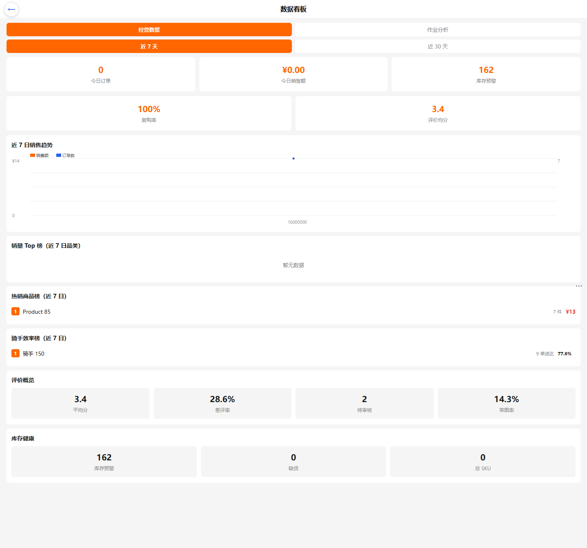

任一接口失败对应卡片显示「—」（不伪造 0）。部署：vendure 走服务器 `git pull + pm2 restart`；web-admin 走 `node scripts/deploy.mjs`（本地构建 scp）。

## 9. 个人中心（地址簿 + 资料编辑 + 发票 + 邀请）

上线日期：2026-10-07。后端为纯加法：campus-delivery-plugin customFields（Address `zoneId/buildingId/route`、Customer `avatarUrl/invoiceTitles`、Order `invoiceApplied/invoiceInfo`，物理列开机自动建）+ shop mutation `applyOrderInvoice`；前端新增 pkg-user 分包六页，地址簿复用 Vendure Address 原生 CRUD，零新实体。

### 9.1 版式 B「外卖资产区」与入口总览

我的 tab 自上而下：**橙头部**（头像圆 + 昵称 + 电话/「未绑定电话」+ 编辑资料入口；未登录显示「点击登录」）→ **资产区四宫格**（优惠券·即将上线灰态 / 常用地址 / 发票抬头 / 邀请好友）→ **订单四态快捷条**（待付款 / 待送达 / 待评价 / 退款售后，跳订单列表带状态筛选）→ **菜单组**（我的评价 / 我的跑腿单 / 联系客服 / 关于拾光达 / 成为传信者）→ 退出登录。

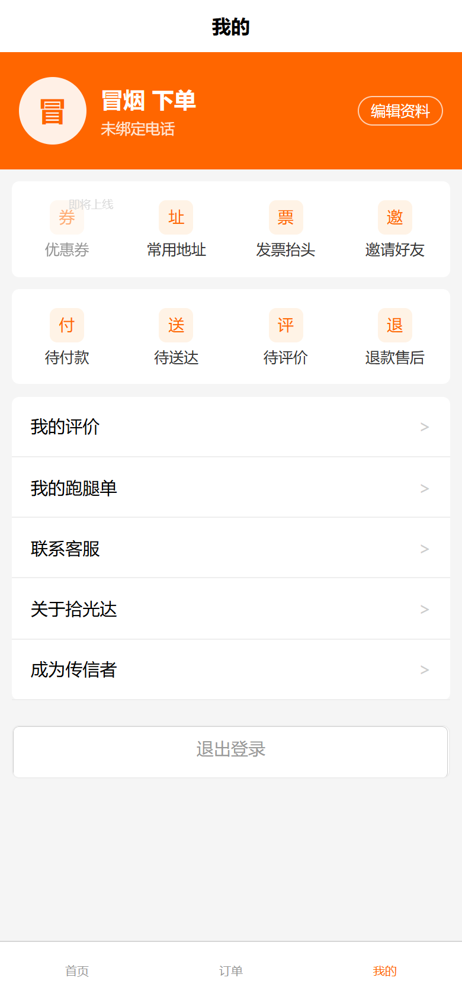

### 9.2 常用地址（下单自动带出）

「资产区 → 常用地址」进入地址簿，底部「新增地址」：

- **字段**：联系人（必填）、手机号（11 位校验）、分区 → 楼栋级联单选（数据源与下单页同源）、房号（选填，拼入楼栋明细）、存为默认地址开关；
- **列表操作**：点击进编辑、右侧「删除」（二次确认）、「设为默认」；默认地址带橙色「默认」徽标；
- **失效地址**：分区/楼栋被删除或停用后，地址置灰标「**待更新**」，不可设默认、不可供下单选用，仅可进编辑页修正（跨店铺的脏数据同理不生效）；
- **下单联动**：checkout 进入时若默认地址的分区/楼栋命中当前店铺配置，自动预选分区与楼栋（**送达时段不预存，仍需手选**），分区选择区上方显示默认地址摘要行，可点击改选。

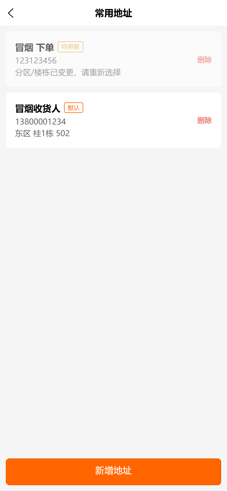

### 9.3 资料编辑

橙头部「编辑资料」进入：头像（点击换图，走既有上传通道）+ 昵称 + 电话，保存后返回即刷新。未上传头像时回显 SSO 头像/首字占位。

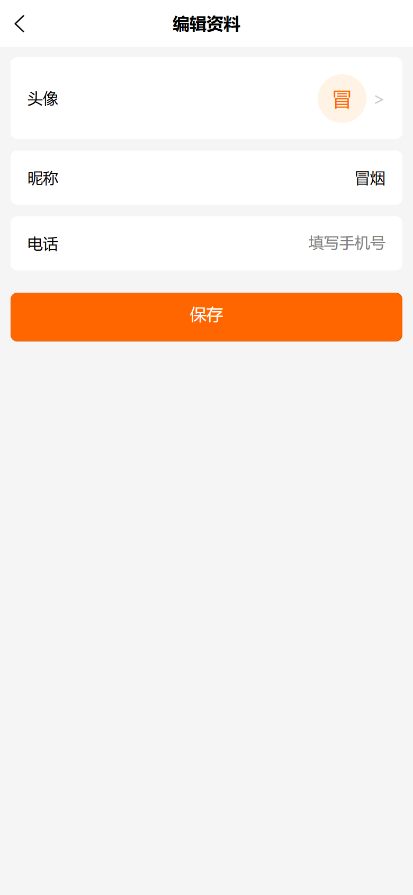

### 9.4 发票（抬头管理 + 订单开票申请）

- **抬头管理**：「资产区 → 发票抬头」，最多 **5 条**（超限前端拦截）；个人抬头必填名称+邮箱，企业抬头另需税号（15-20 位字母数字校验）；数组首位为默认。
- **订单开票**：订单详情页对**已支付且未申请过**的订单显示「开发票」按钮 → 底部弹层选抬头 + 接收邮箱（默认带抬头邮箱）→ 提交后按钮区转为「已提交开票申请」只读条（展示抬头快照摘要）。幂等：`invoiceApplied` 闸防重复申请，商家线下人工开票（B 端本期不流转）。

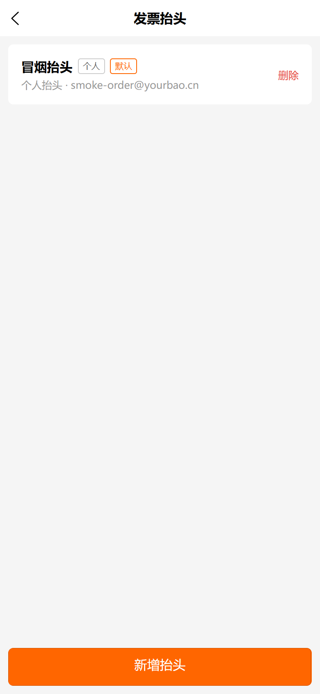

### 9.5 邀请好友与关于

- **邀请好友**：展示当前用户邀请码（SSO 侧生成写入）大字号卡片，「复制邀请链接」拼 `?invite_code=<码>` 复制分享；
- **关于拾光达**：版本号 + 客服电话（`VITE_SERVICE_PHONE` 环境变量，当前待运营提供，未配置显示「未配置」）+ 用户协议 / 隐私政策。


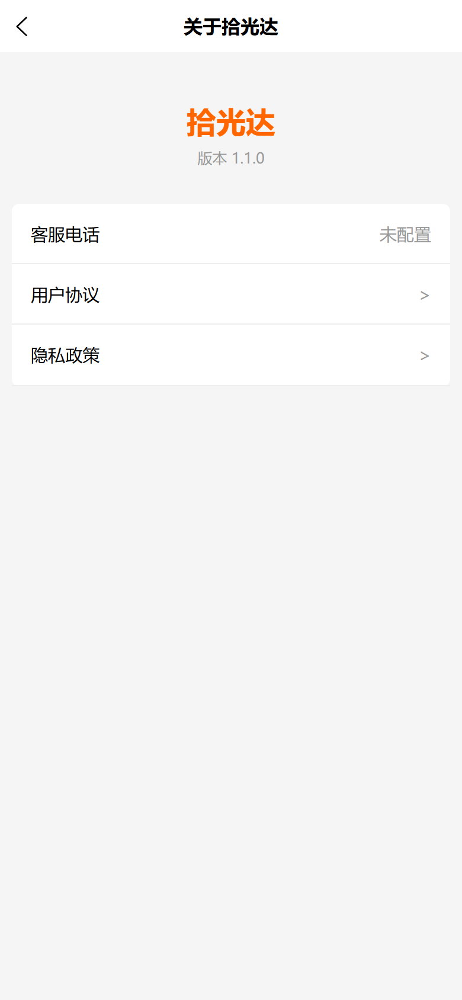

暗色主题下个人中心保持固定浅色版式（品牌橙头部不变，无样式破碎）：


### 9.6 冒烟复跑

```bash
python scripts/_smoke_profile.py   # waimai 仓库根执行，期望 E2E SMOKE PASS (10/10)，幂等可重复跑
```

覆盖：登录 → campusZones/Buildings → 地址创建（customFields 落库）→ 地址簿默认徽标渲染 → 发票抬头 JSON 写回 → 邀请码注入与页面渲染 → 已支付订单 `applyOrderInvoice` 首调成功（或幂等已申请）→ 重复申请被拒 `INVOICE_ALREADY_APPLIED` → 七张 390×844 dpr=2 截图。

已知限制：客服电话待运营提供后填 `.env.production` / `.env.development` 重新部署；发票为轻量版，B 端流转 / 第三方自动开票不在本期。

## 10. 优惠券（券 C 端闭环）

上线日期：2026-10-07。学生端全链路：领券中心领券 → 券包管理 → 下单自动试挂最优 → 支付核销。

### 10.1 功能入口与学生操作流

- **领券中心**：个人中心「资产区 → 优惠券」进入券包，点「去领券中心」；或券包页内直达。两个 tab：
  - **可领取**：已开始的券模板，点「立即领取」即入券包（每张券每人限领 1 张，重复领取被拦截 toast）；
  - **即将开始**：未开始的券模板（`couponCentreUpcoming`），可提前浏览、到点领取。
- **我的券包**：三个 tab——未使用（可「去使用」直达领券中心关联商品）/ 已使用 / 已过期，空态均有引导按钮。
- **商品专属券 chip**：店铺菜单页已绑券的商品行显示「领取」chip（商品维度专属券，与通用券分开展示），点击即领。
- **下单选券**：checkout 页「优惠券」行自动**试挂当前最优可用券**（无可用券显示默认文案）；点行弹选券弹层——可用券（勾选切换）/ 不可用券（灰态 + 原因：未达门槛等）；支持换券 / 不使用。
- **核销链路**：领取 UNUSED → 支付成功自动核销 USED → 角标 -1；退款 RETURNED；到期 EXPIRED。

**券优惠口径**（以 `coupon-promotion-condition.ts` 为唯一权威）：折扣券按折数（`discountValue=85` 即 8.5 折），优惠 = 商品小计 × (100−折数)/100；免邮券优惠 = 配送费；固定/满减券优惠 = min(面额， 商品小计)；门槛按**商品小计**判断（不含运费）。

### 10.2 截图

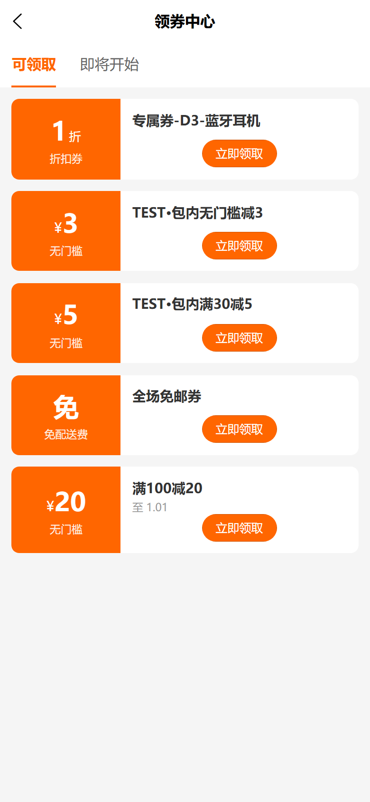
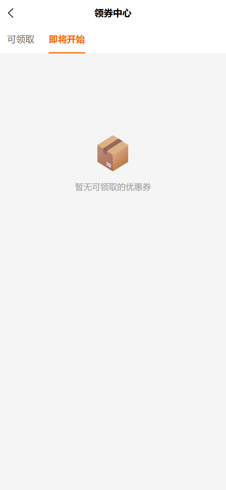
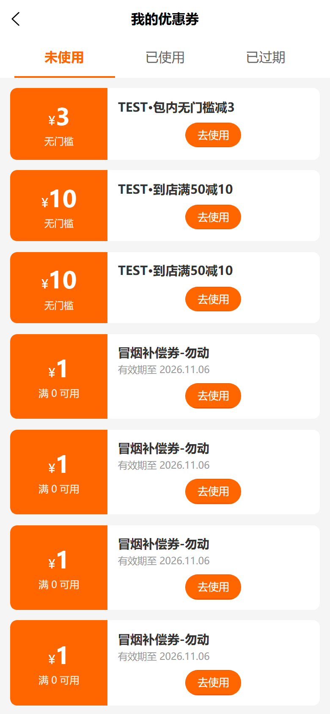
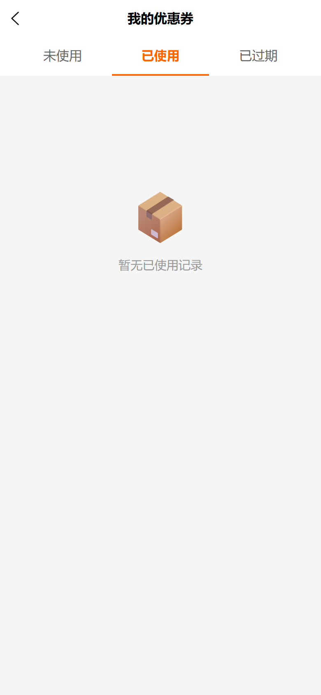
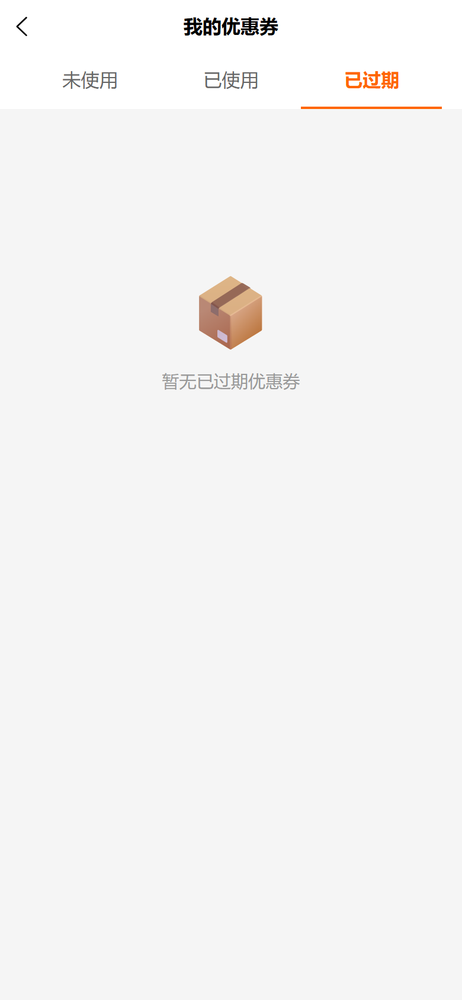
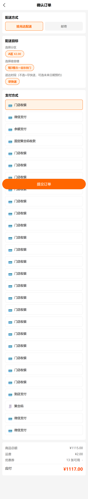
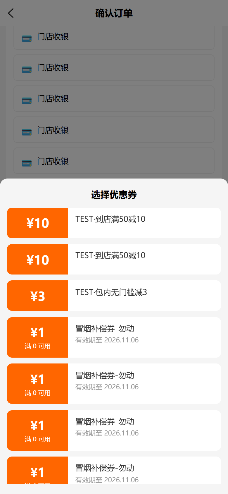
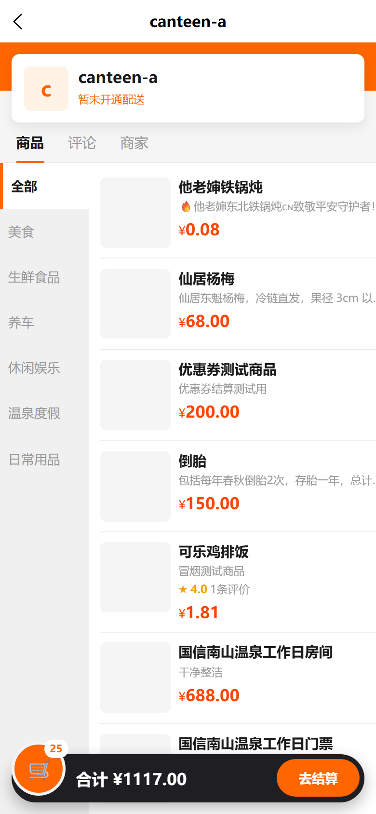
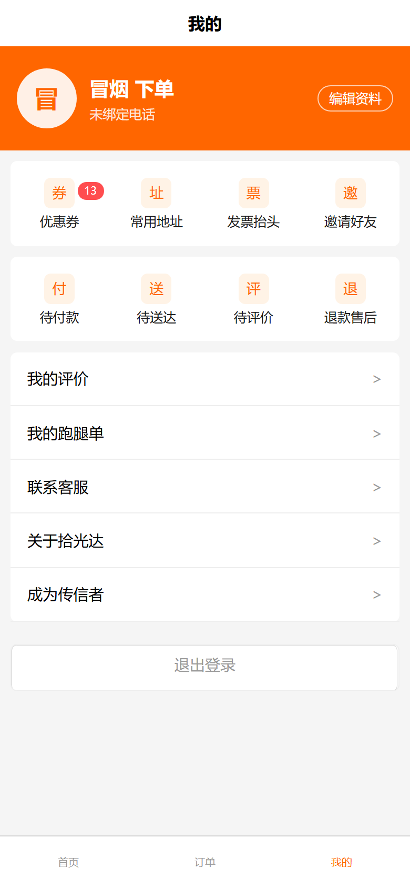

### 10.3 冒烟复跑

```bash
python scripts/_smoke_coupon.py   # waimai 仓库根执行，期望 E2E SMOKE PASS，幂等可重复跑
```

覆盖：登录 → 券中心双 tab → 券包三 tab → checkout 自动试挂 + 选券弹层 → 菜单 chip → profile 角标 → 清理购物车。生产冒烟（只领不下单）可用环境变量覆写 `SMOKE_BASE` / `SMOKE_CHANNEL` 跑同脚本。

## 11. 订单通知（微信公众号模板消息）

上线日期：2026-10-07。campus-notify 加法扩展：订单域 4 事件模板推送 + 待付款提醒/超时取消定时任务。

### 11.1 推送事件一览

| 事件 | 触发时机 | 说明 |
|------|----------|------|
| 下单成功 orderPlaced | 订单支付成功（转入 PaymentSettled/授权完成） | 推送店铺确认信息 |
| 待付款提醒 paymentPending | 订单停在待支付 **+10 分钟** | 定时任务扫描触发，提醒尽快支付 |
| 取消通知 orderCancelled | 商家/系统/超时取消订单 | **用户本人主动取消不推**（避免打扰） |
| 售后进度 afterSales | 售后审核通过 Approved / 已退款 Refunded / 退款失败 RefundFailed 三节点 | 其余售后状态不推 |

- **落地页跳转**：消息点击跳转 H5——由 campus 配置的 `h5BaseUrl` 拼接订单/售后详情路径（禁硬编码域名）。
- **待付款超时取消**：+15 分钟未支付自动取消（先释放库存分配再取消，到点复查订单状态，非待支付则幂等跳过；与既有 30 分钟 OrderTimeoutPlugin 共存，先到先得）。取消同样触发「取消通知」。
- **静默跳过**：用户无 openid、渠道未配置对应模板 ID 时静默跳过，不报错不重试。

### 11.2 运维配置（**上线必做**）

1. **微信公众号申领模板**：在公众号后台「广告与服务 → 模板消息」申领 4 个订单类模板，拿到 4 个模板 ID：
   - 下单成功通知 / 待付款提醒 / 订单取消通知 / 售后进度通知；
2. **web-admin 填配置**：登录 `https://e.joho.cn` → 校园配送 → 店铺配置页，每个店铺渠道填：
   - 4 个新模板 ID（下单成功 / 待付款提醒 / 取消通知 / 售后进度）——与既有 5 个模板字段（接单/骑手接单/出餐完成/送达/异常处理）并列；
   - `h5BaseUrl`（H5 站点域名，如 `https://www.yourbao.cn/waimai/index.html`）；
3. **验证**：配置后下一笔真实订单即走推送；也可用 pm2 日志关键字 `CampusNotify` / `PaymentTimeout` 观察发送调用（未配置模板时日志为静默跳过）。

