# waimai 外卖（校园配送 + 骑手端）操作手册

上线日期：2026-10-06 ｜ H5 站点：**https://www.yourbao.cn/waimai/**
后端：Vendure（campus-delivery-plugin）｜ 验证：e2e 冒烟 S1-S8 全 PASS（见 `docs/verify/2026-10-waimai-e2e.md`）

## 1. 学生点单流程（五步）

| 步骤 | 页面 | 操作 |
| --- | --- | --- |
| ① 选店铺 | 首页 | 搜索或点店铺卡（商家自送 + 校内骑手接力，满20减4） |
| ② 点餐 | 店铺菜单 | 左侧分类选菜，右侧「+」加购 |
| ③ 结算 | 确认订单 | 选配送方式（校园配送）→ 分区（东区 ¥2.00）→ 宿舍楼 → 送达时段 → 支付方式 → 提交订单 |
| ④ 支付 | — | 到店支付（COD）/ 微信 JSAPI（生产配置后生效） |
| ⑤ 跟踪 | 订单跟踪 | 配送进度四步：商家接单 → 骑手取餐 → 配送中 → 已送达；可申请售后 / 再来一单 |

### 学生端截图


## 2. 骑手流程（入驻 → 接单 → 配送 → 送达）

| 步骤 | 页面 | 操作 |
| --- | --- | --- |
| ① 入驻 | 我的 → 骑手入驻 | 填真实姓名/学号/校区（+学生证照片选填）提交，管理员审核（一般 1 个工作日）。已通过则直接进大厅 |
| ② 接单大厅 | 骑手首页 | 打开「接单中」开关上线；大厅实时出单（跨店铺聚合，加急置顶、小费降序），点击抢单 |
| ③ 到店取货 | 配送中 | 到店后点「我已到店 · 开始取货」；未取货可转单 |
| ④ 送达 | 配送中 | 点「我已送达（拍照存证）」拍照提交 → 已送达 ✓ 分成实时入账 |
| ⑤ 异常/转单 | 配送中 | 已取货转单需拍照交接；联系不上学生走「异常上报」平台介入 |

骑手信用分规则：初始 100，送达 +2；拒单/超时未抢扣分；**低于 60 禁止抢单**（大厅可见但 grab 报 FORBIDDEN）。

### 骑手端截图


## 3. 管理员操作入口

| 事项 | 入口 |
| --- | --- |
| 骑手审核 | Vendure 管理台 → 客户 → 找到申请人 → customFields `riderStatus` 置 `approved`（或 GraphQL `campusSetRiderStatus(customerId, status)`，需 CampusAuditRider 权限） |
| 信用分调整 | admin-api `updateCustomer(input: { id, customFields: { riderCredit } })`（无专用界面） |
| 订单干预 | 管理台订单：cancelOrder / transitionOrderToState / settlePayment |
| 店铺上下架/暂停 | 渠道 customFields（waimaiStoreList 读 paused/promoText） |
| 造数（测试环境） | `node docs/verify/waimai-e2e-prepare.cjs`（幂等：店铺渠道/校区/时段/冒烟商品/账号） |

## 4. 部署与冒烟复跑

```bash
# H5 部署（本地构建 → scp → 服务器解压，绝不在服务器构建）
node d:\zhao\waimai\.secrets\deploy-waimai.mjs

# 生产冒烟（期望 E2E SMOKE PASS，幂等可重复跑；脚本会临时调低起送价并在结束时自动还原）
node d:\zhao\vshop\docs\verify\waimai-e2e-smoke.cjs
```

- 部署产物落点：服务器 `/opt/1panel/apps/openresty/openresty/www/sites/e.joho.cn/yourbao/waimai/`（容器内路径 `/www/sites/...`），静态替换即时生效无需 reload。
- nginx conf：`conf.d/www.yourbao.cn.conf`（改前备份 `.bak_waimai_20261006`）。
- 冒烟账号：`smoke-order@yourbao.cn` / `smoke-rider@yourbao.cn`（Wm@Smoke123）。

## 5. 校园配送二期（R2/R4/R5 + 起送价硬校验）

上线日期：2026-10-06。设计文档：`docs/superpowers/specs/2026-10-06-campus-delivery-phase2-design.md`。

### 5.1 路线速查（全端统一标准语句）

| 码 | 名称 | 说明 |
| --- | --- | --- |
| R1 | 商家自送+拾光达接力 | 商家送至校门口，拾光传信者接力送到手 |
| R2 | 快递到校+拾光达接力 | 快递到校后，拾光传信者代取并送达 |
| R3 | 档口+拾光达接力 | 档口现做，拾光传信者送至楼层 |
| R4 | 到店自取 | 凭取件码到店自取 |
| R5 | 校内拾光达 | 拾光传信者按下单需求跑腿代办 |

### 5.2 新增功能一览

| 功能 | 入口 | 说明 |
| --- | --- | --- |
| R5 校内拾光达（跑腿单） | 首页「校内拾光达」入口卡 → 发单页 | 服务类型（代取快递/带饭/帮买/其他）+ 起止点 + 物品描述 + 跑腿费（起步价可配）+ 小费滑杆；支付后自动进接单大厅 |
| 我的跑腿单 | 发单页右上「我的跑腿单」 | 跑腿单列表与状态跟踪 |
| R2 快递到校 | checkout 校园配送 tab 选 R2 | 快递段运费按商家标准；校内接力段 ¥0（接力费在发接力单时单独付） |
| R2 已到校确认 | R2 订单详情 | 快递到校后点「快递已到校」（二次确认，不可撤销）→ 自取或发接力 |
| R2 接力子卡 | R2 原单详情 | 实时反查关联 R5 接力单状态（接力中/已接单/已退款），退款后可重发 |
| R4 到店自取 | checkout「到店自取」 | 自提点=店铺地址；订单详情显示核销码，到店出示核销或自助核销 |
| 起送价硬校验 | 下单时（后端拦截） | 商品金额（含税）未达店铺起送价时拦截，提示「未满起送价 ¥X」；R5 跑腿单豁免 |

### 5.3 R2 学生操作流（快递到校）

```
checkout 选 R2 下单支付 → 等快递到校（订单卡显示「快递配送中」）
  → 点「快递已到校」→ 二次确认（确认后不可撤销）
  → 选择取件方式：
     ① 我去自取：凭取件通知到校内代收点自取，取到后「确认收货」完成订单
     ② 发 R5 接力：跳转发单页（自动预填 A 点=校内代收点、B 点=默认宿舍楼），
        支付接力费后进大厅等传信者代取送达
```

- 接力单退款语义：**只退接力单的跑腿费+小费，R2 原单不退**（快递已到校）；接力失败自动降级为自取，原单回到「请选择取件方式」可再次发接力。
- 确认到校为不可撤销操作，误触请走客服人工。

### 5.4 R5 发单流（校内拾光达）

首页点「校内拾光达」→ 发单页：选服务类型 → 填 A 点（取）/ B 点（送）→ 物品描述 → 跑腿费（不低于起步价）+ 小费（可选）→ 提交支付。运力紧张时提示「当前运力紧张，接单可能延迟」但不阻断发单；入厅后订单卡显示「平台调度中」，滞留超时自动加急置顶 → 强派 → 调度看板人工介入 → 自动退款（T0-T4 降级链路）。

### 5.5 后台配置项（web-admin 拾光达配置页）

| 配置 | 字段 | 说明 |
| --- | --- | --- |
| 跑腿起步价 | `errandBaseFee`（元输入，分存储） | R5 发单页跑腿费下限；未配置默认 ¥2 |
| 起送价 | `minOrderAmount`（分） | 商品单下单硬校验（含税口径）；留空=不校验；R5 跑腿单不受限 |
| 店铺地址 | `storeAddress` | 保存时自动绑定该店为 R4 自提点（名称=店铺名）；清空不影响已有自提点 |
| 启用路线 | `routesEnabled` | 勾选后 checkout 才显示对应路线选项 |
| R4 前置（Vendure 管理台） | — | 渠道需绑定 `store-pickup` 运费方式；商品变体配送档案需含 store-pickup。**推荐直接点配置页「初始化配送档案」按钮**（见 5.8） |

### 5.6 二期截图

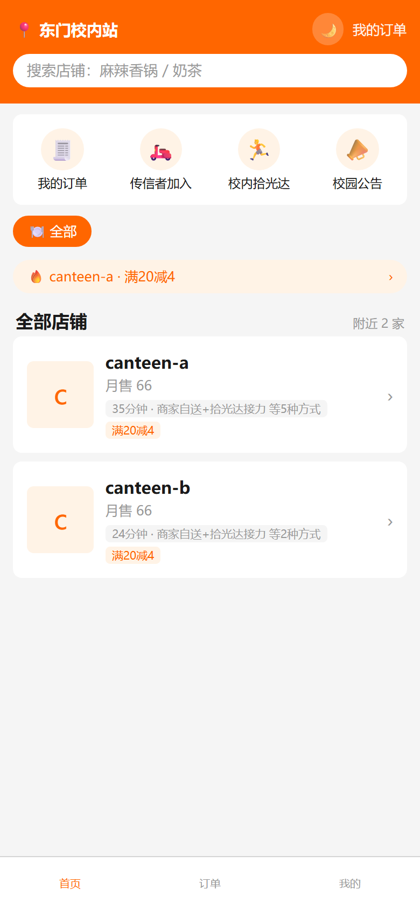
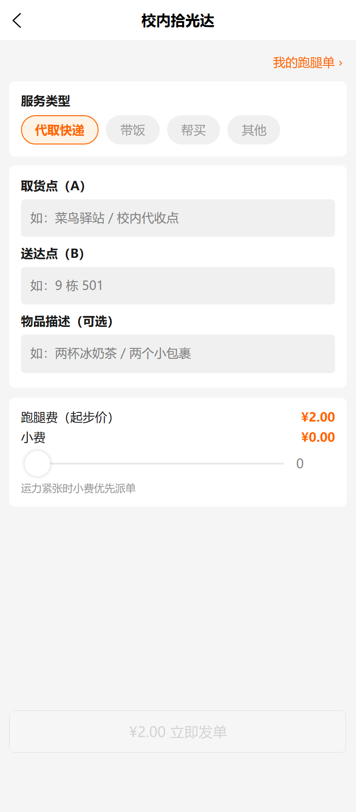
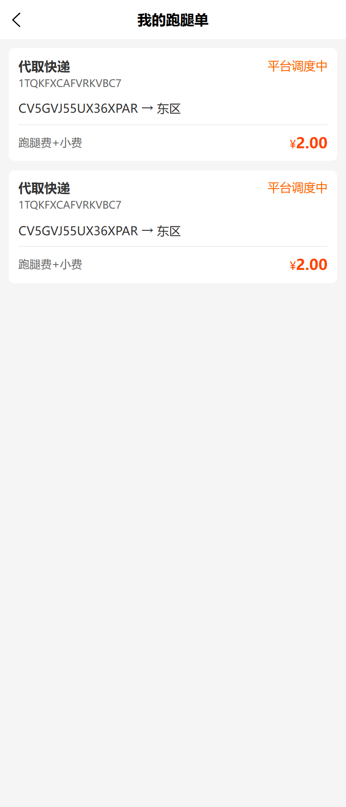
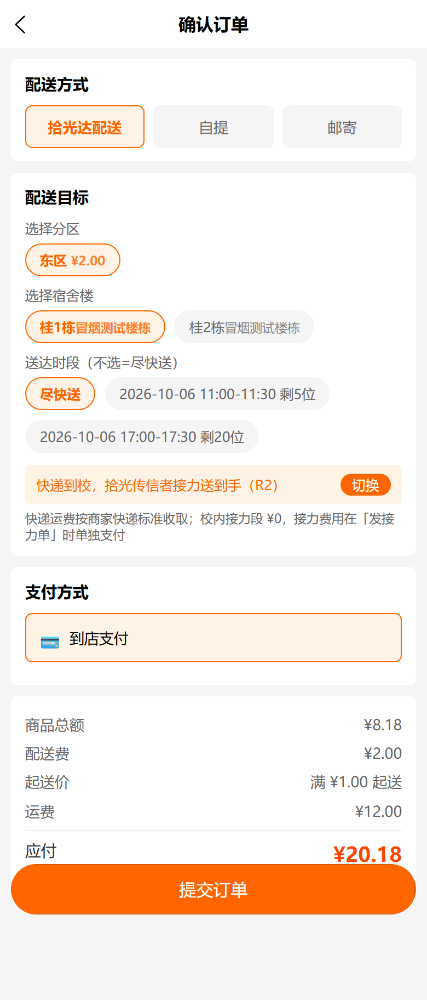
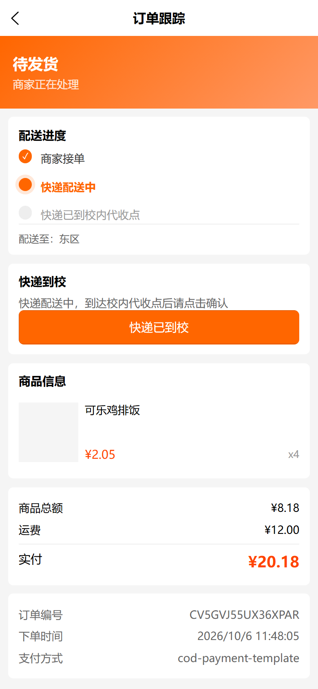
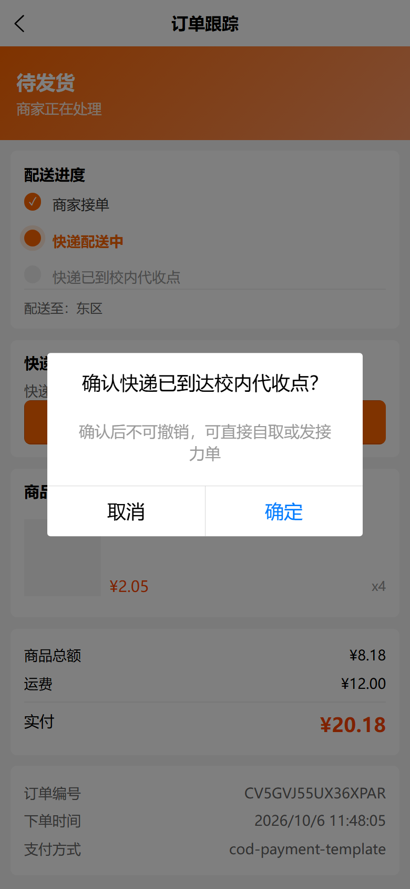
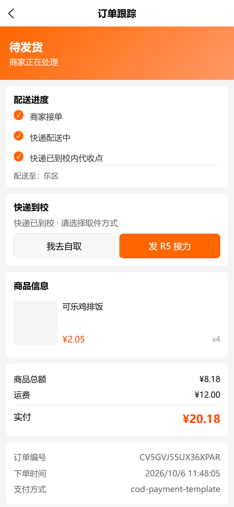
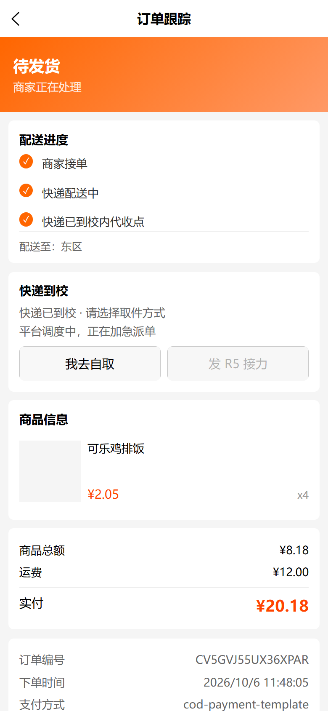
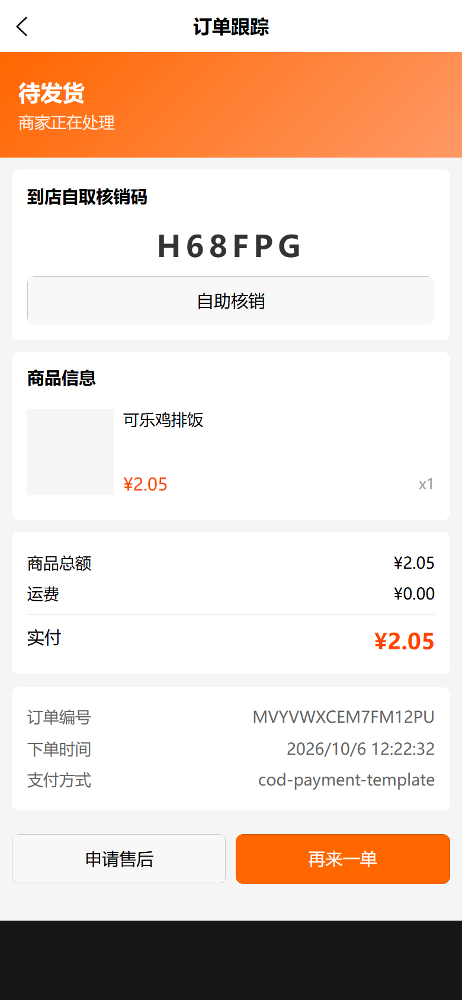
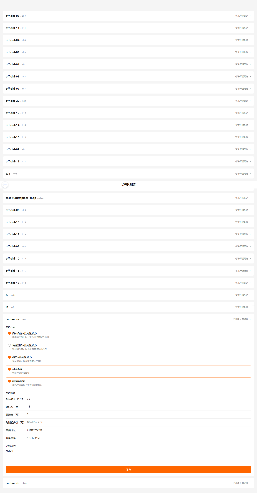

### 5.7 常见问题

- **接力单退款了，我的快递单钱退吗？** 不退。退款只退接力单的跑腿费+小费，快递原单照常（快递已到校），可在原单重新发接力或自取。
- **起送价按什么算？** 按商品含税金额（页面所见金额）；不含配送费。跑腿单（R5）不校验起送价。
- **「快递已到校」点错了怎么办？** 确认后不可撤销，联系客服人工处理。
- **R5 发单后没人接？** 走平台降级保护：5 分钟加急置顶 → 超时强派 → 调度人工介入 → 最终自动退款，无需手动催单。
- **R4 核销码找不到了？** 订单详情页随时可查，码一生对一单、已核销会显示「已核销」。

### 5.8 配送档案初始化（R2/R4 共用档案，三期）

R2（快递到校）与 R4（到店自取）依赖同一变体档案出配送方式（cjk 分箱按变体 `shippingProfileId` 单值分箱）。拾光达配置页每张店铺卡底部提供**「初始化配送档案」**按钮：

- 点击后自动 **get-or-create** 该渠道租户默认档案「拾光达默认配送档案」，合并 `store-pickup` + `courier-delivery` 两种方式（union 补齐，不删已有绑定），并把两种方式幂等绑定到渠道；
- 渠道内**未绑定档案的商品变体**自动补绑到该默认档案（已显式绑定的变体不触碰）；
- **幂等**，可重复点击；结果弹窗展示已绑定方式与补绑商品数；缺少方式时提示对应路线暂不可用。

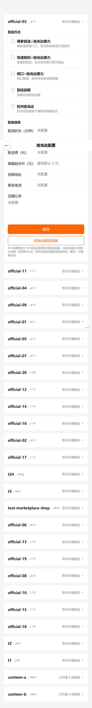
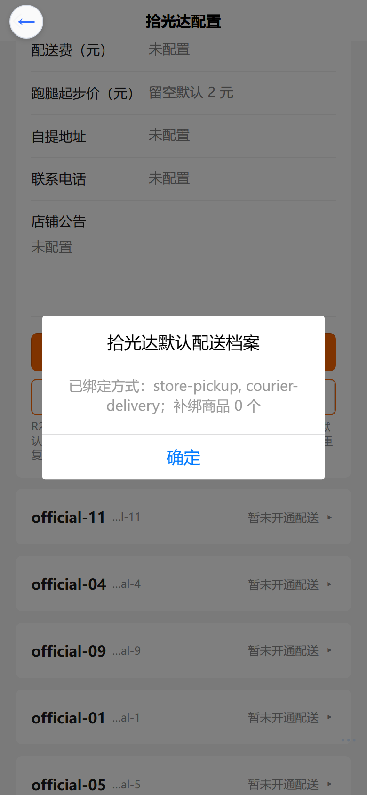


## 6. 已知限制 / 待办

- 骑手收入页提现功能二期开放（分成随送达实时入账 `status=credited`）。
- R5 载体变体（id=86）`trackInventory=false` 且已分配到店铺渠道——R5 发单购物车载体行依赖，勿回收/重开库存。
- 微信 JSAPI 支付需在生产配置商户参数后生效；当前冒烟走 COD 授权链路。
- 大厅单滞留 >5 分钟自动加急置顶；强派（T2/T3）调度已具备（DispatchJobService），默认关闭。
- 0 分成单（shipping=0 且 tip=0）送达会写库成功但 addBalance 抛错（不影响状态流转，真实跑腿单不触发）。
