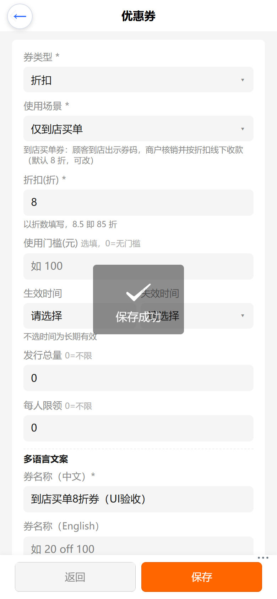
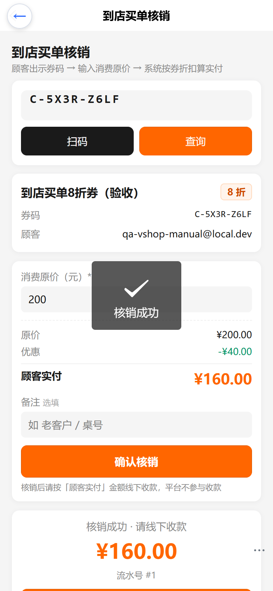
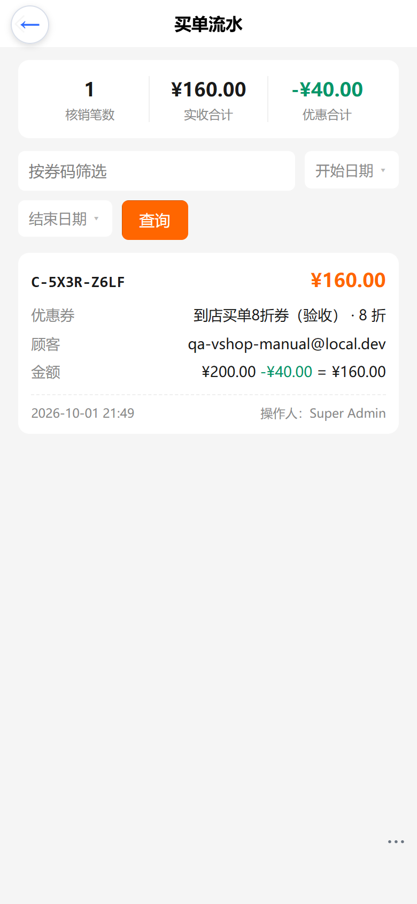
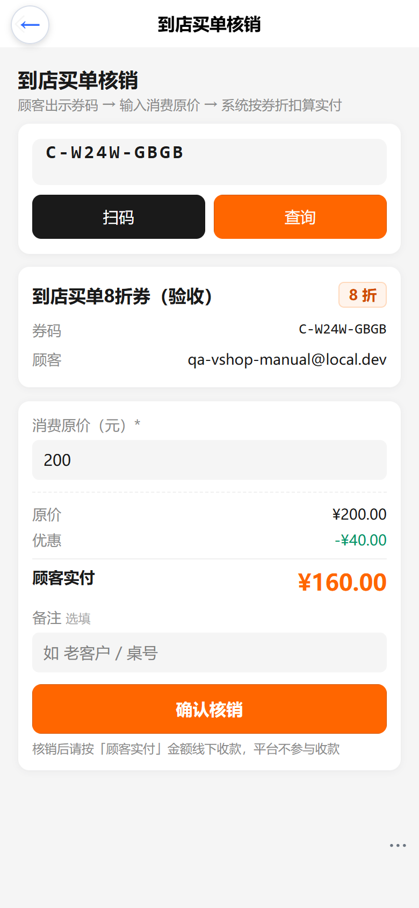
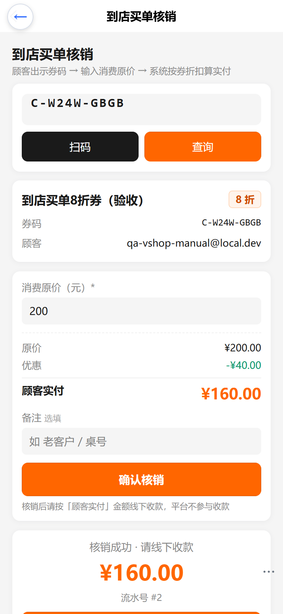
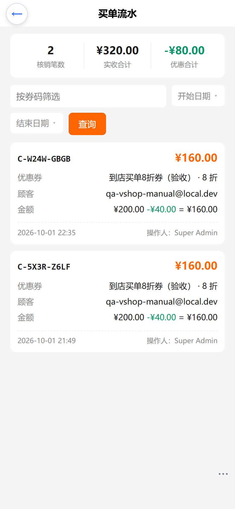

# 到店买单（商户端）操作手册

## 功能说明
平台不收款，仅为商家引流。顾客领取「到店买单券」→ 到店出示券码 → 商户核销并按券折扣算实付 → 商户线下收款 → 记录买单流水。

## 前置：新建到店买单券（优惠券编辑页）
1. 进入「营销 → 优惠券 → 新建」
2. 名称/类型（满减或折扣）/折扣值（折扣券填 80 表示 8 折）/最低消费/有效期/总量按需填写
3. **使用场景**选「到店买单」（或「通用」）
4. 保存

## 核销流程（买单核销页）
1. 进入「到店买单 → 买单核销」
2. 输入或扫描顾客券码 → 点「查询」，出现券信息卡（券名/折扣/顾客/有效期/门槛）
3. 输入顾客**消费原价**（元）→ 实时显示「优惠」与「顾客实付」
4. 核对无误 → 点「确认核销」→ 二次确认 → 核销成功
5. 按「顾客实付」金额**线下收款**

## 流水查询（买单流水页）
- 顶部汇总：核销笔数 / 实收合计 / 优惠合计
- 可按券码、日期区间筛选
- 每条流水含：券码、券名与折扣、顾客、原价/优惠/实付、备注、操作人、时间

## 常见问题
- 「该券不支持到店买单」：券模板使用场景为「仅线上」
- 「该券不属于当前门店」：券为其他租户/渠道发放
- 「未达到该券使用门槛」：消费原价低于最低消费

## 线上验收截图
线上环境（e.joho.cn/guanli）实测：核销一张到店买单券（原价 ¥200，8 折后优惠 ¥40、实付 ¥160），并在流水页可查到该笔。

