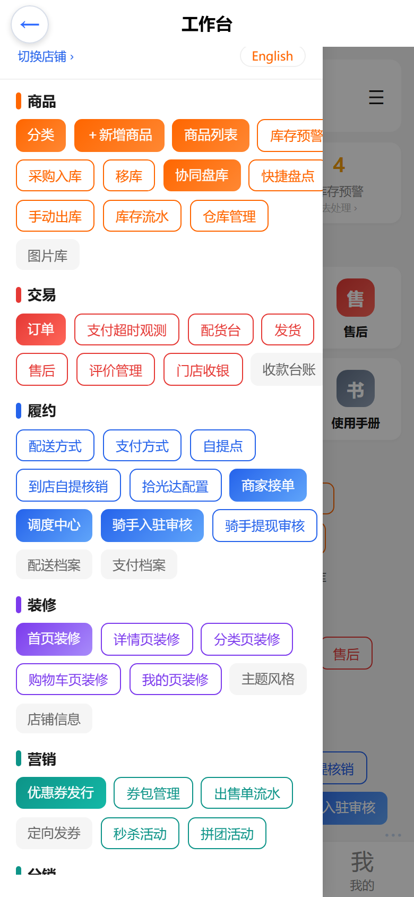
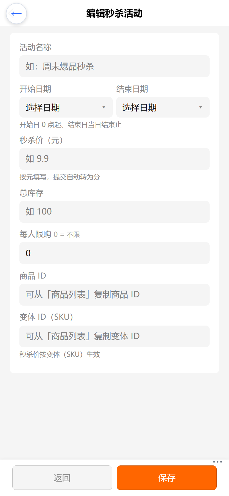
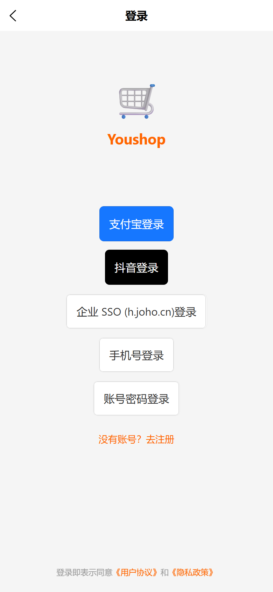
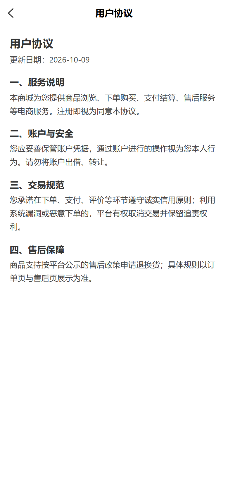
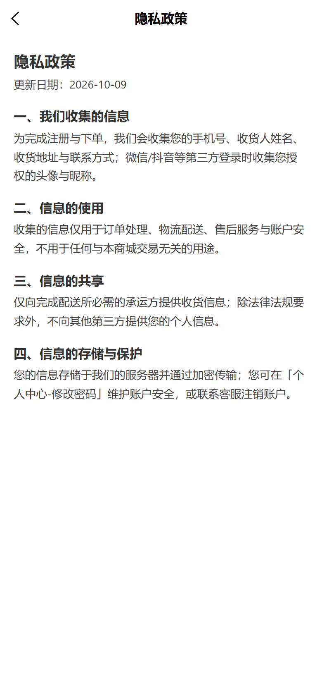
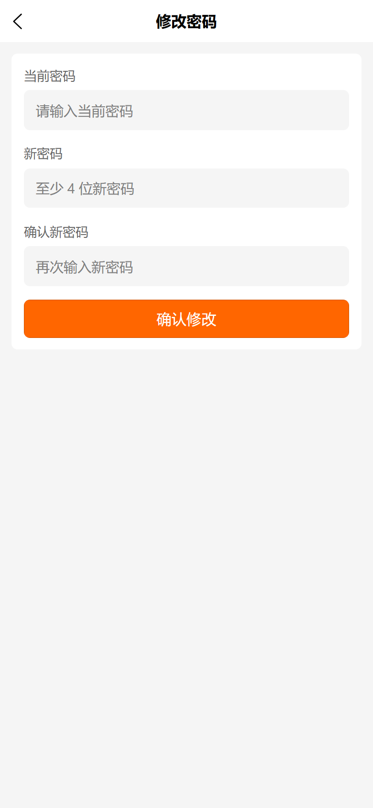
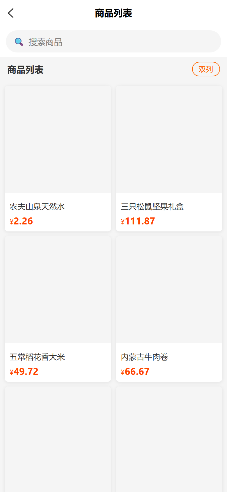
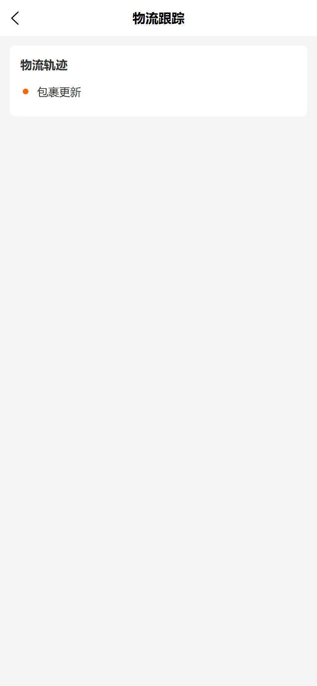
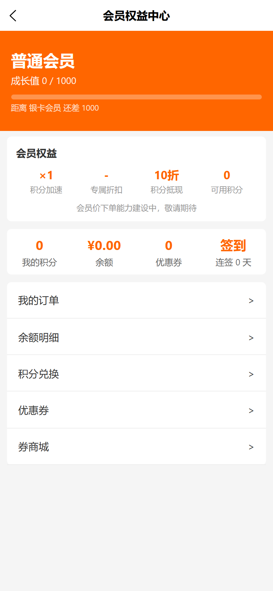

# usemall→vshop 批次 1 补齐：操作手册与截图

> 生成日期：2026-10-09 ｜ 视口规范：Playwright 移动端 **390×844、deviceScaleFactor=2**（实际 780×1688 像素）
> 截图环境：本地 dev-server（`http://localhost:3000`，DEV_BYPASS_SMS=true）+ C 端 `npm run dev:h5`（5180）+ web-admin `scripts/serve-h5.mjs`（5280，`/admin-api` 代理 3000）。全部为本地真实取数截图，无生产写操作。

---

## 一、批次 1 范围总览

| # | 功能 | 端 | 入口路径 | 关键后端能力（既有） |
|---|------|----|----------|----------------------|
| F01 | 物流轨迹页 | C 端 | 订单详情 →「查看物流」→ `/pkg-user/pages/logistics?orderId=<id>` | shop-api `myOrderPackages` / `myOrderTracks`（logistics-plugin） |
| F10a | 修改密码页 | C 端 | 个人中心 →「修改密码」→ `/pkg-user/pages/change-password` | shop-api `updateCustomerPassword` |
| F10b | 用户协议 / 隐私政策页 | C 端 | 登录页底部《用户协议》《隐私政策》链接 → `/pkg-user/pages/agreement?type=user\|privacy` | 无（前端静态文案单页双模式） |
| F15 | 商品列表瀑布流版式 | C 端 | 商品列表页右上角「瀑布流 / 双列」切换 → `/pkg-product/pages/list` | core `search`（纯前端版式，偏好记忆于本地存储 `product_list_view_mode`） |
| F17 | 会员中心权益卡 | C 端 | `/pkg-user/pages/member-center` 等级卡下方「会员权益」卡 | shop-api `myTier`（member-level-plugin） |
| F23 | 秒杀 / 拼团活动管理 | web-admin | 工作台 ☰ → 营销组 →「秒杀活动」「拼团活动」 | admin-api `flashSaleActivities` / `groupBuyActivities` CRUD（flash-sale-plugin / group-buy-plugin） |

对应提交：`411b040`（F01）、`4fcc015`（F10a）、`9ae5848`（F10b）、`69b1668`（F15）、`5c5e713`（F17）、`96e5ec0`（F23）。

---

## 二、web-admin：创建秒杀 / 拼团活动全流程

### 2.1 登录与进菜单

1. 打开手机后台（生产 `https://e.joho.cn/guanli/`，本地预览 `http://localhost:5280/guanli/`），输入管理员账号密码登录。
2. 多店账号登录后进入「选择店铺」页，点选目标店铺（活动数据**按渠道隔离**，店铺切错会看不到其他店的活动）。
3. 进入工作台后点右上角 **☰** 打开菜单抽屉，**营销** 分组下即有本次新增的「秒杀活动」「拼团活动」两项：

### 2.2 创建秒杀活动

1. 营销组 →「秒杀活动」进入列表页（含状态徽章 进行中/未开始/已结束、价格、时间区间、已售/库存、限购，操作行「编辑 / 删除」）：

2. 点 **＋ 新建秒杀**，填写表单：
   - **活动名称**：必填；
   - **开始 / 结束日期**：日期选择器，开始日 0 点起算、结束日当日结束；
   - **秒杀价（元）**：按元填写，提交自动转为分（内部单位为分）；
   - **总库存**、**每人限购**（0 = 不限）；
   - **商品 ID / 变体 ID（SKU）**：可从「商品列表」复制；**秒杀价按变体（SKU）生效**。

3. 保存后回到列表可见新活动卡片（状态、时间、价格、库存/限购、商品 ID），可随时「编辑」或「删除」（删除有确认弹窗）。

### 2.3 创建拼团活动

1. 营销组 →「拼团活动」→ **＋ 新建拼团**。表单在秒杀字段之外另有：**活动描述**、**成团人数**（targetCount）、**最大人数**（maxCount，可选）、**团购价（元）**、**团长优惠**（leaderDiscount）、**团长奖励类型**（折扣 / 返现 / 免单 三选）、**自动成团** 与 **成团后允许加入**（开关）。
2. 保存后列表卡片展示：状态徽章、**成团进度 currentCount/targetCount**、团购价、团长奖励映射（discount=团长折扣 / cashback=返现 / free=免单）：

3. 编辑拼团时，**创建期字段（商品 / 变体、团长奖励类型、自动成团、成团后允许加入）只读展示并注明「创建后不可修改」**——后端 `UpdateGroupBuyActivityInput` 不含这些字段。

---

## 三、C 端新页说明

### 3.1 登录页协议区（F10b）

登录页底部「登录即表示同意《用户协议》和《隐私政策》」两个链接由死链改为可点，分别跳转协议页双模式：

### 3.2 用户协议页 / 隐私政策页（F10b）

同一页面 `/pkg-user/pages/agreement` 按 `type` 参数切换内容与导航栏标题（`type=user` 用户协议、`type=privacy` 隐私政策）：

### 3.3 修改密码页（F10a)

个人中心 →「修改密码」进入。三字段：当前密码、新密码（≥4 位）、确认新密码；校验两次输入一致后调 `updateCustomerPassword`。后端返回 `InvalidCredentialsError`（当前密码错）或 `PasswordValidationError` 时 toast 展示原因，成功后自动返回上一页：

### 3.4 商品列表瀑布流（F15）

商品列表页右上角按钮在「双列 / 瀑布流」间切换，选择持久记忆（本地存储 `product_list_view_mode`）。瀑布流为两列错落卡片（宽度自适应图片、两行标题、价格）：

（本地 dev 种子商品无主图，卡片图区显示灰底占位；生产带图商品显示真实图片。）

### 3.5 物流轨迹页（F01）

订单详情物流区块新增「查看物流」入口（`order.trackingCode` 或有包裹时显示）。轨迹页按订单加载包裹列表（运单号 / 承运 / 配送员 / 状态）+ 轨迹时间线；无拆单包裹时降级为「物流轨迹」裸轨迹卡。轨迹明细依赖物流查询通道，未同步时显示「包裹更新」兜底：

本地验证数据链路：订单 #13（zhangsan@test.cn）经 admin-api `settlePayment` → `batchCreateFulfillment`（圆通 YT9876543210）→ fulfillment Shipped，C 端 `myOrderTracks` 真实取数渲染成功。

### 3.6 会员中心权益卡（F17）

会员中心等级头部改接 `myTier`，等级卡下方新增「会员权益」卡：积分加速（pointsMultiplier×）、专属折扣（specialDiscountRate）、积分抵现（redeemDiscountRate）、可用积分（points），并注明「会员价下单能力建设中，敬请期待」：

---

## 四、已知边界

1. **拼团创建期字段不可改**：商品 / 变体、团长奖励类型、自动成团、成团后允许加入在编辑页只读（后端 Update 输入不含，见上）。
2. **会员价下单为批次 2**：本期权益卡仅展示权益，下单按会员价结算的能力后续批次交付。
3. **批次 3 残项**：F05 提现、F11 意见反馈、F19 购物圈、F20 积分抽奖均未在本批实现。
4. **F22 激励视频不适用**：端内广告能力，不做。
5. **价格单位为分**：秒杀价 flashPrice、团购价 groupPrice 等 SDL 字段均以「分」存储；管理端表单按「元」填写、提交自动 ×100。
6. **注册页无协议区**：协议死链接线只涉及登录页（注册页本就没有协议区，无需接线）。
7. **活动按渠道隔离**：flash-sale / group-buy 活动挂在 Channel 维度，web-admin 顶部「切换店铺」决定可见与可管的活动范围；C 端租户渠道对应各自活动。
8. **本地 dev 轨迹详情为空**：dev-server 物流查询 provider 为 Noop 桩，`trackInfo` 恒为空 → 轨迹行显示「包裹更新」兜底；生产接入快递 100 后展示真实轨迹。
9. **拼团列表「商品 ID」显示为空**：`web-admin/src/apis/groupBuy.ts` 列表 FIELDS 未包含 `productId`（不影响功能与其他字段，待后续提交修正）。
10. **本批验证中发现并已修复一处 F01 运行时缺陷**：`src/api/queries/order.ts` 中 `getMyOrderPackages` / `getMyOrderTracks` 的查询变量 `$orderId` 原声明为 `String!`，后端要求 `ID!`，运行时必然 400 导致物流页空态；已改为 `ID!`（该修复不在本手册目录提交内，需随后续 fix 提交入库）。
11. **物流轨迹页截图说明**：本地无「已发货订单」，验证用订单 #13 通过 admin-api 造数（结算支付 → 创建发货 → Shipped）后截取；拆单包裹（OrderPackage）为空走裸轨迹卡兜底展示。

---

## 五、验证记录（2026-10-09）

| 验证项 | 结果 |
|--------|------|
| C 端 `npm run build:h5`（Task 1-5 各自收尾） | 0 error（warning 可接受），产物已入库 |
| web-admin `npm run build:h5`（Task 6 收尾） | 0 error，产物含 `pages-promotion-flash-sale-*` / `pages-promotion-group-buy-*` |
| 生产只读探针 `web-admin/scripts/_smoke_usemall_parity.py` | **6 OK**（F06 领券中心 2 项、F12 装修 customFields、F13 积分商城模板、F23 秒杀/拼团进行中活动 Query），introspection 149 query fields |
| 本地端到端 | dev-server 上完成 秒杀/拼团活动创建（API 种子）→ web-admin 列表渲染；订单 #13 造数 Shipped → C 端物流页真实取数；`myTier` 权益卡渲染正常 |
| 截图 | 11 张，390×844 @2x，全部人工目检通过（本目录） |

### 本地测试环境说明（复现用）

- 后端：`d:\zhao\vendure\packages\dev-server`，`npm run dev:server`（:3000，`.env` 内 `DEV_BYPASS_SMS=true`，手机验证码任意值可登录）。
- C 端：`d:\zhao\vshop`，`npm run dev:h5`（:5180，`VITE_API_URL=http://localhost:3000`）。
- web-admin 预览：`d:\zhao\vshop\web-admin`，`node scripts/serve-h5.mjs`（:5280，`/admin-api` → localhost:3000）。
- 本地管理员：`superadmin / superadmin`；C 端测试顾客：`zhangsan@test.cn / test`（customer id=1，持订单 #12/#13）。
