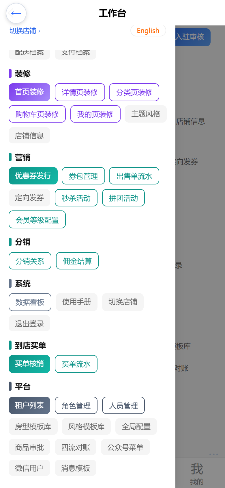
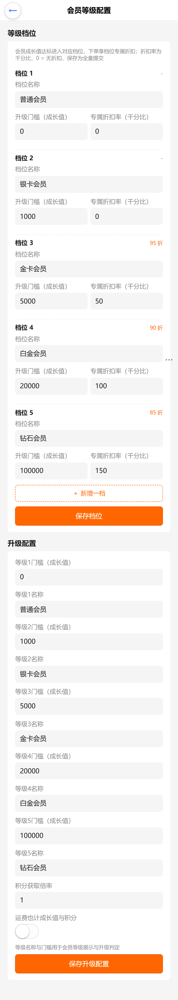
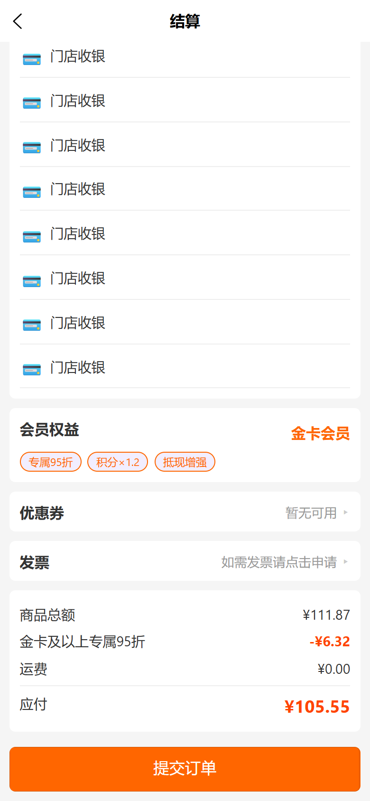
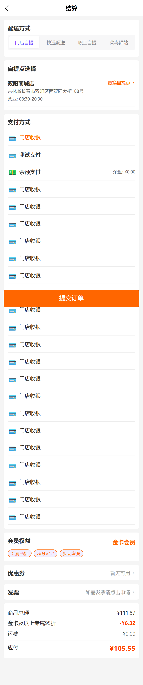

# usemall→vshop 批次 2 补齐：操作手册与截图（F17 会员价下单收尾）

> 生成日期：2026-10-09 ｜ 视口规范：Playwright 移动端 **390×844、deviceScaleFactor=2**（实际 780×1688 像素）
> 截图环境：本地 dev-server（`http://localhost:3000`）+ C 端 `npm run dev:h5`（5180）+ web-admin `scripts/serve-h5.mjs`（5280，`/admin-api` 代理 3000）。全部为本地真实取数截图，无生产写操作。

---

## 一、批次 2 范围总览

| # | 交付物 | 端 | 入口 / 位置 | 说明 |
|---|--------|----|-------------|------|
| F17-a | `tier_discount` 促销在 shop-api 下单生效的 e2e 固化 | vendure | `packages/member-level-plugin/e2e/tier-discount-shop.e2e-spec.ts` | 断言：达标客户下单出现折扣行、totalWithTax 相应减少；未达标客户无折扣（vendure 仓 `ebae809`） |
| F17-b | web-admin 会员等级/权益配置页 | web-admin | 工作台 ☰ → 营销组 →「会员等级配置」→ `/pages/member/level-config/index` | 等级档位（名称/门槛/专属折扣率）全量保存 + 升级配置表单（vshop 仓 `4c2f97f`） |
| F17-c | C 端结账会员/促销折扣行动态化 | C 端 | `/pkg-order/pages/checkout` 汇总区 | 折扣行按 `order.discounts` 逐行动态渲染，不再按促销名硬编码过滤（vshop 仓 `9133a73`） |

对应提交：vendure `ebae809`；vshop `4c2f97f` + `9133a73`（本手册另见 `docs(manual)` 提交）。

**折扣生效链路（零全局价格策略改动）**：customer.customFields.growthValue 达标 → member-level-plugin `tier_eligible` 条件命中（按渠道读 MemberTier 表取最大达标档）→ `tier_discount` 动作按 `Math.floor(subTotalWithTax × specialDiscountRate / 1000)` 返回负数折扣 → 促销框架计入 `order.discounts` → C 端结账汇总区逐行展示。

---

## 二、web-admin：会员等级/权益配置

### 2.1 登录与进菜单

1. 打开手机后台（生产 `https://e.joho.cn/guanli/`，本地预览 `http://localhost:5280/guanli/`），输入管理员账号密码登录。
2. 多店账号登录后进入「选择店铺」页，点选目标店铺（会员档位数据**按渠道隔离**，每个渠道有独立的 MemberTier 配置）。
3. 进入工作台后点右上角 **☰** 打开菜单抽屉，**营销** 分组下即有本次新增的「会员等级配置」（与秒杀活动/拼团活动同组）：

### 2.2 配置等级档位（专属折扣）

「会员等级配置」页上半部为**等级档位**卡片列表，每档可编辑：

- **档位名称**：如「普通会员/银卡会员/金卡会员/白金会员/钻石会员」；
- **升级门槛（成长值）**：客户 `growthValue` 达到该值即进入本档（取满足的最大档）；
- **专属折扣率（千分比）**：下单时按 `折扣额 = 订单小计(含税) × 折扣率 / 1000` 让利。

**千分比换算口径（重要）**：

| 填写值 | 含义 |
|--------|------|
| `50` | 95 折（让利 5%） |
| `100` | 9 折（让利 10%） |
| `150` | 8.5 折（让利 15%） |
| `0` | **无折扣**（该档位不参与 tier_discount 促销，权益只剩积分倍率/抵现等） |

页面卡片右上角实时回显换算结果（`(1000 - rate) / 10 折`），rate=0 或空显示 `-`。本地 dev 播种档位：普通 0 / 银 1000(门槛) 0 / 金 5000·50 / 白金 20000·100 / 钻石 100000·150。

- **保存方式**：「保存档位」为**全量提交**（按 tierLevel upsert，同档覆盖、缺档保留原值）；「＋ 新增一档」自动取当前最大 tierLevel + 1。
- 下半部**升级配置**为 level1-5 门槛/名称、积分获取比率、运费是否计成长值等全局数值，独立保存。

### 2.3 折扣落到订单的前提

档位折扣要真实生效，需同时满足：

1. 该渠道存在启用的 `tier_discount` 促销（条件 `tier_eligible`，参数 `minLevel`；dev 播种名「金卡及以上专属95折」，minLevel=3 即金卡及以上都吃 95 折起）；
2. 客户 growthValue ≥ 目标档门槛（后台可用 `adjustMemberGrowth(customerId, amount, source)` 调整成长值）；
3. 折扣率 > 0（rate=0 的档位条件不命中，不下折扣）。

---

## 三、C 端结账：会员/促销折扣逐行动态展示

结账页（`/pkg-order/pages/checkout`）汇总区改为**逐行动态渲染 `order.discounts`**：会员等级折扣、优惠券、满减等任何促销都会各自成行（`描述 + -¥金额`），未来新增促销类型无需改前端。折扣合计为 0 时整块不渲染，不占版面。

本地验证链路（真实取数）：种子客户 `zhangsan@test.cn` 经 admin-api `adjustMemberGrowth` 提升至 6000 成长值（金卡档）→ 加购「三只松鼠坚果礼盒 1kg」（¥111.87）→ 结账页汇总区：

- 商品总额 ¥111.87
- **金卡及以上专属95折 -¥6.32**（红色折扣行，促销描述由后端 `order.discounts[].description` 返回）
- 运费 ¥0.00
- 应付 ¥105.55

同页「会员权益」卡同步显示「金卡会员 专属95折 / 积分×1.2 / 抵现增强」：

结账整页效果（配送方式/支付方式/会员权益/汇总区）：

---

## 四、已知边界

1. **POS 规则型 MemberPriceRule 不进 shop-api（暂缓项）**：POS 式「等级×分类规则价」（按行改价的 MemberPriceRule）若注册进 shop-api，会撞上全局 OrderItemPriceCalculationStrategy 的 bootstrap 覆盖链（core bootstrap 按插件顺序 Object.assign，CJKPlugin 已覆盖 dev-config 的 Sales 策略，member-level 再注册会覆盖酒店逐晚计价），复合兜底风险高、收益低。本批**记录不迁移**，C 端下单侧以 `tier_discount` 订单级促销为准。
2. **specialDiscountRate=0 的档位无折扣**：普通/银卡档 rate=0，`tier_eligible` 条件不命中、`tier_discount` 返回 0，其权益只有积分倍率/抵现/免运费等；配置页显示 `-`。
3. **播种促销名为演示文案**：「金卡及以上专属95折」是 dev-server 播种数据的 name，仅影响折扣行展示文案；C 端已按 `order.discounts` 逐行动态渲染，不依赖特定 name（改名需重播种，默认不动）。
4. **档位数据按渠道隔离**：MemberTier 挂在 Channel 维度，web-admin 顶部「切换店铺」决定可配置的档位范围；C 端租户渠道各自结算各自档位。
5. **dev 本地管理员口径**：dev-server 播种库的可用超管是 `superadmin@china.test / superadmin`（bootstrap 自带的 `superadmin` 在播种库中无 roles 关联，admin-api 查询会 FORBIDDEN）。
6. **折扣金额以含税小计为基数**：`tier_discount` 按 `subTotalWithTax × rate/1000` 向下取整（分），展示金额与订单明细由后端统一计算，前端不做二次换算。

---

## 五、验证记录（2026-10-09）

| 验证项 | 结果 |
|--------|------|
| vendure e2e `tier-discount-shop.e2e-spec.ts`（Task 1，`ebae809`） | 达标客户折扣行存在、totalWithTax 减少；未达标客户无折扣——全绿 |
| 本地端到端 | zhangsan 成长值 6000（金卡）→ 加购 ¥111.87 → 结账汇总区出现「金卡及以上专属95折 -¥6.32」、应付 ¥105.55；web-admin 配置页 5 档真实取数回显（50→95折 / 100→90折 / 150→85折） |
| 截图 | 4 张，390×844 @2x，全部人工目检通过（本目录） |
| 全量回归 | 见批次收尾报告（member-level / checkin / vcash-pos member-pricing e2e + 双端 build:h5） |

### 本地测试环境说明（复现用）

- 后端：`d:\zhao\vendure\packages\dev-server`，`npm run dev:server`（:3000）。
- C 端：`d:\zhao\vshop`，`npm run dev:h5`（:5180）。
- web-admin 预览：`d:\zhao\vshop\web-admin`，`node scripts/serve-h5.mjs`（:5280，`/admin-api` → localhost:3000）。
- 本地管理员：`superadmin@china.test / superadmin`；C 端测试顾客：`zhangsan@test.cn / test`（customer id=1，growthValue 经 `adjustMemberGrowth` 调至 6000=金卡档）。
- 造数手段：admin-api 登录（`Authorization: Bearer` 头）→ `adjustMemberGrowth` → shop-api 登录加购 → Playwright 注入 localStorage（`auth_token`/`auth_userId`）后直达结账页；web-admin 侧注入 `wa_auth_token`/`wa_user_id`/`wa_channel_code`/`wa_channel_token`。

---

## 六、截图索引

| 文件 | 内容 | 目检要点 |
|---|---|---|
| `01-admin-menu-drawer.png` | 工作台菜单抽屉（滚动至营销组） | 营销分组下「秒杀活动 / 拼团活动 / **会员等级配置**」三项齐全 |
| `02-admin-member-level-config.png` | 会员等级配置页（fullPage） | 5 个档位卡（名称/门槛/千分比折扣率，95折·90折·85折回显）＋ 新增一档 ＋ 保存档位 ＋ 升级配置段 |
| `03-checkout-tier-discount.png` | C 端结账页整页（fullPage） | 配送方式 tabs / 支付方式 / 会员权益卡（金卡会员·专属95折）/ 汇总区折扣行 |
| `04-checkout-summary-detail.png` | 结账汇总区特写 | 商品总额 ¥111.87、**金卡及以上专属95折 -¥6.32**、运费 ¥0.00、应付 ¥105.55 |
