# usemall→vshop 批次 3 补齐：操作手册与截图（F05 余额提现 / F11 常见问题与意见反馈 / F19 购物圈 / F20 积分抽奖）

> 生成日期：2026-10-10 ｜ 视口规范：Playwright 移动端 **390×844、deviceScaleFactor=2**（实际 780×1688 像素）
> 截图环境：本地 dev-server（`http://localhost:3000`，postgres 库）+ C 端 `npm run dev:h5`（5180）+ web-admin `scripts/serve-h5.mjs`（5280，`/admin-api` 代理 3000）。全部为本地真实取数截图，无生产写操作。

---

## 一、批次 3 范围总览

| # | 交付物 | 端 | 入口 / 位置 | 对应提交 |
|---|--------|----|-------------|----------|
| F05 | 余额提现三态机（申请冻结→审核→打款/驳回退回） | vendure + C 端 + web-admin | C 端「我的→余额提现」；后台 分销组→「余额提现审核」 | vendure `cd5ef7024`；vshop `7bc78db` |
| F11 | 常见问题（FAQ 分组折叠面板）+ 意见反馈（类型/标题/内容/图片/联系方式） | vendure（新建 feedback-plugin）+ 双端 | C 端「我的→常见问题 / 意见反馈」；后台 营销组→「FAQ 管理 / 意见反馈」 | vendure `6a2c9e25c`；vshop `810ae40` |
| F19 | 购物圈（双列瀑布流 / 帖子详情 / 发布 + 点赞收藏，后台置顶/隐藏） | vendure（新建 shopping-circle-plugin）+ 双端 | C 端「我的→购物圈」；后台 营销组→「帖子管理」 | vendure `15df56b3b`；vshop `de05f65` |
| F20 | 积分抽奖（九宫格、服务端加权开奖、按奖品消耗积分扣减） | vendure（新建 lottery-plugin）+ 双端 | C 端「我的→积分抽奖」；后台 营销组→「积分抽奖奖品」 | vendure `1c6073ebb`；vshop `5e86491` |

**业务链路要点**：

- **F05**：复用 recharge-card-plugin 的 `CustomerBalance`（可用/冻结双列）+ `BalanceTransaction` 流水；申请提现原子条件扣减（余额不足即拒），pending→approved→paid / pending|approved→rejected（驳回解冻回补，带原状态条件的原子更新防重复回补）；**起提 ¥10**。
- **F11**：FAQ 未登录可看（`faqs` 无需登录），按 `type` 分组（register/order/pay/afterSale/account）；反馈需登录，title≤20、contactWay≤30，type 为英文 key（bug/experience/other）。
- **F19**：帖子按渠道隔离，feed 只出 published；点赞/收藏为 toggle（`@Unique(postId,customerId)` 幂等往返）；`nickname` 由后端按 customer 补齐。
- **F20**：服务端加权开奖（`weight` 相对权重，**weight=0 仅展示、永不抽中**）；**每次抽中按所中奖品的 `consume` 扣积分（consume=0 为免费抽奖）**；`prizeIndex` = 奖品数组下标，C 端九宫格同序渲染，前端不随机。

---

## 二、C 端使用流程

所有入口都在 C 端 **「我的」页菜单**（与余额明细/收货地址等并排）：**余额提现 / 购物圈 / 积分抽奖 / 常见问题 / 意见反馈**。

### 2.1 余额提现（F05）

1. 「我的→余额提现」进入提现页：上半显示**可提余额**（冻结金额单独灰字提示），下半为申请表单（金额-元、收款方式 picker：微信/支付宝/银行卡、收款账号）与提现记录列表。
2. 金额最低 **¥10**（后端 1000 分硬校验），提交后可用余额即时转入冻结，记录状态为「待审核」。

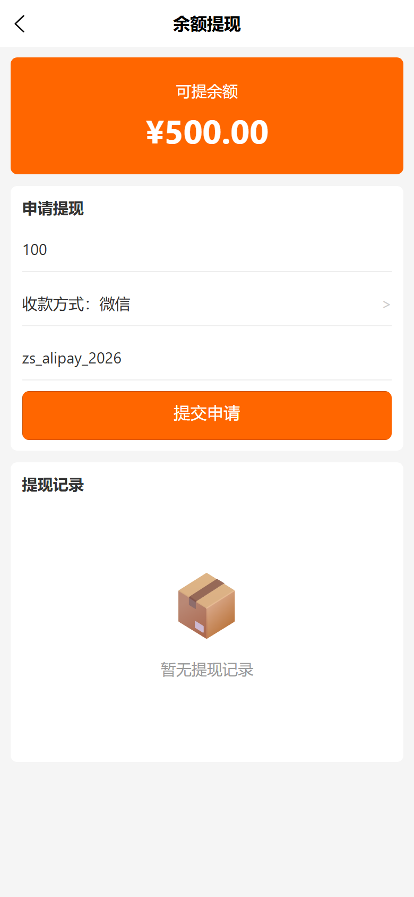

3. 状态机：待审核 →（商家「通过」）已通过 →（「标记已打款」）已打款；待审核/已通过可「驳回」，驳回后金额解冻退回可用余额并写 UNFREEZE 流水。

### 2.2 常见问题（F11）

「我的→常见问题」：顶部横滑 tab（全部/注册登录/订单/支付/售后/账户，与后端 `type` 对齐），点击问题行展开答案（折叠面板）。未登录可看。

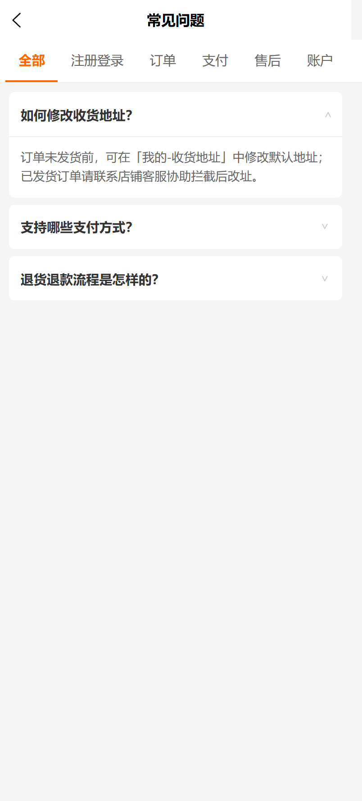

### 2.3 意见反馈（F11）

「我的→意见反馈」：反馈类型 picker（功能异常/体验问题/其他）+ 标题（≤20 字必填）+ 描述（必填）+ 图片补充（最多 3 张，走 `uploadCustomerAsset`）+ 联系方式（≤30 字选填）。提交后可在后台「意见反馈」列表看到处理状态（待处理/处理中/已解决）。

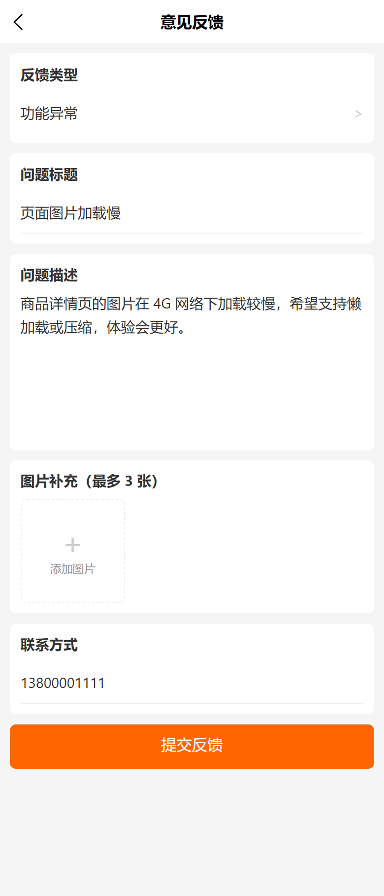

### 2.4 购物圈（F19）

1. 「我的→购物圈」进入双列瀑布流 feed，卡片含首图/标题/正文截断/作者/♡点赞 · ☆收藏数；右下角「＋发布」悬浮按钮进发布页。
2. 发布页：标题（≤50 字选填）+ 正文（必填）+ 图片（最多 6 张）。**关联商品暂缓**（见「已知边界」#2），发布不选商品。
3. 帖子详情：图片轮播（swiper）/视频（videoUrl 优先）+ 标题/正文/作者/时间 + 底部操作条**点赞 ♥ / 收藏 ★ / 分享**（再次点击取消，计数 ±1）；「买同款」仅当帖子带 productId 时出现。

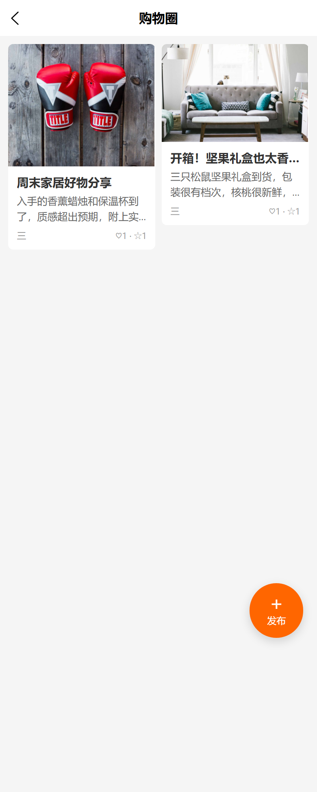

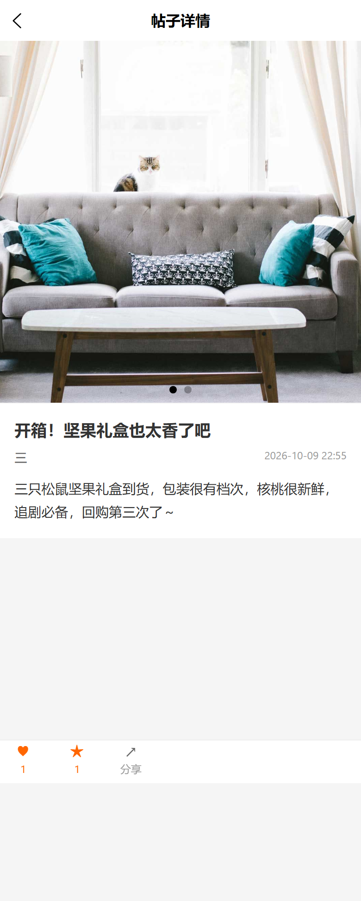

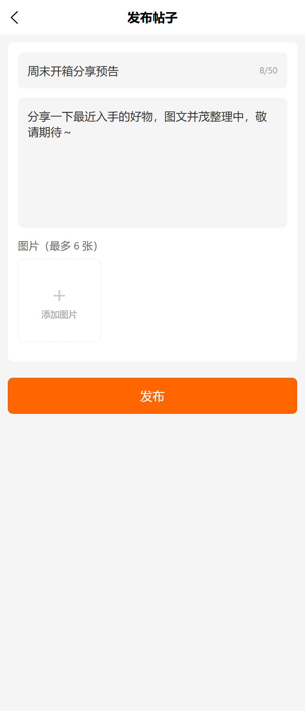

### 2.5 积分抽奖（F20）

1. 「我的→积分抽奖」：上部「我的积分」卡 + 3×3 九宫格（8 个奖品位循环展示奖品池 + 中央「抽奖」格）+ 下部「我的中奖记录」。
2. 点击抽奖 → 服务端按 weight 加权开奖并**按所中奖品 consume 扣积分** → 前端跑马灯（1.5 圈先快后慢）停在 prizeIndex 对应格 → 弹中奖结果（consume=0 显示「本次为免费抽奖」）。
3. 积分不足时后端报错原样 toast；weight=0 的奖项仅展示不参与开奖。

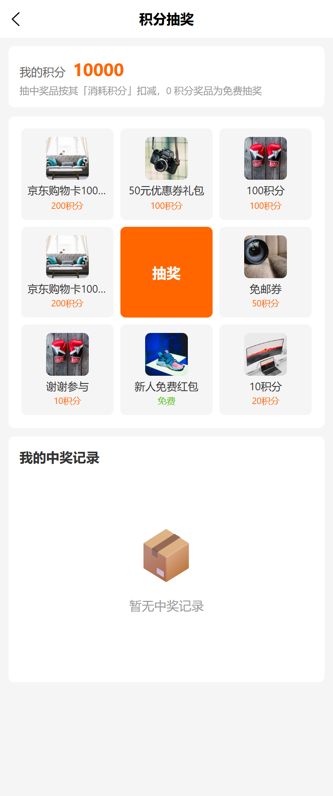

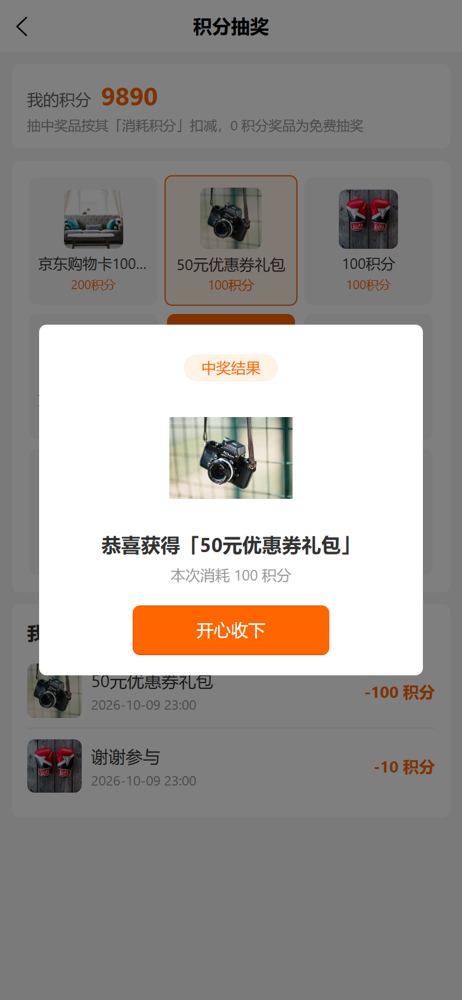

---

## 三、web-admin 使用流程

登录（本地预览 `http://localhost:5280/guanli/`，生产 `https://e.joho.cn/guanli/`）→ 选择店铺 → 工作台右上 ☰ 菜单抽屉。

### 3.1 余额提现审核（分销组 →「余额提现审核」）

`/pages/balance/withdraw/index`。五态 tabs（待审核/已通过/已打款/已驳回/全部，默认待审核）。卡片展示金额/客户/收款方式/收款账号/申请时间；待审核单有「通过」「驳回」按钮（驳回弹备注框），已通过单有「标记已打款」。所有状态流转走带原状态条件的原子更新，重复点击不会二次流转。

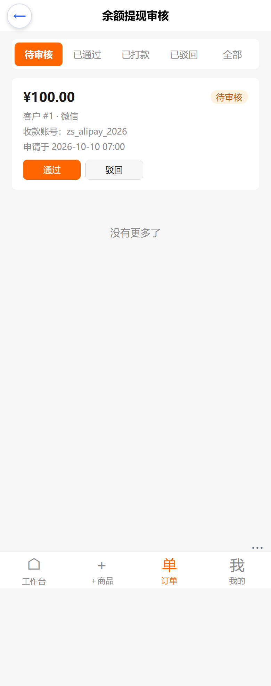

### 3.2 FAQ 管理（营销组 →「FAQ 管理」）

`/pages/feedback/faq/index`。行内编辑卡片：标题/内容 textarea + 分组徽标 + 启用开关 + 排序数字，底部「保存 / 删除」；右上「＋ 新增问题」推入空卡。**保存即全量生效**（C 端 faqs 实时按 enabled=true + type 过滤拉取）。

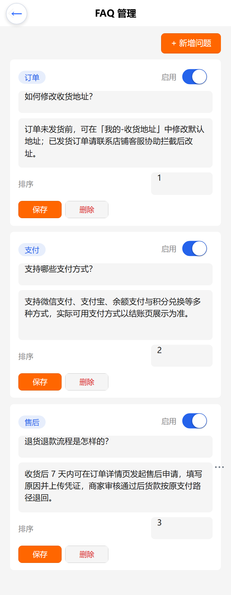

### 3.3 意见反馈（营销组 →「意见反馈」）

`/pages/feedback/list/index`。四态 tabs（待处理/处理中/已解决/全部）；卡片含标题/类型徽标/客户/内容摘要/图片缩略（点击 `uni.previewImage` 大图）/联系方式/提交时间；待处理单可「处理中」「已解决」（置 handledAt）。

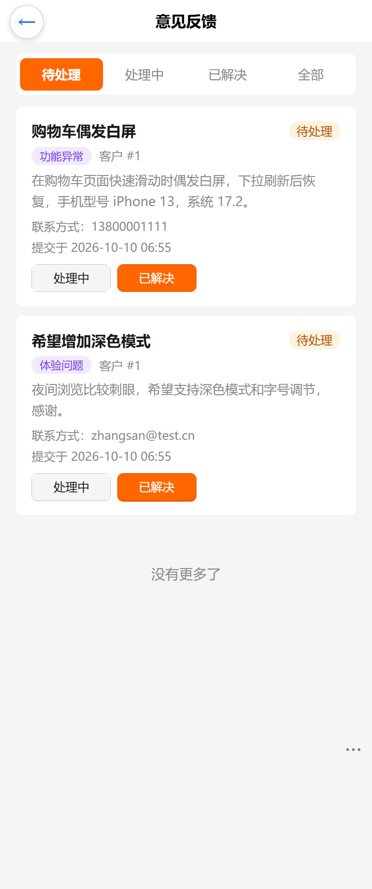

### 3.4 帖子管理（营销组 →「帖子管理」）

`/pages/circle/posts/index`。卡片含首图缩略/标题/作者/点赞收藏数/发布时间/状态（已发布）；操作「置顶」切换（isPinned，feed 内优先靠前）与「隐藏/恢复」（status published↔hidden，隐藏后 C 端 feed 与详情不再出现）。

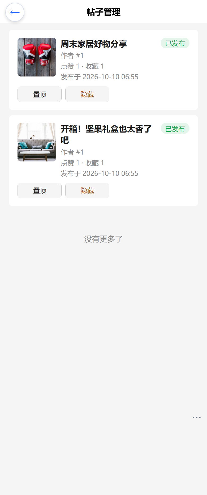

### 3.5 积分抽奖奖品（营销组 →「积分抽奖奖品」）

`/pages/lottery/prizes/index`。奖项行内编辑卡：图（换图）/名称/权重/消耗积分/库存/排序/启用开关；文案提示「**权重越高越易中，0 = 仅展示、不参与抽取**」「**抽中该奖品时消耗的积分，0 = 免费抽奖**」；「＋ 新增奖项」＋「全量保存」。C 端九宫格按排序同序渲染，新增/改配即时生效。

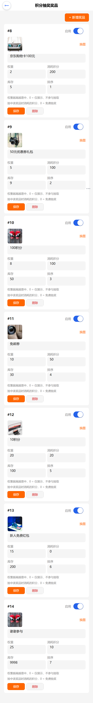

---

## 四、已知边界（暂缓项与口径）

1. **POS 规则型 MemberPriceRule 不进 shop-api（暂缓项，沿用批次 2 结论）**：按行改价的 MemberPriceRule 若注册进 shop-api 会撞全局 OrderItemPriceCalculationStrategy 的 bootstrap 覆盖链，复合兜底风险高、收益低，记录不迁移。
2. **购物圈发布页选商品暂缓**：「从我的订单/收藏选商品」降级为不选商品（productId 留空），详情页「买同款」入口随之隐藏；后续增强另立任务（矩阵已注明口径）。
3. **提现额度与打款离线**：起提 ¥10 为后端常量（暂未开放渠道级配置）；「标记已打款」仅做状态记账，实际打款（微信商家转账/支付宝转账）线下完成，无支付通道对接。
4. **收款账号明文存储**：`accountInfo` 按业务需要明文展示于后台审核页（打款要用）；如需合规加固另立任务。
5. **FAQ 分组固定**：C 端 tab（注册登录/订单/支付/售后/账户）为前端硬编码映射，后端 type 新增值需同步前端 tab。
6. **反馈类型为英文 key**：C 端提交 bug/experience/other，后台徽标经 locale（`feedbackManage.type_*`）转义；直接改库为中文值会在后台露出原始 key。
7. **抽奖消耗为「所中奖品」的 consume**：不是固定每次消耗——奖品可分别定价（0=免费）；weight=0 仅展示。抽奖记录/库存由后端维护，后台奖品卡库存会随抽取递减。
8. **购物圈分享 = 复制链接**：H5 无原生分享面板，详情页「分享」复制帖子链接到剪贴板。
9. **截图数据为本地造数**：本手册截图使用 dev-server 播种库 + 手工造数（见下），生产环境页面结构一致、数据不同。

---

## 五、验证记录（2026-10-10）

| 验证项 | 结果 |
|--------|------|
| vendure e2e（批次3 四插件，各自包内 spec） | recharge-card 余额提现三态机 / feedback / shopping-circle / lottery 全绿（批次收尾报告见计划 Task 10） |
| 双端构建 | vshop `build:h5` 0 error（150 assets 新产物，`chore(c端)` 提交）；web-admin `build:h5` 0 error（606 文件） |
| 本地端到端造数走查 | admin 造 FAQ×3、奖项×7（含 consume=0 免费奖与谢谢参与）、zhangsan 积分 +10000 / 余额 +¥500；C 端发帖×2 并点赞收藏、提交提现 ¥100（待审核）、抽奖 2 次（谢谢参与 -10 / 50元券 -100，积分 10000→9890） |
| 截图 | 13 张（C 端 8 + 后台 5），390×844 @2x，全部人工目检通过（本目录） |

### 本地测试环境说明（复现用）

- 后端：`d:\zhao\vendure\packages\dev-server`，`npm run dev:server`（:3000，DB=postgres `vendure` 库，synchronize:true 自动建表）。
- C 端：`d:\zhao\vshop`，`npm run dev:h5`（:5180）。
- web-admin 预览：`d:\zhao\vshop\web-admin`，`node scripts/serve-h5.mjs`（:5280，`/admin-api` → localhost:3000）。
- 本地管理员：`superadmin@china.test / superadmin`（bootstrap 自带 `superadmin` 在播种库无 roles，勿用）；C 端测试顾客：`zhangsan@test.cn / test`（customer id=1，本批造数后积分 9890、余额 ¥400、金卡会员）。
- 造数手段：admin-api 登录（`Authorization: Bearer` + `vendure-token: default-token` 头）→ `saveFaq` / `createLotteryPrize` / `adjustPoints(customerId, amount, remark)` / `adminAdjustBalance({ customerId, amount, type:'adjust', remark })`；shop-api 以 zhangsan 会话调 `createFeedback` / `createCirclePost` / `toggleCircleLike` / `toggleCircleFavorite` / `requestBalanceWithdrawal`。
- 截图注入：C 端 localStorage `auth_token`/`auth_userId`；web-admin `wa_auth_token`/`wa_user_id`/`wa_channel_code`（`__default_channel__`）/`wa_channel_token`（`default-token`）。

---

## 六、截图索引

| 文件 | 内容 | 目检要点 |
|---|---|---|
| `c-withdraw.png` | C 端余额提现页（表单态） | 可提余额 ¥500.00、金额 100、收款账号 zs_alipay_2026、提现记录空态 |
| `c-faq.png` | C 端常见问题 | 6 分组 tab、3 条 FAQ、首条展开显示答案 |
| `c-feedback.png` | C 端意见反馈（表单态） | 类型=功能异常、标题/描述/联系方式已填、图片补充（最多 3 张） |
| `c-circle-feed.png` | C 端购物圈瀑布流 | 双列两卡、首图/标题截断/♡1 · ☆1、右下发布悬浮钮 |
| `c-circle-detail.png` | C 端帖子详情 | 轮播图指示点、标题/正文/时间、底部 ♥1 ★1 分享（激活态橙色） |
| `c-circle-publish.png` | C 端发布帖子（表单态） | 标题 8/50 计数、正文已填、图片（最多 6 张）、发布按钮 |
| `c-lottery.png` | C 端积分抽奖九宫格 | 我的积分 10000、8 奖位循环 7 奖品（免费/积分标注）、中央抽奖格、记录空态 |
| `c-lottery-result.png` | C 端中奖弹窗 | 中奖结果徽标、奖品图、「恭喜获得 50元优惠券礼包」、本次消耗 100 积分、开心收下 |
| `admin-balance-withdraw.png` | 后台余额提现审核 | 待审核 tab、¥100.00 卡（客户#1·微信·zs_alipay_2026）、通过/驳回 |
| `admin-feedback-faq.png` | 后台 FAQ 管理 | 3 张行内编辑卡（订单/支付/售后徽标、启用开关、排序、保存/删除、＋新增问题） |
| `admin-feedback-list.png` | 后台意见反馈 | 待处理 tab、两卡类型徽标（功能异常/体验问题）、处理中/已解决按钮 |
| `admin-circle-posts.png` | 后台帖子管理 | 两卡首图缩略、已发布徽标、点赞 1 · 收藏 1、置顶/隐藏 |
| `admin-lottery-prizes.png` | 后台抽奖奖品配置 | 7 张奖项卡（#8-14：图/名称/权重/消耗积分/库存/排序/启用）、0 权重与 0 消耗文案说明 |
