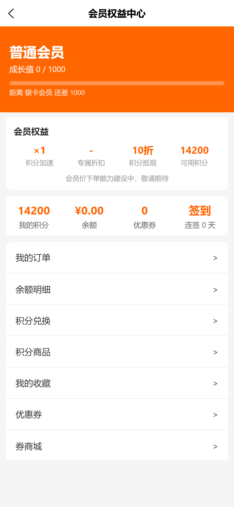
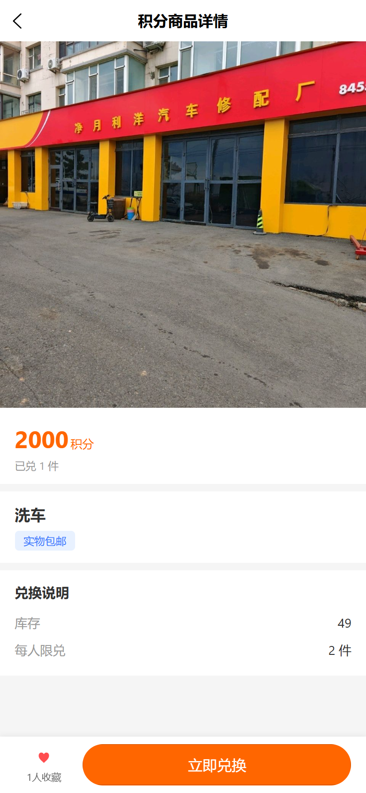
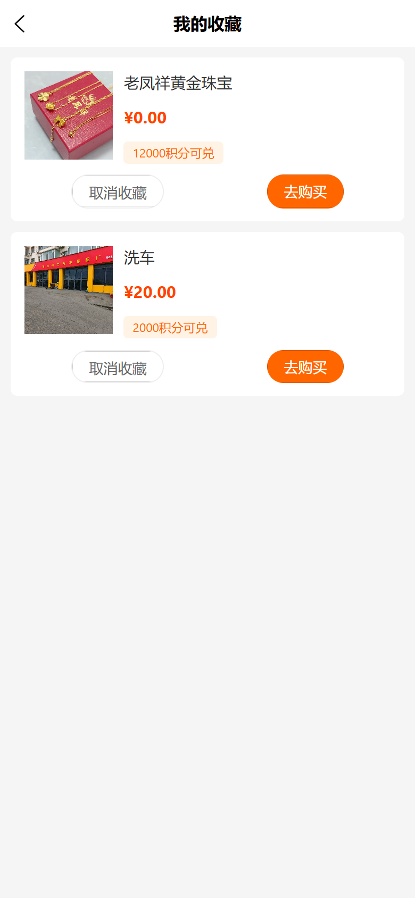
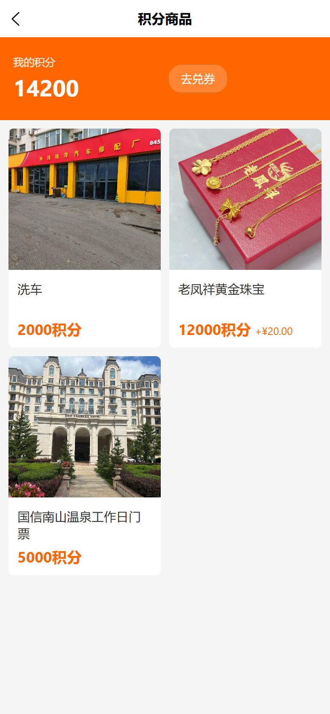
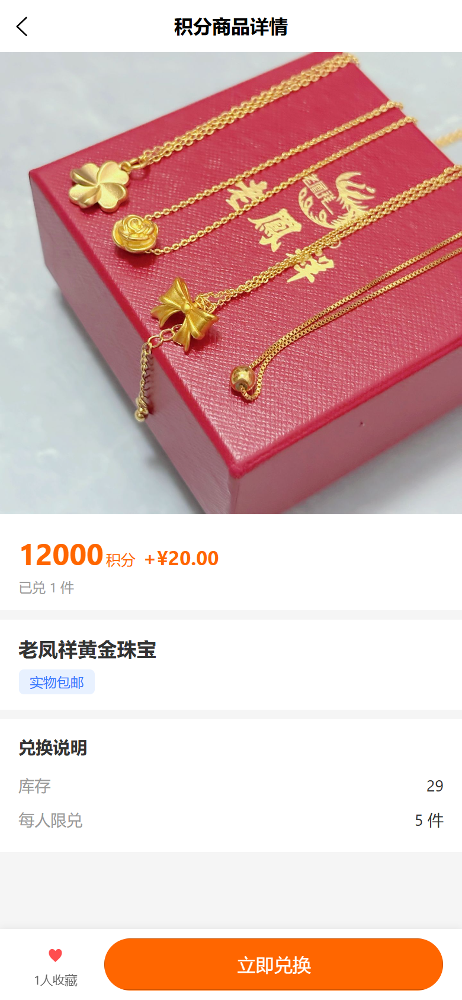
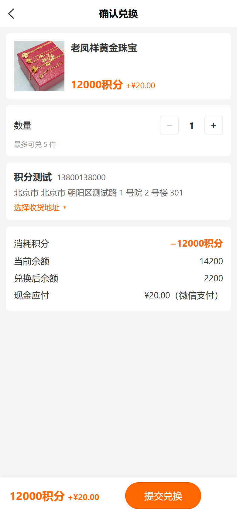
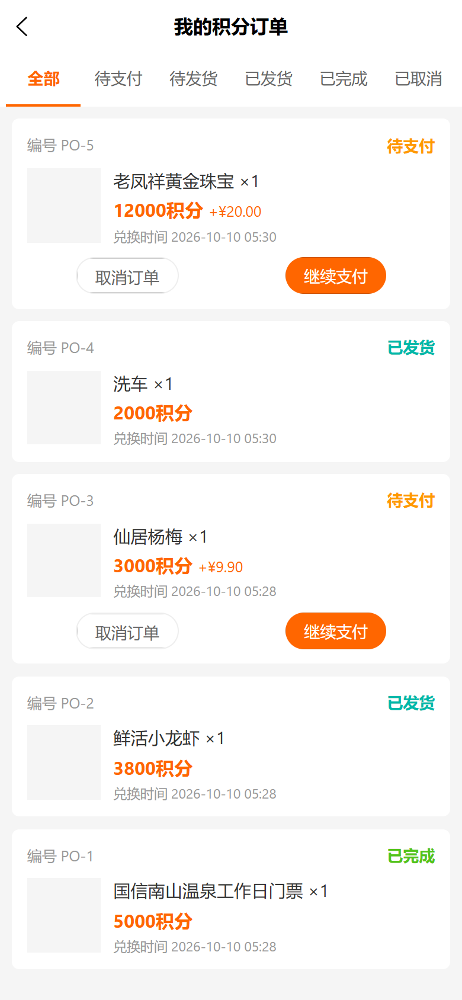

# usemall→vshop 对齐：商品收藏 + 积分商城（操作手册与截图）

> 生成日期：2026-10-10 ｜ 视口规范：Playwright 移动端 **390×844、deviceScaleFactor=2**（实际 780×1688 像素）
> 截图环境：**线上 `https://e.joho.cn`** 真实取数（测试客户 points-probe@joho.cn，造数后截图；截图脚本 `web-admin/scripts/_vshop_points_mall_shots.mjs` 只做浏览不触发写操作）。

---

## 一、范围总览

| # | 交付物 | 端 | 入口 / 位置 | 对应提交 |
|---|--------|----|-------------|----------|
| F01 | 商品收藏（详情页 ♥ 切换、我的收藏列表、收藏人数） | vendure + C 端 | C 端商品详情页底部「♥ 收藏」；「我的→我的收藏」 | vendure `d1979b2f4` 等；vshop `e5c6f4b` |
| F02 | 积分商城（积分商品列表 / 详情 / 兑换确认 / 积分订单） | vendure + C 端 + web-admin | C 端「我的→会员中心→积分商品」；后台 营销组→「积分商品 / 积分订单」 | vendure `d1979b2f4`/`352d17d0c`/`468ac4737`/`3a762c516`；vshop `e5c6f4b`/`9506894` |

**业务链路要点**：

- **商品收藏**：`ProductFavorite` 实体（productId + customerId + channelId 唯一），toggle 幂等往返；游客点收藏要求登录；收藏列表按渠道隔离、id 倒序；商品已删除显示「已删除商品」占位；详情页展示「N 人收藏」。
- **积分商城**：`PointsProduct` 挂在原商品上（一个商品一个积分价），支持**纯积分**与**积分+现金混合价**；下单 = 先扣积分（SPEND 流水）→ 原子扣库存（防并发超卖）→ 建单 → 混合价建支付单。
- **订单状态机**：混合价（cashTotal>0）→ `pending_payment` 待支付；纯积分实物 → `pending_ship` 待发货；纯积分虚拟（virtual）→ `completed` 直接完成。后台可流转：待支付→（标记已收款）→待发货→（标记发货）→已发货→（标记完成）→已完成。
- **图片绝对 URL**：插件返回给 C 端的图片经 `assetStorageStrategy.toAbsoluteUrl` 补全为绝对地址（vendure `3a762c516`），避免 H5 路由基目录下相对路径 404。

---

## 二、C 端使用流程

### 2.1 入口

「我的→会员中心」页面提供「积分兑换」（券兑换，原有功能）与「积分商品」（本次新增积分商城）两个入口。

### 2.2 商品收藏

1. 商品详情页底部操作条「♥ 收藏」按钮：未收藏点击即收藏（心形变红 +「N 人收藏」+1），已收藏点击取消；游客点击弹出登录。
2. 「我的→我的收藏」列表：条目含商品图、名称、现价、积分价标签（如「12000积分可兑」）、取消收藏 / 去购买按钮。

### 2.3 积分商品列表

「积分商品」页：顶部「我的积分」余额卡（含去兑券入口），下方商品卡片网格（商品图、名称、积分价、混合价时附现金加价副标如「+¥20.00」）。

### 2.4 商品详情与兑换

1. 详情页：主图轮播、积分价（混合价时双展示）、已兑件数、商品名、配送方式标签（实物包邮 / 虚拟）、兑换说明（库存 / 每人限兑）、底部「立即兑换」。
2. 兑换确认页：收货地址选择（实物）、积分抵扣明细、兑换后余额预览，提交即下单。

### 2.5 积分订单

「我的→积分订单」：按状态展示（待支付 / 待发货 / 已发货 / 已完成 / 已取消），待支付订单可**去支付**（现金部分拉起微信支付）或**取消订单**（自动退回积分并回补库存）；已发货订单可查看物流单号。

---

## 三、web-admin 使用流程

登录（生产 `https://e.joho.cn/guanli/`）→ 选择店铺 → 工作台右上 ☰ 菜单抽屉 → **营销组** →「积分商品」/「积分订单」。

### 3.1 积分商品管理（营销组 →「积分商品」）

- 列表展示全部积分商品（图、名称、积分价、现金价、库存、已兑、状态）。
- **新增 / 编辑**：选择原商品（搜索）、积分价（必填）、现金价（选填，>0 即混合价）、配送类型（实物 / 虚拟）、库存、每人限兑（0 = 不限）、有效期（validFrom/validTo，选填）、上下架状态、排序。
- **删除**：二次确认后删除（已有订单不受影响，订单保留快照）。

### 3.2 积分订单管理（营销组 →「积分订单」）

- 状态 tab 筛选 + 分页列表（单号、客户、积分/现金金额、状态、物流单号、下单时间）。
- 操作按钮随状态出现：
  - **待支付 →「标记已收款」**：线下收款兜底（客户微信支付未完成、商家线下确认收款后使用），订单进入待发货。
  - **待发货 →「标记发货」**：可填物流单号，订单进入已发货。
  - **已发货 →「标记完成」**：订单完结。
- 客户积分余额调整在会员体系：客户列表 → 调整积分（增减 + 备注，写积分流水）。

---

## 四、下单校验规则（后端硬校验）

| 校验 | 错误码 | 说明 |
|------|--------|------|
| 积分不足 | spendPoints 抛错 | 下单先扣积分，不足即中止 |
| 库存不足 | `OUT_OF_STOCK` | 原子扣减（`stock >= quantity` 条件更新），防并发超卖 |
| 超出每人限兑 | `PER_USER_LIMIT_EXCEEDED` | `perUserLimit > 0` 时按非取消订单计数 |
| 不在有效期 | `NOT_IN_VALIDITY` | validFrom/validTo 窗口外不可兑 |
| 商品未上架 | 下单校验 | 仅 enabled 积分商品可兑换 |

---

## 五、已知边界

1. **无自动超时关单**：`pending_payment` 订单不会超时自动关闭退分，需用户手动「取消订单」（自动退分 + 回补库存），或商家后台线下沟通处理。
2. **手动取消退分**：仅 `pending_payment` 可取消；取消即退回全部积分、回补库存、支付单置 cancelled，不可逆。
3. **线下收款兜底**：混合价现金部分若微信支付未完成，商家可后台「标记已收款」跳过在线支付（信任场景兜底），订单照常进入发货流程。
4. **现金部分走微信支付**：混合价仅支持微信支付（复用 wechatpay 网关裸支付参数），无其他在线支付渠道。
5. **积分无过期**：积分余额与流水由会员等级插件管理，本插件只消费（SPEND）与退回（EARN），不处理过期。

---

## 附：截图清单与复现

截图均由 `web-admin/scripts/_vshop_points_mall_shots.mjs` 生成（Playwright 390×844@2x，SPA 导航，登录态经 localStorage 注入）：

| 文件 | 内容 |
|------|------|
| `assets/points-member-center-entry.png` | 会员中心入口（积分商品 / 积分兑换） |
| `assets/points-goods-list.png` | 积分商品列表（余额卡 + 混合价副标） |
| `assets/points-goods-detail-favorited.png` | 详情页收藏激活态 |
| `assets/points-goods-detail-mixed-price.png` | 详情页混合价 |
| `assets/points-goods-confirm.png` | 兑换确认页（地址 + 明细） |
| `assets/points-orders.png` / `assets/points-orders-bottom.png` | 积分订单列表（三态） |
| `assets/favorites-list.png` | 我的收藏列表 |

复现：`node web-admin/scripts/_vshop_points_mall_shots.mjs`（可选 `--only list,detail`；环境变量 `SITE_URL` / `SHOT_USER` / `SHOT_PWD`）。前置需测试客户 + 积分商品 + 订单造数。
