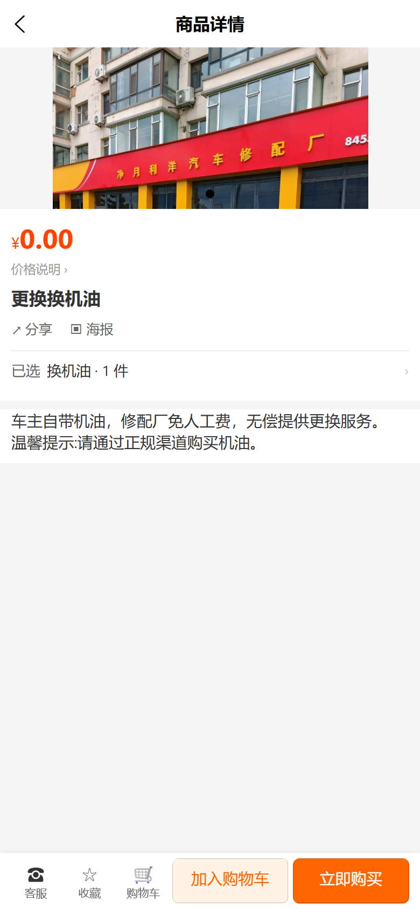

# vshop 对齐 usemall 版式 操作手册

## 1. 范围与版本

| 项 | 值 |
|---|---|
| 版本 | v1.7（2026-09-29，第二轮 S2：评价体系四页 + 「我的订单」取数修复；同日修订：订单页 3 缺陷修复 + 截图 7 张，见 §4 / §5.10） |
| 设计文档 | `web-admin/docs/superpowers/specs/2026-09-24-vshop-usemall-alignment-design.md`；第二轮：`web-admin/docs/superpowers/specs/2026-09-29-vshop-usemall-alignment-round2-design.md`（本轮） |
| 执行计划 | `web-admin/docs/superpowers/plans/2026-09-24-vshop-usemall-alignment-plan.md`；第二轮：`web-admin/docs/superpowers/plans/2026-09-29-vshop-usemall-alignment-round2-plan.md`（本轮） |
| 只读探针 | `web-admin/scripts/_smoke_usemall_align.py` |
| 截图脚本 | `web-admin/scripts/_vshop_usemall_shots.mjs`（版式截图，含拼团三 tab）、`web-admin/scripts/_vshop_cart_invalid_shots.mjs`（购物车「已下架」回归 + 截图） |
| 线上环境 | C 端 H5 + shop-api：`https://e.joho.cn`；后台：`https://e.joho.cn/guanli` |
| 本轮范围 | 首页秒杀楼层、分类页双模式、详情页 SKU 弹层与 5 键、购物车勾选真生效/未登录态/推荐/**失效行「已下架」**、秒杀页与拼团页版式（**v1.5 起拼团页含「我的开团 / 我的参团」两 tab**）、结算页发票入口行；**v1.6 起**详情页 SKU 弹层规格组计数与单规格降级；**v1.7 起**评价体系（详情页评价区 / 商品评价页 / 订单评价页 / 我的评价页）+「我的订单」列表取数修复 |
| 回归账号 | C 端测试客户 `qa-vshop-manual@local.dev` / `Qa123456`（生产新建，customer id=139）；后台 `superadmin` / `z123123` |

> **本文中「备注行」的最终状态是「已回退不做」**，原因见 §5.2。
> **v1.1 相对 v1 的增量**：三类线上阻塞缺陷修复（分类页、秒杀补拉、pm2 内存）+ 演示数据 + 全部截图重采，见 §5.5。
> **v1.2 相对 v1.1 的增量**：二次线上复验发现「购物车冷启动/刷新一律误报空车」，已修复并重新构建部署、复验通过，见 §5.6；线上产物入口哈希随之更新，见 §5.4。
> **v1.3 相对 v1.2 的增量**：v1.2 里被记为「未交付」的购物车失效行（§5.3）已补交付 —— 后端 cjk-plugin 的 shop SDL 扩展 `ProductVariant.enabled`，前端恢复失效行判定与「已下架」标签，见 §5.7；同时首次产生**后端代码改动**并部署，见 §5.4。
> **v1.4 相对 v1.3 的增量**：default 渠道分类体系重建（4 个一级 + 8 个二级，`product-id-filter` 挂真实商品），旧的 4 个空壳分类设为私有；并修复「分类页点二级分类进去商品列表为空」的参数错配，见 §5.8。本轮**只动 H5**，无需重启后端。
> **v1.5 相对 v1.4 的增量**：拼团页从「仅拼团列表」变为 **三 tab**（拼团列表 / 我的开团 / 我的参团），后端新增 shop SDL `myGroupBuyOrders(isLeader)`（**无数据库迁移**），见 §5.9。本轮**含后端改动**，部署顺序为「先后端 → 再 H5」。
> **v1.6 相对 v1.5 的增量**：第二轮 S1 —— 详情页 SKU 弹层规格组标题带 `(N)` 计数、单规格商品降级（详情页规格区整段不渲染 / 弹层无规格组标题），见 §4。
> **v1.7 相对 v1.6 的增量**：第二轮 S2 —— 评价体系四页（详情页评价区 / 商品评价页 / 订单评价页 / 我的评价页），并顺带修复「我的订单」列表恒空（后端 shop SDL 补 `myOrders`），见 §5.10。本轮**含后端改动**，部署顺序为「先后端 → 再 H5」。
> **v1.7 修订（同日）**：v1.7 首版只靠 API 探针判定「我的订单已修好」，采图后暴露 **3 个缺陷**并全部修复重验：① `myOrders` 关系漏 join `surcharges`（页面仍空）、② 改为 `@Relations(Order)` 按选择集推导关系 + 补同形分片 e2e 用例 ⑤、③ 列表卡片横向溢出 21px 导致右侧被切（`box-sizing`）。截图由 5 张增至 **7 张**（新增 `orders-list.png` / `orders-list-review-entry.png`），详见 §5.10.2。

---

## 2. 涉及页面与入口

H5 为 hash 路由，`#` 后为页面路径。

| 页面 | 路由 | 进入方式 |
|---|---|---|
| 首页（秒杀楼层 + 返回顶部） | `/#/pages/home/index` | 直接访问站点根，或底部「首页」 |
| 分类页（双模式 + 双悬浮按钮） | `/#/pages/category/index` | 底部「分类」 |
| 商品详情（SKU 弹层 + 底部 5 键） | `/#/pkg-product/pages/detail?slug=<slug>` | 首页/分类页点商品 |
| 购物车（勾选真生效 / 未登录态 / 为你推荐 / 失效行「已下架」） | `/#/pages/cart/index` | 底部「购物车」 |
| 结算页（发票入口行） | `/#/pkg-order/pages/checkout` | 购物车勾选后点「结算」 |
| 秒杀页 | `/#/pkg-promotion/pages/flash-sale` | 首页秒杀楼层右上「更多 ›」；或直接访问 |
| 拼团页（三 tab：拼团列表 / 我的开团 / 我的参团） | `/#/pkg-promotion/pages/group-buy` | 直接访问（首页 sections 内暂无拼团入口；`flash` 楼层的 `source=groupBuy` 枚举已预留但后台不暴露） |
| 商品评价页（v1.7） | `/#/pkg-product/pages/evaluate?slug=<slug>` | 详情页评价区右上「查看全部 ›」；或直接访问 |
| 订单评价页（v1.7） | `/#/pkg-order/pages/order-evaluate?code=<订单号>` | 「我的订单」卡片上「我要评价」；或订单详情页 |
| 我的评价页（v1.7） | `/#/pkg-user/pages/my-reviews` | 个人中心「我的评价」 |
| 我的订单（v1.7 修复取数） | `/#/pkg-order/pages/orders` | 个人中心「我的订单」 |

购物车/结算页需登录；未登录时购物车显示引导态（「当前未授权，登录后查看购物车」+「去登录」），这本身是本轮交付项之一。订单评价页 / 我的评价页 / 我的订单同样需登录。

---

## 3. 后台配置说明

### 3.1 首页「限时精选（秒杀）」楼层

装修页（sections 体系）新增 `flash` 类型 section，字段：

| 字段 | 说明 |
|---|---|
| `type` | 固定 `flash` |
| `title` | 楼层标题，字符串或 locale 字典（`LocalizedText`），逐级回退 |
| `source` | 本轮只开放 `flashSale`（秒杀活动）；`groupBuy` 枚举已预留但**后台下拉不暴露**，等后端字段稳定后再开 |
| `layout` | `row`（横滑单行，默认） / `grid2`（两列网格） |
| `limit` | 最多取几条活动，默认 4，范围 1..20 |

数据来源固定为**进行中的秒杀活动**（`activeFlashSaleActivities`）；商品名与图片 shop-api 不暴露，由前端按 `productId` 补拉（`getProductsByIds`），**补拉失败的那一条单独跳过**，不整块隐藏。

### 3.2 空数据与关闭状态的表现

- 该渠道**没有任何进行中的秒杀活动**时，楼层整块不渲染（不占位、不显示空壳）。
- **单条活动的商品补拉失败时只跳过那一条**，不做整块隐藏；但如果**全部**补拉都失败（例如变量类型写错导致 GraphQL 400），楼层会因 `items.length === 0` 整块消失 —— v1 线上就是这个表现，根因与修复见 §5.5 缺陷 #2。
- 渠道模板为 `marketplace` 时秒杀楼层不渲染。
- 首页 sections 为空时自动回退到默认模板首页（`DefaultHome`）；v1.1 起 default 渠道已写入 `shopContent`，线上走的是 `DynamicHome`（见 §5.5）。

---

## 4. 手机截图（390×844 / dpr=2）

截图目录：`web-admin/docs/superpowers/manual/vshop-usemall-alignment/assets/`
采集脚本：`web-admin/scripts/_vshop_usemall_shots.mjs`（Playwright，移动视口 390×844，`deviceScaleFactor=2`）

```bash
# 游客态（购物车引导态）
node web-admin/scripts/_vshop_usemall_shots.mjs
# 登录态（详情 SKU 弹层 / 购物车勾选真生效）——登录走 shop-api 原生登录 + 注入 localStorage
node web-admin/scripts/_vshop_usemall_shots.mjs --user qa-vshop-manual@local.dev --pwd 'Qa123456'
# 只重采分类页三张（不碰购物车存量）
node web-admin/scripts/_vshop_usemall_shots.mjs --only category
# 只重采评价体系 7 张（v1.7；登录态，快跑，不碰购物车存量）
node web-admin/scripts/_vshop_usemall_shots.mjs --only review --user qa-vshop-manual@local.dev --pwd 'Qa123456'
# 只重采详情页销量/积分 3 张（v1.8；含切语言，不碰购物车存量）
node web-admin/scripts/_vshop_usemall_shots.mjs --only stats
# 购物车「已下架」失效行（自带前后对照 + 后台下架/复原，见 §5.7）
node web-admin/scripts/_vshop_cart_invalid_shots.mjs
```

脚本用 `SITE_URL` 指定站点（默认 `https://e.joho.cn`）；Playwright 依赖按 `PW_ROOT` → 本机 vendure 依赖 → 就近 `node_modules` 顺序解析，并自动挑一个已存在的 chromium，无需先跑 `npx playwright install`。

| 文件 | 覆盖点 | 截图内实测内容 |
|---|---|---|
| `home-flash-floor.png` | 首页楼层（含秒杀楼层）+ 返回顶部 | ✅ 轮播 3 图 + 「限时精选」标题 + 倒计时（快照 `21:42:00`，随剩余时间变化）+ 「更多 ›」+ 秒杀价 `¥99.00`（原价 `¥168.00` 划线）+ 库存进度 `0%` + tabbar 角标 `2` |
| `category-modes.png` | 分类页默认模式（二级分类格） | ✅ 左栏 4 个一级分类（温泉度假/汽车服务/黄金珠宝/生鲜食品）；右侧二级分类格「温泉门票 / 温泉住宿」+ 右侧 `⇄` / `↑` 双悬浮按钮（v1.4 重建数据后重采，见 §5.8） |
| `category-sub-list.png` | 点二级分类 → 商品列表页 | ✅ 点「温泉门票」→ `/#/pkg-product/pages/list?collectionSlug=hot-spring-tickets`，「商品列表」页 3 条：国信南山温泉门票 ¥168.00 / 国信南山温泉工作日门票 ¥168.00 / 国信南山节假日门票 ¥198.00 + 「没有更多了」（v1.4 新增，证明二级分类跳转真的按分类筛出商品） |
| `category-mode-list.png` | 分类页另一模式（商品列表） | ✅ 点 `⇄` 后切到商品列表模式，展示「温泉度假」的 6 个商品（国信南山温泉门票 ¥168.00 / 工作日门票 ¥168.00 / 节假日房间 ¥880.00 / 工作日房间 ¥688.00 / 节假日门票 ¥198.00 / 酒店测试-豪华套房 ¥888.00）+ 「没有更多了」（v1.4 重建数据后重采） |
| `detail-sku-sheet.png` | 详情页 + SKU 弹层 | ✅ 页面价 `¥168.00` + 底部 5 键（客服/收藏/购物车/加入购物车/立即购买）；弹层含价格、已选、数量步进、加入购物车、立即购买 |
| `cart-select-real.png` | 购物车勾选真生效 | ✅ 自营 1 件，行项 `☑`、数量 3、`¥168.00`；「为你推荐」4 条；全选 `☑`；合计 `¥504.00`；`结算(1)`；tabbar 角标 3 |
| `cart-select-partial.png` | 同上，取消勾选后 | ✅ 行项 `☐`、全选 `☐`、合计 `¥0.00`、`结算(0)` 置灰禁用 —— **证明勾选参与结算金额与按钮可用性** |
| `cart-invalid-before.png` | 失效行**对照图**（变体在售） | ✅ 行正常色、勾选框 `☑`、全选 `☑`、合计 `¥504.00`、`结算(1)` 橙色可点 |
| `cart-invalid-line.png` | 失效行「已下架」（后台把该变体 `enabled=false`） | ✅ 行灰显（`opacity .55`）+ 灰色「已下架」标签 + 勾选框 `☐`；全选 `☐`、合计 `¥0.00`、`结算(0)` 置灰禁用 —— **证明失效行不参与勾选与结算** |
| `cart-invalid-toast.png` | 点失效行勾选框 | ✅ toast「该商品已下架，请删除」 |
| `cart-guest-and-reco.png` | 购物车未登录引导态 | ✅ 「当前未授权，登录后查看购物车」+「去登录」；未登录时**不渲染**「为你推荐」（推荐区需登录，见 `cart-select-real.png`） |
| `flash-sale-page.png` | 秒杀页 | ✅ 倒计时头 + 活动卡片（秒杀价 `¥99.00` / 原价 `¥168.00` 划线 / 进度 `0%`） |
| `group-buy-page.png` | 拼团页 · 拼团列表 tab | ✅ 顶部三 tab（**拼团列表** / 我的开团 / 我的参团，列表态下划线激活）+ 卡片三段式：① 左图右文（商品名 / `¥128.00` / 原价 `¥168.00` 划线 / 进度点 2/3 + 「还差 1 人成团」）② 独立一行规格标签「3 人团 · 剩 154:50:58」（快照值，随剩余时间变化）③ **整宽**「去拼团」按钮（v1.5 修正，见 §5.9） |
| `group-buy-mine-leader.png` | 拼团页 · 我的开团 tab（登录态） | ✅ 头行状态「拼团中」+ 「3 人团 · 剩 154:50:55」（快照值）；左图右文卡片（商品名 + 拼团价 `¥128.00` + 进度点 2/3 + 「还差 1 人成团」）；**整宽**「查看订单」按钮（v1.5 新增，见 §5.9） |
| `group-buy-mine-join.png` | 拼团页 · 我的参团 tab（登录态） | ✅ 与「我的开团」同版式，数据源为 `isLeader=false` 的拼团记录（v1.5 新增） |
| `group-buy-mine-guest.png` | 拼团页 · 未登录态 | ✅ 切到「我的开团」时显示引导「登录后查看我的拼团」+「去登录」按钮；不渲染任何团卡片（v1.5 新增） |
| `detail-page.png` | 详情页主体 | ✅ 主图、价格、标题、分享/海报、「已选」行、服务区、底部 5 键 |
| 单规格商品详情 | `detail-single-spec.png` | 规格区整段不渲染，已选行显示变体名 |
| 单规格商品 SKU 弹层 | `detail-sku-sheet-single.png` | 无规格组标题；已选行为变体名；头部缩略图为真实图片（非灰底） |
| `detail-review-block.png` | 详情页评价区（v1.7） | ✅ 评价区位于详情富文本**之前**；`用户评价（6）` 计数 + `3.3 分` + `好评率 50%`；2 条评价齐全（第 1 条带图 `product-0__preview.jpg` + `商家回复` + `展开`；第 2 条为 5 星文本） |
| `review-list-all.png` | 商品评价页「全部」（v1.7） | ✅ 4 个 chip 计数自洽：`全部（6）` = `好评（3）` + `中评（1）` + `差评（2）`；头部分数 `3.3 分` / `好评率 50%` 与详情页一致 |
| `review-list-bad.png` | 商品评价页「差评」（v1.7） | ✅ 点「差评」后列表只剩 2 条（`★★☆☆☆` + `★☆☆☆☆`），与 chip 计数一致；第 2 条显示 `匿` + `匿名用户`（`isAnonymous` 生效） |
| `orders-list.png` | 我的订单列表（v1.7，后端 `myOrders` 修复 + 版式修复后重采） | ✅ 顶部 5 页签（全部/待付款/待发货/待收货/已取消）；列表渲染出 **6 单**（此前恒为「暂无订单」）：`A92GRNC6MGFX73RJ 待收货 豪华套房(测试) x1 共1件 ¥898.00 已评价`、`DSPQ9DKTXPWS9RDP ¥48.00`、`R4KA52ZC9M3TJWV9 共6件 ¥340.00`、`32BJMF714X2165SU`…；右侧状态标签与金额**完整显示在 390px 视口内**（修复见 §5.10.2 缺陷②） |
| `orders-list-review-entry.png` | 我的订单「我要评价」入口（v1.7） | ✅ 滚入视口后可见 **3 张卡片带橙色描边「我要评价」按钮**（未评行所在单）：`32BJMF714X2165SU`（2 行 = 500g 装 + 2 斤礼盒 / 共2件 / ¥116.00）、`22LP6JDATC6TWFPS`（国信南山温泉工作日门票 x1 / ¥168.00）、`QLKGJTNMDTQH19Q9`（同商品 x4 / ¥672.00）；另 3 单已全评，显示灰字「已评价」 |
| `order-evaluate.png` | 订单评价页一单多商品（v1.7） | ✅ `商品 1 500g 装 ¥38.00 x1` + `商品 2 2 斤礼盒 ¥68.00 x1` 两块独立评分区；每块含星级、`请输入评价内容`、`上传图片（最多 6 张）` + 加号、`公开显示您的头像、昵称` 匿名开关；底部 `提交评价` |
| `my-reviews.png` | 我的评价页三种状态（v1.7） | ✅ tab 计数 `全部（8）待审核（1）已通过（6）已驳回（1）`；三种状态标签各自配色：**已驳回=红**、**待审核=橙**、**已通过=绿**；条目含商品名、星级、日期、内容摘要 |
| `product-detail-stats.png` | 详情页元信息行·有数据（v1.8） | ✅ `温泉门票`（`salesCount=127` / `pointsReward=16800`）元信息行显示「分享 海报 已售 127 可得 16800 积分」 |
| `product-detail-nostats.png` | 详情页元信息行·无数据降级（v1.8） | ✅ `机油`（`salesCount=0` / `pointsReward=null`）两处 `v-if` 均不渲染，元信息行只剩「分享 海报」，**不占位、不留空行** |
| `product-detail-stats-en.png` | 详情页元信息行·切语言 en（v1.8） | ✅ 同商品切 `locale=en` 后显示「Sold 127」「Earn 16800 points」，证明 `product.sold` / `product.pointsReward` 两个 key 即时生效 |

> 采集前置：C 端测试客户已登录（`cart-select-*`）；跑脚本时详情页弹层会再加购 1 件，因此购物车数量就是「跑脚本前的存量 + 1」。本版截图是在存量 2 件时采集的，故呈现「1 行 / 数量 3 / 合计 ¥504.00 / 角标 3」。

### 多规格商品的 SKU 弹层缩略图仍是灰底？

属**数据缺失**，非代码问题。库内仅有的 2 个多规格商品（`鲜活小龙虾` / `仙居杨梅`）商品级与变体级都没有图片（`featuredAsset` 为 null）。缩略图回退链 `currentVariant.featuredAsset?.preview || product.featuredAsset?.preview` 在这两个商品上都取不到值。给商品补图后即正常。

### 提交评价后，商品页 / 评价页看不到自己刚写的评价？

**属预期**。评价插件是 `autoApprove = false`（后审模式）：`createReview` 落库时 `status = pending`，只有 `approved` 才计入商品评分聚合、才出现在 C 端商品页与商品评价页。要在 C 端看到，需管理员在后台审核通过（`approveReview`）；被 `rejectReview` 驳回的则永远不露出。**「我的评价」页能看到全部状态**（待审核 / 已通过 / 已驳回），可用它确认提交确实成功了。

### 「我的订单」里订单状态显示「待收货」，但这个订单其实已经送达？

这是 v1.7 观测到的**文案语义偏差**：订单列表标签映射把 `Delivered` 归到「待收货」（`{ Delivered: '待收货' }`），而 Vendure 里 `Delivered` 已经是终态「已送达」。它不影响功能（「我要评价」入口按 `state ∈ {Delivered, Completed}` 判定，与标签文案无关），但纯语义上 `Delivered` 显示成「待收货」容易误解 —— 记在 §5.3 未交付项，本轮不改文案。

### 「我的订单」里有的卡片是「我要评价」、有的是「已评价」，怎么判定？

两者互斥，由「该单是否还有未评 line」决定：`orders.vue#canReview()` 要求 `state ∈ {Delivered, Completed}` **且**存在 `orderLineId` 不在「我的评价」集合里的 line（集合来自 `myReviews`）。本轮 6 单实测：`32BJMF714X2165SU`（215/216）、`22LP6JDATC6TWFPS`（200）、`QLKGJTNMDTQH19Q9`（199）**未评 → 显示「我要评价」**；`R4KA52ZC9M3TJWV9`（6 行）、`DSPQ9DKTXPWS9RDP`、`A92GRNC6MGFX73RJ` 已全评 → 显示「已评价」。首屏只能看到前 3 单的「已评价」，未评行那 3 单在折叠线以下，故追加了滚入视口的取证图 `orders-list-review-entry.png`。

---

## 5. 验收结论

### 5.1 只读探针（生产 shop-api）

```
== 探针目标：https://e.joho.cn/shop-api ==
[flash] 活动数=1
[flash] productId 断言通过（1 个全部可补拉）
[group-buy] 活动数=1
[group-buy] productId/variantId 断言通过
[facet] 分类=hot-spring 不带过滤=6 单分面(8)过滤=2 该分面count=2
[facet] 服务端过滤生效断言通过
[cart] activeOrder 行数=1（人工核对：勾选 N 行结算时应为 N）
[cart] ORDER_FRAGMENT 的 enabled / stockLevel 断言通过
== 全部断言通过 ==
```

> v1.3 起探针的 `[cart]` 段已带上 `AUTH_TOKEN`（C 端测试客户）实跑，不再走「无 activeOrder，跳过」分支；新增断言要求 shop-api 的 `ProductVariant.enabled` 是 `Boolean`（这是 §5.7 失效行判定的服务端前提）。
>
> **2026-09-29 追加修正（`[facet]` 段）**：原断言用「该分类**全部**分面值的或集」过滤再要求 `totalItems` 变化 —— 该或集必然覆盖分类内全部商品，是恒等式 no-op。v1.3 及更早之所以没暴露，是因为 `collections[0]` 一直是**无商品的空壳分类**（`ids` 为空 → 走「该分类无 facet，跳过」分支）；v1.4 新建 `hot-spring`（6 商品）成为首个顶级分类后，断言首次真正执行并**恒定失败**，还会中断后续 `[cart]` 段。现改为：自动跳过「无商品/无分面」的分类，改用**单个**分面值过滤，断言 `过滤结果 == 该分面 count`（本例 `6 → 2`，与分面「支持邮寄」count=2 吻合），才真正验证服务端过滤生效。

关键点：**`activeGroupBuyActivities` 已能返回 `productId` / `variantId`**（Task 1 的后端 SDL 扩展已上线并生效），这是拼团页「去拼团」能落单的前提。v1.1 中秒杀与拼团均已各有 1 条进行中活动，因此 `[flash]` 补拉断言与 `[group-buy]` 断言都真正跑到了断言体（v1 时因活动数为 0 被跳过）。

### 5.2 结算页备注链路：**验证不通过 → 已按设计 §5.5 回退移除**

设计 §5.5 允许「备注随 `PaymentInput.metadata` 尽力透传」，并要求**必须先用真实链路验证一次**，不通过则退回不做。实测结论是**不通过**，证据链：

1. 前端确实把备注放进了 `PaymentInput.metadata`——`checkout.vue` 调 `addPaymentToOrder(method, { remark })`，而 `src/api/mutations/checkout.ts` 发的是 `addPaymentToOrder(input: { method, metadata })`。
2. 后端 `order.service.js` 把 `input.metadata` 交给 `paymentService.createPayment`。
3. 但 `payment.service.js` 里 Payment 是由**handler 的返回值**构造的：`new Payment({ ...result, method, state })`，**客户端传入的 metadata 不参与构造**。
4. 本系统全部支付 handler 都只返回自己的 metadata、丢弃入参：
   - `cjk-plugin/src/payment/cod-handler.ts` → `metadata: { method: 'cash-on-delivery' }`
   - `wechatpay-plugin/src/wechatpay-handler.ts` → `metadata: { public: {...} }`
   - `cjk-plugin/src/wallet/balance-wallet-payment-handler.ts` → `metadata: { remainingBalance }`
5. 生产库旁证：`payment` 表 36/36 行 metadata 全为 `{"method":"cash-on-delivery"}`，即 handler 写入值，无任何客户端字段。

附带事实：wechatpay handler 注释指出 shop-api 的 `Payment.metadata` resolver 只返回 `metadata.public`，即使存住 C 端也读不到。

**处理**：按兜底移除备注行（模板块、`orderRemark` 状态、`paymentMetadata.remark` 透传、`.remark-block` 样式全部删除），提交 `revert(checkout): 移除订单备注行——实测 metadata 透传不成立`。**发票入口行保留**（零后端改动，跳已有 `pkg-order/pages/invoice-apply.vue`）。

### 5.3 规格偏差与未交付项

| 项 | 说明 |
|---|---|
| 结算页订单备注 | 规格原为「前端暂存 + metadata 尽力透传」，实测链路不成立，按设计兜底**退回不做**（§5.2） |
| 购物车「已下架」行内标签 | ~~未交付~~ → **v1.3 已交付**：原计划补 `ProductVariant.enabled` 判定失效行，v1.2 时因 **shop-api 的 `ProductVariant` 不暴露 `enabled`**（仅 admin-api 有）而回退。v1.3 已在后端 cjk-plugin 的 shop SDL 扩展该字段，前端恢复 `invalid` 状态与「已下架」标签，见 §5.7 |
| 分类页商品为空 | ~~未交付~~ → **v1.4 已修复**（数据 + 代码，见 §5.8）。v1.1 时只是把非法查询改好，商品仍为 0：default 渠道的 4 个一级分类（`electronics`/`home`/`personal-care`/`food`）用的是 `facet-value-filter`（`facetValueIds=["1".."4"]`，来自 `品类` facet），而该渠道**无任何一个在售商品打过 facetValue**，因此分类命中数恒为 0；且这 4 个分类的语义（数码电子/家居生活）与现存商品（温泉门票/汽修/生鲜）完全不匹配 |
| 详情页 SKU 弹层无规格分组、缩略图为灰底占位 | 触发弹层的商品（国信南山温泉工作日门票）只有 1 个变体、`optionGroups` 为空，弹层仍按通用样式显示「已选：请选择规格」且左上缩略图取不到图。属**既有 UX 小瑕疵**，本轮不改 `SkuSheet.vue`，记录为已知偏差 |
| 拼团页「我的开团 / 我的参团」 | ~~需按当前用户筛团的后端查询，本轮不做（spec §1.2）~~ → **v1.5 已交付**（后端 `myGroupBuyOrders` + 前端三 tab，见 §5.9）。注：该项在本轮之前被列为「不做」的依据是 **usemall 参照物本身也未实现**（其 `group.vue` 的 navList 被 `v-if="false"` 隐藏），v1.5 按用户追加需求单独交付 |
| 详情页用户评价区 | ~~无数据源，采用「有则显示」降级~~ → **v1.7 已交付**：后端 review-plugin 早有完整评价能力（shop SDL `productReviews` / `reviewStats`），前端本轮补评价区与三个评价页面，见 §5.10 |
| 销量/积分元信息 | ~~无数据源，采用「有则显示」降级，本轮不新增后端字段（spec R6/R7）~~ → **v1.8 已交付**：后端补 `Product.salesCount` / `pointsReward` 等 5 个自定义字段 + 每日重算任务 + 事件即时生效 + `recomputeProductStats` 回填接口（vendure `004194882`，含建字段 `19589cd98`、重建 dist `6a6a11182`），前端补 fragment 字段并让两处文案走 i18n（vshop `4095dda`），见 §5.11。口径：销量 = 已支付及之后状态订单聚合（全渠道）+ 后台展示基数；积分 = 最低变体不含税价派生（×1 下界），可单品覆盖 |
| 订单列表状态文案 `Delivered` 显示「待收货」 | v1.7 观测到的**语义偏差**（`Delivered` 在 Vendure 已是终态「已送达」）。不影响功能（「我要评价」按 `state` 判定，与文案无关），本轮不改文案，见 §4 常见问题 |

### 5.4 线上产物核对（v1.5 重新构建部署后复核）

| 产物 | 部署方式 | 线上入口 | 核对 |
|---|---|---|---|
| vshop H5 | 本地构建 → tar → scp → 服务器备份/清空/解压 | `https://e.joho.cn/` | v1.5 重新构建部署后入口为 `assets/index-vgvT9n4-.js`（首个 v1.5 版本为 `index--umdIy5c.js`，是「列表卡按钮整宽」修正前的构建，见 §5.9）；线上 121 个文件，与本地一致 |
| web-admin | `web-admin/scripts/deploy.mjs`（本地构建 → scp → 解压 `/guanli` + nginx reload） | `https://e.joho.cn/guanli/` | 线上 533 个文件；入口 `assets/index-DFicyhQq.js`（该产物已含装修页 `flash` 楼层编辑块：`pages-decorate-home-index.CwPZYhlD.js` 内含 `flashSale`）。**v1.5 未改动 web-admin，未重新部署** |
| vendure 后端 | `git pull --ff-only` + `pm2 restart vendure vendure-worker` | `/shop-api` | v1.5 改动：group-buy-plugin 的 shop SDL 新增 `MyGroupBuyOrder` 类型与 `myGroupBuyOrders(isLeader: Boolean!)` 查询 —— 提交 `cd454ab26`（新增）+ `6ee4a3add`（修复 Postgres `int = varchar` 报错）。重启后实测：未登录返回 `[]`、登录后 `isLeader=true/false` 各返回 1 条含 `orderCode` 的记录 |

> v1.1 曾把 web-admin 入口记为 `assets/index-D5PSCjyp.js`，那是更早一次构建的哈希；线上实际入口是 `assets/index-DFicyhQq.js`（后台产物不入库，`web-admin/dist` 被 gitignore，故以线上实测值为准）。
>
> v1.3 只动 `src/pages/cart/index.vue`、`src/utils/flash-normalize.ts`、`src/api/fragments.ts`（三处均与失效行相关），因此 H5 入口哈希由 v1.2 的 `index-Bwz4jGda.js` 变为 `index-0DlrE3ZT.js`；web-admin 本轮无改动，未重新部署。
>
> v1.4 只动 `src/pages/category/index.vue`、`src/pkg-product/pages/list.vue`（纯前端），H5 入口哈希变为 `index-Dgd4xEQw.js`；**后端与 web-admin 均无改动，未重启、未重新部署**。数据侧改动（建分类/停旧分类/启用 3 个生鲜商品）走 admin-api，无需重启进程。
>
> v1.5 动 `src/pkg-promotion/pages/group-buy.vue`、`src/api/queries/promotion.ts`、5 个 `src/i18n/locales/*.json`（纯前端）+ vendure `group-buy-plugin`（后端），H5 入口哈希变为 `index--umdIy5c.js`；web-admin 无改动。**本轮后端有改动，必须按「先后端 → 再 H5」顺序**：`myGroupBuyOrders` 若在 shop SDL 上线前被前端调用，会被 GraphQL 校验拒绝（`Cannot query field "myGroupBuyOrders"`），「我的开团/我的参团」两 tab 直接报错。
>
> **部署顺序**：后端必须先上线。新的 `ORDER_FRAGMENT` 会带 `enabled`，若 shop SDL 还没这个字段，`activeOrder` 查询会被 GraphQL 校验直接拒绝（`Cannot query field "enabled"`），购物车整体报错。本次即按「先后端 → 再 H5」执行。
>
> v1.5 服务器 `git pull` 时被 `product-survey-plugin` 的本地未提交改动阻塞（`git diff origin/master` 显示差异仅 `.d.ts` 的 prettier 多行/单行格式化与 `.ts` 缺尾换行，**`.js` 完全一致 → 运行时无差异**）。处理：先 `cp` 备份到 `/tmp/vendure_bak/`，再 `git checkout -- packages/product-survey-plugin`，`git pull --ff-only` 成功。
>
> vendure 重启后 `/shop-api` 会有 30–60 秒冷启动 502 窗口，`Start-Sleep` 后重试即恢复。
>
> v1.2 重新构建部署的原因是 §5.6 的购物车冷启动修复；修复只动 `src/pages/cart/index.vue`，因此 H5 入口哈希由 `index-C_Q5FXhL.js` 变为 `index-Bwz4jGda.js`。
>
> 本地构建直接在主工作区 `d:\zhao\vshop` 进行：构建前 `git status` 只有本次计划内的改动与未跟踪的 `web-admin/docs/superpowers/manual/`，**不存在他人未提交 WIP**，故无需走临时 worktree。

### 5.5 v1.1 新增：线上阻塞缺陷修复与演示数据

三轮线上回归中暴露出 3 个**阻塞能否验收**的缺陷，均已修复并上线：

| # | 缺陷 | 根因 | 处理 |
|---|---|---|---|
| 1 | 分类页永远空态 | `src/pages/category/index.vue` 的 collections 查询里写了 **`Collection` 类型不存在的 `facetValues` 字段**，整条 GraphQL 被校验拒绝（`Cannot query field "facetValues" on type "Collection"`），`categories` 恒为空 | 去掉该非法字段；`loadProducts` 同步去掉 `facetValues → facetValueFilters`，改为按 `collectionSlug` 拉取（与 mode=2 语义一致） |
| 2 | 首页秒杀楼层不渲染、秒杀页恒「暂无秒杀活动」 | `src/api/queries/product.ts` 的 `getProductsByIds` 声明 `$ids: [ID!]!`，但 Vendure `ProductFilter.id.in` 是 **`[String!]`**，补拉商品必 400（`Variable "$ids" of type "[ID!]!" used in position expecting type "[String!]"`），且 `FlashSection` 在补拉失败时整块不渲染 | 变量类型改为 `[String!]!`；`web-admin/scripts/_smoke_usemall_align.py` 里复刻的同一条查询一并修正 |
| 3 | 站点间歇 502 / 详情页 `pageerror` / 购物车显示空 | vendure pm2 `restarts=97`、1.8G 内存被吃到只剩 179MB，dmesg 有 `Out of memory: Killed process` —— 进程被内核 OOM 反复杀 | `pm2 delete` + 重建：`vendure --max-old-space-size=512 --max-memory-restart 600M`、`vendure-worker --max-old-space-size=256 --max-memory-restart 400M`，并 `pm2 save` 固化。恢复后两进程 `restarts=0`，available 内存回到 466MB。**注意**：OOM 会让「购物车显示空」变频繁，但该现象真正的可复现根因是客户端时序问题，见 §5.6 |

**为让截图能反映真实版式，在生产 default 渠道造了演示数据**（均为新增，不改动既有数据）：

| 数据 | 明细 |
|---|---|
| 秒杀活动 id=1 | 「限时精选-演示」，`active`，商品 59 / 变体 57（国信南山温泉工作日门票），秒杀价 ¥99.00，库存 100，限购 1，起止 = now-1h ~ now+24h |
| 拼团活动 id=1 | 「拼团演示-温泉门票」，`active`，同商品/变体，拼团价 ¥128.00，成团 3 人，上限 10，团长优惠 ¥10，起止 = now-1h ~ now+7d |
| 渠道 `shopContent` | default 渠道装修 JSON：`banner`（3 图）+ `flash` 楼层（`title={zh-CN:限时精选,en-US:Flash Picks}`、`source=flashSale`、`layout=row`、`limit=4`） |
| C 端测试客户 | `qa-vshop-manual@local.dev` / `Qa123456`（customer id=139，生产 `requireVerification=false`，注册后可立即登录） |

> 上述造数都是一次性运维动作（走 admin-api，脚本为临时文件、未入库），这里只记录**最终值**以便核对与复原。生产 `shopContent` 若后续由后台装修覆盖，秒杀楼层按 §3.1 的字段约定继续生效；活动过期后需重新建一条进行中的活动，秒杀/拼团楼层才会再次出现。

### 5.6 v1.2 新增：购物车冷启动误报空车（已修复）

二次线上复验时发现一个**影响购物车可信度**的缺陷：

| 现象 | 复现 | 根因 | 处理 |
|---|---|---|---|
| 已登录且有商品的账号，**直接打开 / 刷新 `/#/pages/cart/index`** 时页面显示「购物车是空的」、tabbar 角标也消失；但从首页点进购物车一切正常 | Playwright 冷启动直开购物车、以及在购物车页 `reload()`，各等 4s / 12s 两次，均稳定复现；同上下文「先首页再购物车」则正常 | 页面数据是 `onShow` 里一次性拉取：冷启动时 `onShow` 早于 `App.onLaunch` 的 `await initTenant()` 与 `restoreSession()` 完成，`getShopApiHeaders()` 拿到的 `vendure-token` / `Authorization` 都为空，`activeOrder` 恒为 `null`；页面既不重试也不响应登录/渠道就绪事件，于是停在空车态 | `src/pages/cart/index.vue`：`onShow` 先 `await waitTenantReady()`（监听 `tenantStore.tenantReady`，异常时最多等 8s）再拉取；渠道与登录 token 就绪后才发请求 |

复验证据（Playwright，390×844 / dpr=2，同一账号；`no-query` = 无查询串，`with-cb` = 带 `?cb=<时间戳>` 冷加载）：

```
[cart-after-reload] 购物车 自营 1 件 ☑ 国信南山温泉工作日门票 ¥168.00 - 3 + × 为你推荐 … ☑ 全选 合计: ¥504.00 结算(1)   ← 修复后
[no-query / with-cb 各 wait=4000ms / 12000ms] 均为上述正确内容（冷启动直开购物车同结论）；修复前这 5 种走法全部是「购物车是空的」
```

> 说明：v1.1 §5.5 缺陷 #3 曾把「购物车莫名显示空」归因于 vendure OOM；OOM 确有其事且已修，但购物车空车的**可复现根因是本节这个客户端时序问题**，OOM 只会让现象更频繁。两处均已修复。

### 5.7 v1.3 新增：购物车失效行「已下架」（补交付，含后端改动）

v1.2 §5.3 把「购物车『已下架』行内标签」记为**未交付项**，卡在服务端：Vendure 默认只在 `admin-api` 的 `ProductVariant` 上暴露 `enabled`，`shop-api` 的 `ProductVariant` 没有该字段，C 端拿到 `activeOrder` 后无法判定哪一行已下架。v1.3 补上这个缺口。

| 层 | 改动 | 说明 |
|---|---|---|
| 后端 | `packages/cjk-plugin`：`shopApiExtensions` 里新增 `extend type ProductVariant { enabled: Boolean! }` | 直读实体列 `ProductVariant.enabled`，走 GraphQL 默认 fieldResolver，**无需自定义 resolver**（Vendure 未配 `fieldResolver`，只配了 `fieldResolverEnhancers: ['guards']`）。编译产物 `lib/src/plugin.js` 同步做**外科式单点插入**，未整体重编译（`lib` 与 `src` 存在既有漂移，整体重编译会引入缺失模块并启动崩溃） |
| 前端 | `src/api/fragments.ts`：`ORDER_FRAGMENT` 的 `productVariant` 补 `enabled` | 一并补 `stockLevel`，购物车据两者判定行状态 |
| 前端 | `src/utils/flash-normalize.ts`：恢复 `'invalid'` 状态 | `cartLineState(line)` 顺序 = 失效（`!variant \|\| enabled===false`）→ 库存预警（`stockLevel < quantity`）→ 正常 |
| 前端 | `src/pages/cart/index.vue` | 失效行加 `.cart-item--invalid`（灰显 `opacity .55`）与灰色「已下架」标签；`selectableCount` / `allSelected` / `toggleAll` / `loadCart` 自动勾选一律排除失效行；点失效行勾选框 toast「该商品已下架，请删除」；`goCheckout` 暂存未勾选行时**排除失效行**（脏数据不进暂存，但仍从订单移出） |

**为什么必须在 `activeOrder` 上看**：`packages/core/src/api/resolvers/shop/shop-products.resolver.ts` 有 `enabled: { eq: true }` 过滤，已下架变体在 `products` / `search` 里查不到，只能在购物车的 `activeOrder.lines[].productVariant` 上观察到 —— 这正是购物车的真实场景。

线上回归证据（`_vshop_cart_invalid_shots.mjs`，Playwright 390×844 / dpr=2；同一账号，真实链路「加购 → 后台 `updateProductVariants` 置 `enabled=false` → 刷新购物车」）：

```
[1] activeOrder QLKGJTNMDTQH19Q9 行数 = 1
    行 199 国信南山温泉工作日门票 enabled=true stock=IN_STOCK
[2] 后台可见该变体（下架前）enabled = true
[3] 下架前：☑ 国信南山温泉工作日门票 ¥168.00 - 3 + × … ☑ 全选 合计: ¥504.00 结算(1)      → cart-invalid-before.png
[4] admin updateProductVariants enabled=false → ok
    [debug] shop-api 行变体 enabled = 57:false
[5] 下架后：☐ 国信南山温泉工作日门票 已下架 ¥168.00 - 3 + × … ☐ 全选 合计: ¥0.00 结算(0)   → cart-invalid-line.png
    断言：页面含「已下架」标签 ✓
[6] 点失效行勾选框 → toast「该商品已下架，请删除」✓                                    → cart-invalid-toast.png
[7] 复原变体为在售 → shop-api enabled = true
```

结论：失效行①灰显、②带「已下架」标签、③不被自动勾选、④全选不计入、⑤合计与 `结算(N)` 都排除该行、⑥点击提示删除；脚本 `finally` 里把变体复原为在售，**不污染生产数据**（复原后 shop-api `enabled=true` 已实测）。

> **脚本踩坑**：同一 hash URL 的第二次 `page.goto` 会被浏览器当成 same-document 导航、**不重载页面**，页面停在旧数据上（现象酷似「下架没生效」）。脚本里所有页面跳转都带 `?_t=<时间戳>` nonce 强制冷加载；这与 §5.6 的冷启动修复配套。

### 5.8 v1.4 新增：分类页商品为空的排查与修复（数据 + 代码）

**现象**：`/#/pages/category/index` 二级分类格恒「暂无子分类」，切到商品模式恒「暂无商品」。

**只读排查（三份证据链，全部走 SQL + shop-api，不改数据）**：

| 证据 | 结论 |
|---|---|
| 4 个一级分类的 filter | 全是 `facet-value-filter`，`facetValueIds=["1".."4"]`（`品类` facet 的值） |
| 唯一持有这些 facetValue 的 10 个商品 | id 1–10（初始 seed 演示数据，如 `EP-PRO-01` / `NUTS-30PK`），**已在 2026-09-05 18:19 被一次性软删**（该分钟共软删 31 个商品） |
| default 渠道存活商品 vs 带 facet | `alive_products = 18` / `with_facet = 0` → filter 命中 0 |
| 旁证 | `collection_product_variants_product_variant` 是**陈旧缓存**（分类 2/3/4/5 缓存 5/4/3/4 个变体，存活变体 0 个）；collection 成员在 Vendure 3 是**按 filter 动态计算**的，无 `collection_product` 表 |
| 澄清误读 | 「休闲娱乐/养车/美食」等分类属 **t2 渠道**（id 14/16/17/18，`product-id-filter` 手工挂商品）；default 渠道只有 collection 1–5，1 是 `isRoot` 根 |

**处理**：

| 层 | 动作 |
|---|---|
| 数据：新建 | 4 个一级分类（`parentId=1`，`inheritFilters=false`，`product-id-filter`）+ 8 个二级，见下表；名称走 `zh_Hans` 翻译（default 渠道 `availableLanguageCodes` 只有 `zh_Hans`，故未写 en） |
| 数据：停用旧分类 | `electronics`/`home`/`personal-care`/`food`（id 2–5）`isPrivate=true` —— shop-api 不再返回，**可逆**（不硬删）；实测这 4 个只属于 `__default_channel__`，不影响 t1/t2/t3 |
| 数据：启用商品 | 「鲜活小龙虾 / 仙居杨梅 / 现杀黑猪肉」三个生鲜商品商品级与变体级均为 `enabled=false`，shop-api 因此不返回（core 的 shop 商品 resolver 有 `enabled: { eq: true }` 过滤）→ 按用户确认全部启用 |
| 代码：分类页 | `src/pages/category/index.vue` 的 `goList(sub.id)` 把 **collection id 当 `facetValueId`** 传给了列表页（语义错配，点进去必空）→ 改为 `goList(sub.slug)` 并跳 `?collectionSlug=<slug>` |
| 代码：列表页 | `src/pkg-product/pages/list.vue` 只读 `facetValueId`、**完全忽略 `collectionSlug`**（`FloorSection` 的「查看更多」也因此一直在看全量商品）→ 改为两者都读，`collectionSlug` 透传给 `search` |
| 备份 | 改动前 `pg_dump -t collection -t collection_translation -t collection_channels_channel -t collection_product_variants_product_variant -t facet_value_translation --column-inserts` 到服务器 `/home/admin/_backup_collection_1790651200.sql`（30,848 字节 / 74 条 INSERT） |

重建后的分类与 shop-api 实测命中（`search(input:{ groupByProduct:true, collectionSlug })`）：

| 一级分类（id） | 二级分类（id） | 命中数 |
|---|---|---|
| 温泉度假 `hot-spring`(19) | 温泉门票(20) / 温泉住宿(21) | 6 / 3 / 3 |
| 汽车服务 `car-service`(22) | 洗车美容(23) / 轮胎服务(24) / 保养维修(25) | 3 / 1 / 1 / 1 |
| 黄金珠宝 `jewelry`(26) | 黄金首饰(27) | 1 / 1 |
| 生鲜食品 `fresh-food`(28) | 水产海鲜(29) / 时令水果(30) / 肉禽蛋品(31) | 4 / 1 / 1 / 2 |

**未纳入分类存活商品**：`78 优惠券测试商品`（在售，供优惠券测试用）、`72 ok` / `65 pso-15362`（均 `enabled=false`，`65` 无变体），以及 `75 老凤祥黄金珠宝`（`76` 的重复副本，商品级已下架）。

**回归证据**（`_vshop_usemall_shots.mjs --only category`，Playwright 390×844 / dpr=2）：

```
[2] 分类页
  text = 分类 温泉度假 汽车服务 黄金珠宝 生鲜食品 温泉门票 温泉住宿 ⇄ ↑ 首页 分类 购物车 我的
  -> category-modes.png
  点二级分类「温泉门票」-> https://e.joho.cn/#/pkg-product/pages/list?collectionSlug=hot-spring-tickets
  text = 商品列表 🔍 搜索商品 国信南山温泉门票 ¥ 168.00 国信南山温泉工作日门票 ¥ 168.00 国信南山节假日门票 ¥ 198.00 没有更多了
  -> category-sub-list.png
  -> category-mode-list.png
```

---

### 5.9 v1.5 新增：拼团页「我的开团 / 我的参团」（含后端改动）

**背景**：该项在第一轮/第二轮 spec 中均被记为「不做」，依据是 **usemall 参照物本身也未实现** —— `usemall/sub-marketing/pages/group.vue` 的 `navList` 与 `tabClick` 被 `v-if="false"` 整块隐藏，且 `tabClick` 只改索引不重新取数，属废弃死代码。第二轮 spec §8 把它记为开放项并标注了技术前提（`GroupBuyOrder` 无 `customerId`，需经 `orderId` 关联 `Order.customer`）。v1.5 按用户追加需求独立交付。

| 层 | 文件 | 改动 |
|---|---|---|
| 后端 | `packages/group-buy-plugin/src/plugin.ts` | shop SDL 新增 `type MyGroupBuyOrder` 与 `extend type Query { myGroupBuyOrders(isLeader: Boolean!): [MyGroupBuyOrder!]! }` |
| 后端 | `packages/group-buy-plugin/src/group-buy.service.ts` | 注入 `CustomerService`，新增 `findMyOrders(ctx, isLeader)`：`ctx.activeUserId` → `CustomerService.findOneByUserId` 取 customer 主键 → 两步查询（见下） |
| 后端 | `packages/group-buy-plugin/src/group-buy-shop.resolver.ts` | 新增 `@Query() myGroupBuyOrders(@Ctx() ctx, @Args('isLeader') isLeader)` |
| 前端 | `src/api/queries/promotion.ts` | 新增 `getMyGroupBuyOrders(isLeader)` |
| 前端 | `src/pkg-promotion/pages/group-buy.vue` | 三 tab（拼团列表 / 我的开团 / 我的参团）+ 我的团卡片（版式 A）+ 未登录引导 |
| 前端 | `src/i18n/locales/{zh-CN,zh-TW,en,ja,ko}.json` | `promotion.*` 新增 20 键，5 个语言包同步 |

**归属判定与三个坑**（`findMyOrders` 为什么是「两步查询」）：

```ts
// 1) 先查该客户的订单 —— 渠道过滤只在此处（Order 无 channelId 列，必须走 channels M2M 关联）
const orders = await repo(Order).createQueryBuilder('ord')
    .innerJoin('ord.channels', 'channel', 'channel.id = :channelId', { channelId: ctx.channelId })
    .where('ord.customerId = :customerId', { customerId: Number(customer.id) })
    .select(['ord.id', 'ord.code']).getMany();
// 2) 再按 orderId 反查拼团记录（GroupBuyOrder.orderId 是 varchar，参数化 IN 传字符串，不做原生 join）
const rows = await repo(GroupBuyOrder).find({ where: { orderId: In(orders.map(o => String(o.id))), isLeader }, order: { createdAt: 'DESC' } });
// 3) 批量补活动 → 组装 { id, orderId, orderCode, groupBuyActivityId, isLeader, status, activity }
```

| # | 坑 | 现象 | 处理 |
|---|---|---|---|
| 1 | Postgres `int = varchar` | 首版用 `.innerJoin(Order, 'ord', 'ord.id = gbo.orderId')` → `operator does not exist: integer = character varying` | 改两步查询，JS 侧取 `Order.id` 转字符串喂 `In(...)`（提交 `6ee4a3add`） |
| 2 | `Order` 无 `channelId` 列 | `.where('ord.channelId = :c')` 报列不存在（`channels` 是 M2M） | `innerJoin('ord.channels', ...)` |
| 3 | `GroupBuyOrder.channels` 从未写入 | 用它在拼团记录侧过滤恒为空 | 渠道过滤只放在订单侧 |
| 4 | `ctx.activeUser.id` 是 **User** 主键 | 直接当 customer id 用会查不到 | `CustomerService.findOneByUserId(ctx, ctx.activeUserId)` 桥接 |

**`lib/` 产物**：生产跑 `lib/`，本项目 `lib` 与 `src` 存在既有漂移，整体重编译会引入缺失模块导致启动崩溃 → 只对本包做外科式重编译 `npx tsc -p packages/group-buy-plugin/tsconfig.build.json`（不 rimraf），diff 恰为 11 个预期文件。

**生产造数**（一次性运维动作，未入库；用 QA 客户 `qa-vshop-manual@local.dev` 走完整 shop-api 流程下两单）：

```
订单 157 QLKGJTNMDTQH19Q9  ← joinGroupBuy(activityId:"1", isLeader:true)   我的开团
订单 159 22LP6JDATC6TWFPS  ← joinGroupBuy(activityId:"1", isLeader:false)  我的参团
活动 1「拼团演示-温泉门票」：target 3 / currentCount 2 / active / endAt 2026-10-05
```

下单链路：`addItemToOrder(variantId,1)` → `setOrderShippingAddress` → `setOrderShippingMethod(1)` → `transitionOrderToState('ArrangingPayment')` → `addPaymentToOrder(cod-payment-template)`。

**API 回归（生产 shop-api 实测）**：

| 用例 | 结果 |
|---|---|
| 未登录 `myGroupBuyOrders(isLeader:true/false)` | `[]`（不报错） |
| 登录 · `isLeader:true` | 1 条：`orderId=157`、`orderCode=QLKGJTNMDTQH19Q9`、`activity.id=1`、`status=pending`、活动进度 2/3 |
| 登录 · `isLeader:false` | 1 条：`orderId=159`、`orderCode=22LP6JDATC6TWFPS`、同一活动 |
| 漏传 `isLeader` | GraphQL 校验报错（`isLeader: Boolean!` 必填） |

> 取登录 token 的坑：`CurrentUser` 类型上**没有** `token` 字段，直接查会校验失败 → 必须从响应头 **`vendure-auth-token`** 读取。
>
> PowerShell 引号坑（本轮踩到多次）：给 `ssh` 的远程脚本要用**外层单引号**，否则 `$` 变量会被 PS 插值（`cp: missing destination file operand`）；`$(date +%s)` 会被 PS 当 `Get-Date` 解析；`curl.exe -d '{"query":"..."}'` 的内层双引号会被 PS 剥离导致 JSON 解析错 → 改用 `Invoke-RestMethod` + `ConvertTo-Json`。

**卡片主按钮整宽（两处，同一类缺陷）**：

| # | 位置 | 原状 | 修正 |
|---|---|---|---|
| 1 | 「我的团」卡片的「查看订单」 | `.gb-card__action` 未设宽度，按钮按内容自适应宽 | 补 `width: 100%` |
| 2 | **「拼团列表」卡片的「去拼团」** | 卡片底栏右对齐的小按钮（`gb-card__btn`，`height 64rpx` / 窄），与「我的团」卡片的主操作不是同一种视觉 | 两张卡片统一为同一套堆叠版式：`.gb-card--mine` → 重命名 `.gb-card--stack`（纵向堆叠，两卡共用）；列表卡片改为「左图右文 → 独立一行规格标签 → **整宽**主按钮（复用 `gb-card__action`）」；删除不再使用的 `gb-card__btn` |

> **为什么之前「设了 width 也撑不满」**：`.gb-card__foot` 原本嵌套在右文列 `gb-card__main` 内（左图右侧那一列），按钮的 100% 只能撑满文字列而非整卡；且外层 `.gb-card` 是横向 flex。修正的关键不是加宽度，而是**把主按钮提升为卡片直接子节点**，并让卡片纵向堆叠（`.gb-card--stack`）——这也正是「我的团」卡片（版式 A）本来的结构。

复验：重建部署后线上入口 `assets/index-vgvT9n4-.js`，`group-buy-page.png` 中「去拼团」左右均贴卡片内边距，与「我的团」的「查看订单」版式一致。

---

### 5.10 v1.7 新增：评价体系四页 + 「我的订单」取数修复（含后端改动）

#### 5.10.1 交付范围

| 页面/能力 | 实现 | 说明 |
|---|---|---|
| 详情页评价区 | `src/pkg-product/pages/detail.vue` | 位置在详情富文本**之前**；标题计数 + 平均分 + 好评率 + 前 2 条；`reviewTotal === 0` 时整块不渲染 |
| 公共评价条目 | `src/components/ReviewItem.vue` | 详情页与商品评价页共用；含图片九宫格、`商家回复` 折叠、`匿` 标记 |
| 商品评价页 | `src/pkg-product/pages/evaluate.vue` | 4 分档 chip（全部/好评/中评/差评）+ 分页 + 商家回复展开 |
| 订单评价页 | `src/pkg-order/pages/order-evaluate.vue` | 一单多商品分块；每块星级 + 内容 + 图片上传 + 匿名开关 |
| 我的评价页 | `src/pkg-user/pages/my-reviews.vue` | 全部/待审核/已通过/已驳回 四 tab，三种状态标签分色 |
| 评价 API 封装 | `src/api/queries/review.ts` | `productReviews`（支持 `ratingMin/ratingMax`）/`reviewStats`/`myReviews`/`createReview` |
| 入口 | `orders.vue`、`order-detail.vue`、`profile.vue` | 「我的订单」卡片与订单详情页的「我要评价」；个人中心「我的评价」 |
| 订单列表页签映射 | `src/pkg-order/pages/orders.vue` | 本轮修正：`待付款` = `ArrangingPayment`（原 `Created`）、`待发货` 含 `PaymentAuthorized, PaymentSettled` |

#### 5.10.2 「我的订单」列表 —— 本轮顺带修复的 3 个缺陷

**缺陷①：`myOrders` 字段在 shop schema 从未注册（页面恒空）**

- **现象**：`/#/pkg-order/pages/orders` 在生产恒显示「暂无订单」，导致本轮新增的「我要评价」入口不可达。
- **根因**：前端 `getOrders()` 一直查 `myOrders`，但 **shop schema 从未注册该字段**（自前端初始化提交 `4fbbc8f` 起就存在）。生产实测报 `Cannot query field "myOrders" on type "Query"`；vendure 全仓 grep 无该字段定义。
- **修复**：vendure `packages/cjk-plugin` 新增 `MyOrdersShopResolver`（`src/order/my-orders-shop.resolver.ts`），在 shop SDL 扩展 `myOrders(options: OrderListOptions): OrderList!`（**复用 core 已生成的 `OrderList` / `OrderListOptions`，不重复定义**）；按 `ctx.activeUserId` 反查顾客，`ListQueryBuilder` 查询并追加两条 `andWhere`：`order.customer.id = :customerId` 与 `order.state NOT IN ('Draft','AddingItems')`；拿不到顾客返回空列表（防跨顾客串号）。**无数据库迁移**。
- **e2e**：`packages/cjk-plugins-e2e/e2e/my-orders.e2e-spec.ts` 4 用例（传 options / 不传 options / 排除购物车单 / 防串号），先红后绿；需用 Postgres 跑（`$env:DB='postgres'`）。

**缺陷②：`myOrders` 漏 join `surcharges`，真机上页面依旧空（缺陷①修完才暴露）**

- **现象**：缺陷① 上线并按 API 只读探针「返回 6 单」判定通过后，**真机截图仍显示「暂无订单」**（`orders-list.png` 第一版）。
- **根因**：`Order.taxSummary` 是 `@Calculated` getter，硬依赖 `Order.surcharges` 关系；前端 `ORDER_FRAGMENT` 恰好选了 `taxSummary`。原先 `myOrders` 手写关系表，漏了 `surcharges`，整条查询报 `The property "taxSummary" on the Order entity requires the Order.surcharges relation to be joined`，shop-api 返回 `INTERNAL_SERVER_ERROR`，前端吞掉错误只显示空态。此前 API 级回归只查 `id/state` 等标量字段，**覆盖不到这个坑**。
- **修复**：改为 core 的 `@Relations(Order)` 装饰器按本次 GraphQL 查询的**选择集**推导关系（并自动带上 `@Calculated()` 声明的依赖：`taxSummary → lines/surcharges/shippingLines`、`discounts → lines/shippingLines`、`totalQuantity → lines`），不再手写关系表。
- **e2e 补例**：新增用例 ⑤，用与 vshop `ORDER_FRAGMENT` **同形**的字段查询（`taxSummary` / `discounts` / `shippingLines.shippingMethod` / `lines.productVariant.options` / `payments`），5/5 通过。
- **只读复核**：生产 shop-api 用同形分片 + QA 账号实跑 → 无 error，`totalItems = 6`，每单 `taxSummary` 2 项、`shippingMethod = courier-delivery / store-pickup`、`options` 正常。

**缺陷③：订单卡片右侧被切边（横向溢出 21px）**

- **现象**：缺陷② 修完后列表能渲染，但 `orders-list.png` 里状态标签「待收货」与金额 `¥898.00` 被右边缘切掉。
- **根因**：`.orders-page__scroll`（`scroll-view`）由 flex 拉伸到 390px，再叠加 `padding: 0 20rpx`，而该元素默认 `box-sizing: content-box` → 实际宽 **411px**，`documentElement.scrollWidth = 411 > 390`，右侧 21px 被推出视口。
- **修复**：`src/pkg-order/pages/orders.vue` 的 `&__scroll` 加 `box-sizing: border-box`。复核：重采后 `scrollWidth = 390`，状态标签与金额完整可见。**此前页面恒空，所以这个版式问题一直没被看见。**

**lib 产物收窄（重要运维注记，缺陷①②两次后端部署都适用）**

`tsc` 会把编译范围内**所有**文件 emit 出来（即使未被 import），因此重建会把 6 周前已提交 `src`、但**从未部署**的「租户设置」模块一并产出。若照此部署，生产 admin-api 会凭空新增 `tenantSettings` / `updateTenantBasic` 等未上线接口（已实测生产此前没有）。故每次只重建必要文件后**逐项收窄 lib**：本次 `lib/src/order/my-orders-shop.resolver.*` 3 个产物保留，`lib/src/plugin.js` 回退到前一提交（缺陷②不改 plugin）、`lib/src/admin/tenant-config-admin.resolver.*`、`lib/src/tenant/tenant-channel-custom-fields.*` 回退，并删除 `lib/src/tenant/{basic,multi-language,service-notify}-config.service.*` 与 `tenant-config.types.*` 12 个新产物。**两次部署后均实测生产 admin-api 无 `tenantSettings`，收窄有效。**

#### 5.10.3 生产验收前置数据（一次性运维动作，不落库脚本）

| 项 | 值 |
|---|---|
| 被评商品 P | `鲜活小龙虾`（productId `80` / slug `fresh-crayfish` / 2 变体） |
| A 组订单（多行，供评价） | id `165` / code `R4KA52ZC9M3TJWV9` / state `Delivered` / 6 行（lineId 208–213，productId 均为 80） |
| B 组订单（供「一单多商品」取证） | id `160` / code `32BJMF714X2165SU` / state `Delivered` / 2 行（line 215=product 80、line 216=product 81）——**保持未评价** |
| 6 条已审核评价 | reviewId 1–6 对应 lineId 208–213，rating `5/5/4/3/2/1`，全部 `approved`；id 1 带图且被 `replyReview` 回复；id 6 `isAnonymous=true` |
| 交叉验证 | `reviewStats(productId:"80")` = `totalCount 6 / goodRate 50 / averageRating 3.3 / 分布 1×1,2×1,3×1,4×1,5×2`；`productReviews.totalItems` = 6 ✅ |
| 后补样本（v1.7 采图当天） | reviewId 7 = `pending`（C5 正常路径用例）；reviewId 8 = `rejected`（经后台 `rejectReview`，用于「我的评价」三色取证） |

> 生产建单/收款/送达的既有手法：`checkFulfillmentStates: false` 的订单流程下 `addFulfillmentToOrder` 恒报 `invalid input syntax for type integer: "undefined"`，改用 `transitionOrderToState(state:"Delivered")`；生产无 ≥6 变体商品，用 admin 草稿单逐行写不同 `customFields.note`（`qa-A-1..6`）避免同 variant 合并，实现「1 单 6 行」。

#### 5.10.4 API 回归 7 用例（**7/7 通过**）

| 用例 | 结果 |
|---|---|
| `productReviews(productId:"80", {ratingMin:4, ratingMax:5})` | ✅ 3 条，rating 全为 `5/5/4`，全部 `approved` 且 `parentId=null` |
| `productReviews(productId:"80", {ratingMin:3, ratingMax:3})` | ✅ 1 条，rating 全为 `3` |
| `productReviews(productId:"80")`（不传分档） | ✅ `totalItems=6` **=== `reviewStats.totalCount=6`**（既有行为未被破坏的关键交叉验证） |
| `productReviews(productId:"80", {ratingMin:9})` | ✅ 忽略越界参数，退化为不筛选（`totalItems=6`，无 error） |
| `createReview` 正常路径 | ✅ 返回 `status = pending`（`autoApprove=false` 生效） |
| `createReview` 重复同一 `orderLineId` | ✅ `UserInputError('You have already reviewed this order line')` |
| `createReview` 订单未送达 | ✅ `UserInputError('Order must be delivered before reviewing')`（用临时加购行构造 `AddingItems` line，验完即 `removeOrderLine` 复原） |

#### 5.10.5 截图断言

7 张图的逐项断言已并入 §4 表（`detail-review-block.png` / `review-list-all.png` / `review-list-bad.png` / `orders-list.png` / `orders-list-review-entry.png` / `order-evaluate.png` / `my-reviews.png`），并在采图后**逐张目视核对通过**。

> 采图过程本身即验收手段：缺陷②（`surcharges` 漏 join）与缺陷③（卡片切边）**都是截图才发现、API 探针发现不了的**，这也是「功能交付必须带手机视口截图」的价值所在。

#### 5.10.6 部署顺序与产物核对

1. **后端先上线**（否则前端传 `ratingMin/ratingMax` 会被 GraphQL 校验拒绝，且 `myOrders` 取不到数）：`ssh joho "cd /www/apps/vendure && git pull --ff-only && pm2 restart vendure vendure-worker"`（生产路径是 `/www/apps/vendure`，**不是** `/opt/vendure`）。
2. 上线后只读核对：shop-api `myOrders` 字段存在；用 QA 账号 `myOrders` 返回 6 单（含/不含 `options`、`filter.state.eq` 均正常，**无** `AddingItems`/`Draft`）；admin-api **仍无** `tenantSettings`。
   - **必须用前端同形分片再跑一次**（缺陷② 的教训）：只查 `id/state` 会漏掉关系 join 问题。核对项：无 `errors`、`items.length = 6`、每单 `taxSummary` 非空数组、`shippingLines[0].shippingMethod.code` 有值、`lines[0].productVariant.options` 可解析。
3. **前端再上线**：本地 `npm run build:h5`（0 error）→ `tar -czf dist-h5.tar.gz -C dist/build/h5 .` → `scp` 到 `/tmp` → 站点目录 `tar -xzf`。
   - 站点目录为 `drwxrwxrwx`，**无需 sudo**；解压时 `assets/`、`static/` 属 root 会报 `Cannot utime / Cannot change mode`，那只是**目录元数据**操作失败，文件本体已正常落盘 —— 复核方式是比对 `index.html` 的 sha256，并核对「本地 122 个 assets 文件名在服务器上缺失数 = 0」。

### 5.11 v1.8 新增：商品详情页销量 / 积分（补后端数据源，含截图）

#### 5.11.1 口径

| 字段 | 类型 | 含义 | 口径 |
|---|---|---|---|
| `salesCount` | int（public） | C 端展示销量 | `realSalesCount + bonusSales`，由重算任务写入 |
| `realSalesCount` | int（只读） | 真实销量 | 已支付及之后状态订单（`PaymentSettled`/`PartiallyShipped`/`Shipped`/`PartiallyDelivered`/`Delivered`）的 `OrderLine.quantity` 求和，**全渠道** |
| `bonusSales` | int | 后台展示基数 | 后台手填，用于抬高展示值；重算**不改**此字段 |
| `pointsReward` | int（public，nullable） | C 端展示「可得积分」 | 有 `pointsRewardOverride` 用覆盖值，否则 = 最低变体不含税价（分）× 1；无变体 → `null` |
| `pointsRewardOverride` | int（nullable） | 单品积分覆盖值 | 后台手填，优先于派生值 |

- 派生基数用**全渠道最低价**（读 `product_variant_price` 表，`ProductVariant.price` 是 `@Calculated` getter，DB 无该列），使结果与执行上下文的渠道无关 → 定时任务 / 事件订阅 / 手动重算三条路径幂等。
- 重算写入前先比对三项（`salesCount`/`realSalesCount`/`pointsReward`）是否全等，全等则跳过，故重复执行返回 0（幂等）。
- 三条触发路径：每日定时任务 `operations-product-stats`（`5 3 * * *`，仅 worker 进程跑）／`ProductEvent`+`ProductVariantEvent` 订阅即时生效／admin-api `recomputeProductStats(productIds)` 手动回填。

#### 5.11.2 生产验证（2026-09-29）

| 用例 | 结果 |
|---|---|
| 全量回填第 1 次 | ✅ 更新 **14** 个商品 |
| 全量回填第 2 次（幂等） | ✅ 返回 **0**，无写入 |
| C 端探针 | ✅ `id=59/60/61/71/73` 等真实聚合值可见（如 `sales=7`、`pts=16800`） |
| 后台展示基数 | ✅ 商品 59「国信南山温泉工作日门票」设 `bonusSales=120` 后重算 → `salesCount=127`（`real=7 + bonus=120`）、`realSalesCount` 仍为 7 |
| 软删除商品 | ⚠️ 首次全量回填报 `No Product with the id "1" could be found`。根因：`Product.deletedAt` 是普通 `@Column`（非 `@DeleteDateColumn`），TypeORM `find()` **不过滤**软删除行，而 `ProductService.update` 内部会过滤 → 把软删除商品交给它即抛错（生产 `product` 表 83 行仅 18 行存活）。已修：重算改用显式 `where('product.deletedAt IS NULL')` 的 QueryBuilder（vendure `004194882`），并补 e2e 用例 7 守护 |

#### 5.11.3 截图断言

| 截图 | 场景 | 断言 |
|---|---|---|
|  | `温泉门票`（`salesCount=127`、`pointsReward=16800`） | 元信息行显示「已售 127」「可得 16800 积分」 |
|  | `机油`（`salesCount=0`、`pointsReward=null`） | 两处 `v-if` 均不渲染，元信息行只剩「分享 / 海报」，**不占位** |
|  | 同商品切 `locale=en` | 显示「Sold 127」「Earn 16800 points」，验证 `product.sold` 与 `product.pointsReward` 即时生效 |

- 视口 390×844、dpr=2（780×1688），采集脚本：`web-admin/scripts/_vshop_usemall_shots.mjs --only stats`（本轮新增 `stats` 分支）。
- 数据来源：shop-api `Product.customFields.{salesCount,pointsReward}`（`public: true`，C 端只读展示值）。
- H5 构建无语言切换 UI，采图脚本通过 `#app.__vue_app__` → `provides` 里的 vue-i18n 实例改 `global.locale` 实现切语言（脚本内 `setLocale`）。

#### 5.11.4 部署顺序与产物核对

1. **后端先上线**（否则 H5 查询 `customFields.salesCount/pointsReward` 会被 GraphQL 校验拒绝）：`ssh joho "cd /www/apps/vendure && git pull --ff-only && pm2 restart vendure vendure-worker"`。5 个新列由 `synchronize=true` 重启时自动建好。
2. 只读核对：admin-api `recomputeProductStats` 可调；shop-api 能取到 `customFields.salesCount` / `pointsReward`。
3. **前端再上线**：本地 `npm run build:h5` → `tar -czf dist-h5.tar.gz -C dist/build/h5 .` → `scp` 到 `/tmp` → 站点目录 `tar -xzf`（同 §5.10.6）。

#### 5.11.5 遗留项

| 项 | 状态 |
|---|---|
| 按渠道拆分销量 | 明确不做（现为全渠道聚合） |
| 商品列表页 / 首页楼层展示销量、列表按销量排序 | 明确不做（本轮只做详情页元信息行） |
| 积分随会员档位 / 活动变化 | 明确不做（固定比例派生 + 单品覆盖） |
| `operations-plugin` 既有 tsc 报错 | 历史遗留：`src/marketing/coupon.service.ts` 11 条 `Property 'getCoupons' does not exist`（wrapper 写于 2026-07-29，调用 coupon-plugin 2026-09-19 重构前的旧 API）。**非本轮引入**，未修；因 root tsconfig 无 `noEmitOnError`，`npm run build` 退出码为 2 但 dist 正常产出 |

---

## 6. 部署与回滚

**铁律**：一律本地构建，服务器只解压 + 重启/重载，绝不在服务器构建（服务器内存不足）。

### 6.1 vshop H5（站点目录 `.../sites/e.joho.cn/index`）

```bash
# 本地
npm run build:h5
tar -czf vshop-h5.tgz -C dist/build/h5 .
scp vshop-h5.tgz joho:/tmp/vshop-h5.tgz

# 服务器（先备份再清空再解压）
S=/opt/1panel/apps/openresty/openresty/www/sites/e.joho.cn/index
sudo cp -r $S $S.bak_$(date +%s)
sudo rm -rf $S && sudo mkdir -p $S
sudo tar -xzf /tmp/vshop-h5.tgz -C $S
sudo chmod -R a+rX $S
```

> 注意：站点父目录 `sites/e.joho.cn/` 不归 `admin` 所有，`cp`/`rm -rf` **必须 sudo**，否则会「Permission denied」但 tar 仍部分解压成功，留下半新半旧的目录。
>
> **宿主路径与容器路径是同一个目录**：openresty 容器 `1Panel-openresty-3I6S` 里 `e.joho.cn.conf` 的 `root` 写的是 `/www/sites/e.joho.cn/index`，该 `/www/sites` 是宿主 `/opt/1panel/apps/openresty/openresty/www/sites` 的 bind mount。因此「宿主 `sudo tar -C $S`」与「宿主机解压到 `/tmp` 再 `docker cp ... <容器>:/www/sites/e.joho.cn/index/`」两种写法等价；v1.3 用的是后者（`rm -rf <容器目录> && mkdir -p` 后 `docker cp /tmp/h5-staging/. <容器>:<目录>/`，再 `chmod -R 777`）。静态目录替换即时生效，**无需 reload nginx**。
>
> 用 PowerShell 走 `ssh` 时注意引号层级：外层用 PowerShell **双引号**、内层用**单引号**；反过来（外层单引号内套双引号）会被 PS 吃掉引号，出现 `rm: missing operand` 这类假报错。能不嵌套就不嵌套（如 `docker exec <c> rm -rf <path>` 单条命令无需 `sh -c`）。
>
> 部署后核对：`docker exec <c> find <目录> -type f | wc -l` 应等于本地构建文件数；更严的做法是把两端「`sha256sum` 清单」拉平比对（v1.3 实测 121/121 全等）。

### 6.2 web-admin（站点目录 `.../sites/e.joho.cn/guanli`）

用 `web-admin/scripts/deploy.mjs`（本地构建 → tar → scp → 服务器解压 + `docker exec 1Panel-openresty-3I6S openresty -s reload`），或按 §6.1 同样步骤换成 `/guanli` 目录后 reload nginx。

### 6.3 后端 vendure

服务器 `git pull --ff-only` + `pm2 restart vendure vendure-worker`；**不要**与前端机制混用。

### 6.4 回滚

各站点目录的兄弟目录即为历史备份，命名 `index.bak_<epoch>` / `guanli.bak_<epoch>`。回滚 = 把备份目录内容覆盖回站点目录：

```bash
S=/opt/1panel/apps/openresty/openresty/www/sites/e.joho.cn/index
sudo rm -rf $S && sudo cp -r ${S}.bak_<epoch> $S && sudo chmod -R a+rX $S
```
